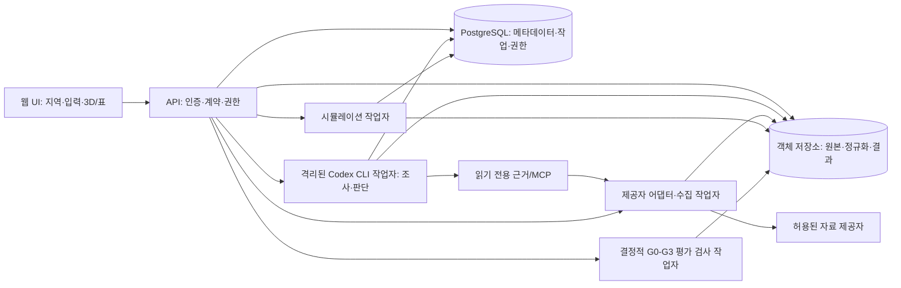

# 시스템 아키텍처와 실행 계약

[초기 계산 평가 연결](../contracts/calculation-assessment-v1.md)은 실제 완료 열·경제 작업을 같은 서명 문맥·결정 시각에 결합해 `/v1/assessments`로 접수한다. CLI/서버가 영수증·저장 결과·해시를 반복 검사하며, 승인 작물/공통 농장·시장/현장/미래/대응 비교 근거가 없는 합성 경로는 보류와 누락 사유만 저장한다. 전체 FarmScenario·실제 CLI·독립 운영 조립·브라우저/G1/G4 수용은 [후속 증거](../research/calculation-assessment-implementation.md)와 별도다.

상태: **설계 초안, 2026-09-27.** [제품 명세](PROJECT_SPEC.md)의 단계별 권고 범위와 [자료 기준선](RESEARCH_BASELINE.md)의 권리·품질 관문을 구현할 계약이다. 비용·마진 계산은 [경제 계약](ECONOMICS.md)을 따른다. [기술 스택](TECH_STACK.md)은 구현 선택이며 설치·운영 검증은 아직 하지 않았다. **개발 중 연구·설계와 배포 제품의 지역별 조사·수집 판단·추천 판단 모두 Codex CLI `gpt-6.1-sol` `xhigh`를 필수 사용한다.**

## 구성과 경계

[농장 계획 열 실행 후보](../contracts/farm-thermal-execution-v1.md)는 등록 판본을 열 입력/완료 영수증 v3에 연결한다. API·작업자·작업별 Run 조회는 같은 실제 농장 서비스와 현재 권한을 검사하며, 완료 조사→수집→검토가 해당 계획의 조사 작업에서 나왔는지 대사한다([검증 기록](../research/farm-thermal-execution-implementation.md)).

[경제 실행 후보](../contracts/farm-economic-execution-v1.md)는 경제 입력/영수증 v2에 같은 계획과 완료 열 작업을 결합한다. 검증된 열 완료의 내부 선택·영수증을 경제 연결 검사에 사용하며, 공개 결과 형식은 유지한다. v2 접수는 현재 입력 연결을 전후 비교하고, 전체 파생 금액 계산/재실행은 임대한 작업자와 완료 조회가 수행한다. 공통 Assessment·구매 에너지/비용 결합·전체 G1은 후속이다([검증 기록](../research/farm-economic-execution-implementation.md)). 사용자의 우선순위에 따라 [첫 내부 3D 뷰어](../contracts/web-thermal-replay-v1.md)는 다음 부분 구현 단계로 진행한다.

[농장 재생 계획 등록 후보](../contracts/farm-replay-scenario-v1.md)는 `/v1/farm-scenarios`로 기존 조사·열·경제 입력을 불변 선택 의도로 묶는다. 실제 등록 좌표/기간, 현재 판본·권리·서명 문맥과 결정 시각·시장 문맥을 검사하며 실행이나 관문 승인을 만들지 않는다. 완전한 FarmScenario 작성과 경제 작업·공통 Assessment의 이 판본 참조는 후속이다([소프트웨어 증거](../research/farm-replay-scenario-implementation.md)).



초기 배포는 **모듈형 단일 Python 백엔드 코드베이스**와 별도 API·수집·Codex CLI·수치 계산 작업자 프로세스로 한다. 필수 소프트웨어와 이유는 [기술 스택 결정표](TECH_STACK.md#최소-운영-구성-결정표)에 명시한다. [FastAPI는 긴 계산을 API 내 배경 작업으로 처리하지 말 것을 권고](https://fastapi.tiangolo.com/tutorial/background-tasks/)하고, [PostgreSQL 문서](https://www.postgresql.org/docs/current/sql-select.html)는 `SKIP LOCKED`를 작업표 소비자에 쓸 수 있다고 설명한다. 초기 작업 큐는 DB 임대 방식이다.

**Codex CLI 작업자**는 지역 선택 후 허용된 출처와 가격·수급·거시·요금·원가 근거를 조사해 수집 계획을 판단하고, 수집된 증거의 발표 판본·적용일·계약 범위·권리·등급을 검토하며, 완료된 계산의 후보별 의미와 추천/보류를 판단한다. **수집 작업자**는 CLI가 제안한 것 중 서버가 검증한 제공자·변수·기간 요청만 실행한다. **정규화 단계**는 단위·시각·변수별 제공자 QC 유무와 프로젝트 품질 검사를 분리해 불변 입력 스냅샷을 만든다. ASOS API허브와 개방포털 화면의 일사 `SI` QC 표에는 해당 필드가 확인되지 않지만, 기상청 데이터위키의 변수 목록에는 일사 QC가 열거된다. [제품별 G0 조사](../research/kma-g0-feasibility.md)는 이 공식 자료 간 불일치와 별도 공공데이터포털 제품 `15057210`의 `icsr` 계약을 기록했다. 실제 연결 제품의 응답과 제공자 설명으로 QC 제공 여부를 확정한 뒤 프로젝트의 일사 자체 검사를 별도로 거친다. **수치 작업자**는 버전이 고정된 방정식과 스냅샷만 실행한다. 향후 시장 전망도 승인된 고정 모델/특성 절단시각으로 별도 실행한다. **경제 계산기**는 고정된 가격/비용 버전과 달력을 받아 [정의된 산식](ECONOMICS.md#3-판매량가격비용-공식)으로 조건부 손익·현금흐름을 계산한다. CLI가 자유 형식으로 예측 수치·산술 결과를 작성하거나 임의 요금을 주입하지 않는다. **관문 검사기**는 CLI의 판단을 이번 Run·후보·목표의 G0~G3 증거와 대조하고 실패 시 `hold`로 만든다. UI는 계산이나 추천 근거를 다시 만들어내지 않는다.

## 도메인 데이터 계약

[기관/50구획 저장 v2](../contracts/crop-result-v2.md)는 기존 farm/source·현재 program
권리와 서버가 계산한 불변 artifact를 별도 표/명시 default false flag로 묶는다.
계산은 HTTP 밖에서 수행한다. [페이지 조회](../contracts/api-crop-coupled-replay-v1.md)는
명시 flag/같은 service의 trusted factory로 조립하고 현재 권리/HMAC를 전후 검사한다.
같은 ID/hash/UTC를 typed 64 sample/8 event·2 MiB 이하로 읽는다
([로컬 수용](../research/api-crop-coupled-replay-implementation.md)).
다음 [50구획 연구 3D](../contracts/web-crop-coupled-replay-v1.md)도 같은 저장 시점을 사용하며
API/3D에서 재계산하거나 G0–G4를 해제하지 않는다.

[저장 작물 연구 조회](../contracts/api-crop-replay-v1.md)는 승인 Run과 구분된
`crop-result-v1`의 같은 농장/현재 권리·불변 bytes를 읽는다. 기존 API/표준 runtime의
명시적 선택 factory를 사용하며 조회 중 계산·자료 채택·관문 승격은 하지 않는다.
공개 typed 상태/UTC/단위/해시·수치 hold가 이후 같은 시점 성장 3D의 입력이다.

| 객체 | 불변 핵심 필드와 관계 |
| --- | --- |
| Location | 소유자, WGS84 `longitude/latitude`, 표시명, 좌표 제공 방식, 공간 적용 범위. 좌표를 GeoJSON으로 교환하면 [RFC 7946의 경도·위도 순서](https://www.rfc-editor.org/rfc/rfc7946)를 따른다. |
| Source record | 제공자·제품/버전·관측소/격자 ID·원 요청 매개변수·수집시각·관측/발표/유효시각·원 단위·**변수별 제공자 QC 값 또는 미제공**·권리 상태·원본 해시. 비밀 API 키는 기록하지 않는다. |
| Snapshot | 고정된 원본 record 목록, 변환 코드 버전, UTC 시간축, 정규화 단위, 결측/보간/대체 이력, **제공자 QC와 프로젝트 검사 결과를 구분한** 품질 보고서, 파일 해시. 권리 미확인 원본은 공개 접근 금지. |
| MarketSnapshot | `market_snapshot_id`, 정확한 `decision_at`(원래 시간대·KST·UTC), 예상 수확/판매 구간, 당시 후보·계약 집합 버전과 불변 `vintage_id` 목록. 각 시장·거시·계약 record의 대상 기간/`observed_at`, 최초 `published_at`(비공개 계약은 해당 없음), 실제 `available_at`, `retrieved_at`, 원 시각의 시간대·정밀도, 제공자·원본 요청/해시·정정 전후 `revision_id`, 단위·품종/등급/포장/지역/거래 단계/채널, 출처·품질·접근/저장/가공/표시/재배포 권리를 연결한다. `available_at ≤ decision_at`인 판본만 결정 입력으로 채택한다. 모호한 공개 시각은 보수적 이용 가능 시각 또는 제외 사유를 기록한다. **시장 G0를 통과한 판본만 승인·게시한다.** |
| Market hold report | `hold_report_id`, `decision_at`, 시장 G0 보류 사유·누락 증거·검사 버전·검토한 원천/권리 상태. 승인된 MarketSnapshot이나 시장 근거를 대신하지 않는다. |
| Crop profile | 종·품종·작기·생육 단계별 기준값과 단위, 근거 URL·검토일·이용조건, **지역·시설형·품종·기간·목표의 검증 범위**와 관문 상태. 수정은 새 버전으로 만든다. |
| Scenario | `decision_at`·`market_context`, 당시 가능한 후보·계약/판로·예산과 예상 수확/판매/수금 구간, 좌표·작기·온실 사양·초기조건·설비 규칙·작물/목표/제약, 난방 용량의 물리적 의미(kW_th 등)와 확인된 효율/계량 근거, 값마다 `origin`과 `evidence_level`을 분리해 기록하고, 단위와 입력 검증 결과를 남긴다. 이후 변경 가능한 관리·출하 결정은 별도 시각/버전으로 둔다. |
| Economic source/price version | 제공자·원문/계약 ID·해시, `measured/quoted/modeled/assumed`, 통화·단위·품목/품종·등급·규격·판매경로·지역·계약종별, 관측/거래일·적용기간·수집일, 세금/수수료/운송 포함 범위, 접근/저장/표시/재배포 권리·출처표시, 검토 상태. 가격·요금 개정은 새 불변 버전이다. |
| Economic scenario | `market_context`·결정시각·가용한 경우 공통 시장/기상/거시 충격 ID, 평가 달력·시설/식재 m²·작물별 점유/휴지/교체일, 수확 `H`/판매 가능 `P`/계약상 판매 인정 `S`/반품 `T`/폐기 `D`/기초·기말 재고 `I` kg와 생산 배치별 투입원가, 경로별 가격 버전과 농가 순수취 단가/공제 범위, 구매량·요율, 직접/공동 비용과 배분 정책 버전, 자산·감가상각·대출·세금·지원금 가정 및 수금/지급일. 입력마다 `origin`·`evidence_level`·단위·원본 ID(있는 경우)를 연결한다. |
| Run | Snapshot·Scenario·모델 버전·매개변수 세트·실행 환경 digest·난수 시드(있는 경우), `temporal_provenance`(`decision_time` 또는 `ex_post_replay`), 시간별 상태·제어·**열수요/공급열(kWh_th)과 확인된 경우에만 전력(kWh_e)·연료(단위·발열량 기준 포함)**·오류/적용 범위·출력 해시. 완료된 Run은 변경하지 않는다. |
| ForecastRun (후속 연구) | **승인된 `market_snapshot_id` 필수**·`decision_at`·예측 대상 수확/판매 기간, 학습 자료 판본 목록·특성 `feature_cutoff`(모두 결정 이전에 이용 가능), 고정 모델/계수·코드/환경 버전·난수 시드, 시장 참고가격의 거래 단계별 경로와 검증된 경우에만 연결한 등급/경로별 `H/P/S`·농가 가격·비용·수금의 공동 경로, 물량/현금 제약 검사·출력 해시. G3a 검증 범위·기준선·구간 보정 증거 ID가 없으면 예측으로 게시하지 않는다. 물리 Run 및 조건부 Economic result와 ID를 분리한다. |
| Economic result | `market_context`·Economic scenario·가격/비용 버전·산식 버전·Run 참조와 `temporal_provenance`, 기간별 **판매 인정량 기준** 매출·반품 조정·미판매 재고와 그 생산원가·변동비·고정비·공헌이익·관리용 운영이익·영업 현금·사업/자기자본 현금흐름(KRW), 세 목표별 `KRW/kg`/kg 손익분기, 누락/미배분 비용, 반올림 전 계산값·입력별 `origin`/`evidence_level`·검증 상태. 원장이 바뀌면 새 결과 ID를 만든다. |
| Assessment | Run 집합·각 Run의 `temporal_provenance`·`market_context`·ForecastRun(가용한 경우에만)·Economic result ID, 당시 후보 집합과 제외 이유, 목표 함수·자본/유동성/판로 제약, 불확실성 표본, **Run/후보별 G0~G3 재검사와 후보별 G3a와 후보 집합·목표별 G3b 대응 비교 증거 ID/적용 범위**, `conditional/pass/hold` 등급과 근거. 경제 입력의 출처·증거 등급·적용/검증 범위, **G3a 후보별 미래 마진과 G3b 비교 순위의 별도 상태**, 조건부 손익과 미래 예측/순위를 구분하는 표시 등급. 기존 평가가 바뀌면 새 Assessment를 만든다. |
| AI decision | 테넌트·작업/요청 ID, 단계(`research/collection_review/assessment`); 가격·요금·원가의 출처 검토는 조사/수집 검토와 평가에 포함, 프롬프트/출력 스키마 버전, CLI 버전·모델 `gpt-6.1-sol`·강도 `xhigh`, 입력 해시, 출처·원문 해시·도구 호출/결과 해시, 구조화된 제안·근거·불확실성, 관문 검사 결과, 사용량·경과시간·종료 사유. 재판단은 새 ID다. |

`MarketContext`는 `market_context = {kind: "available", snapshot_id: MarketSnapshot ID} | {kind: "unavailable", hold_report_id: Market hold report ID}`인 판별 유니온이다. 네 객체(Scenario·Economic scenario·Economic result·Assessment)는 정확히 한 변형과 그 ID만 가지며 다른 변형의 ID·`null`·임의 시장 ID를 거부한다. 참조한 객체 간 변형과 ID도 일치해야 한다. `unavailable`은 G0 보류 사유와 누락 증거를 보고서로 보존한다. 첫 G1 내부 시범에서는 경제 계산에 **사용자가 지정한 가정만** 받으며 각 경제 입력의 `origin=user`, `evidence_level=assumed`와 가정의 적용 범위를 결과까지 유지한다. 후속 단계에서는 비공개 농장 계약·정산·원장의 접근·이용권, 해당 농장·기간·채널·계약 조건의 적용성, 원장·정산 대사를 독립 확인한 뒤 조건부 또는 해당 농장의 과거 계산에 쓸 수 있고, `measured/quoted` 증거 등급을 유지한다. `unavailable`에서 이 증빙은 G0 승인 MarketSnapshot을 대신하지 못한다. 조건부·과거 계산 결과를 낼 수 있어도 Assessment는 `hold`로 끝나고, 공개 시장 근거 카드·자료 유래 시장 시나리오·전망·G3a 미래 예측·G3b 작물 순위는 만들지 않는다. 시장 근거 카드는 G0를 통과한 자료와 유효한 MarketSnapshot이 모두 있을 때만 게시한다.

경제 API의 KRW 금액·`KRW/kg` 단가·비율은 **십진 문자열**로 교환하고 PostgreSQL `numeric`/Python `Decimal`로 계산한다. 계약별 소수 자리와 반올림 시점을 기록하고, 입력 검증에서 이진 부동소수 금액과 통화/단위 혼합을 거부한다. 시간은 UTC 저장·KST 표시를 기본으로 한다. 입력에서 순간값과 구간 적산값을 구분하고, 결과의 각 시점에 단위와 스냅샷 참조를 둔다. 원본→변환→실행→평가의 연결은 [W3C PROV 개념](https://www.w3.org/TR/prov-o/)에 맞춘 프로젝트 출처 모델이다. 공개할 수 있는 `manifest`에는 제공자, 지점/격자, 원본·정규화·결과 SHA-256, 시간/단위 변환 버전, 모델 코드 커밋·이미지 digest·매개변수·초기조건·프로필 근거, 권리 및 결측 상태를 담는다. 원본 자료 자체의 공개는 이용조건별로 제어한다.

시장 `available_at`은 공개 자료의 실제 배포·엠바고 해제와 사용권 발효, 비공개 계약의 서명/수령과 해당 농장의 접근 승인 중 적용되는 **가장 늦은 시각**이다. `retrieved_at`은 시스템 수집 시각이므로 나중에 수집했더라도 당시 원본 판본과 접근 가능성을 독립 증거로 재구성한 경우에만 과거 입력으로 쓴다. 원본 시각의 시간대·일 단위 공표처럼 불명확한 정밀도를 보존하고 UTC 비교에서는 보수적으로 해석한다.

## HTTP·작업 계약

[OpenAPI 3.1](https://spec.openapis.org/oas/v3.1.0)로 요청·응답·오류 스키마를 관리한다. 아래는 첫 계약의 경계이며 필드 상세 스키마는 구현 전에 예시 요청/응답과 함께 확정한다.

[버전 관리 OpenAPI 후보](../contracts/openapi-v1.md)는 현재 구현된 열 경로의 형식·안정 operation ID·Bearer 인증·권한을 고정한다. 기존 후보 경로의 JSON 재생성을 검사하며, 아래 표의 후속 제출 경로가 구현됐다는 뜻은 아니다.

[서비스 Bearer 인증 후보](../contracts/http-identity-v1.md)는 서버가 고정한 테넌트·권한·유효기간을 요청 문맥에 묶는다. API와 요청용 저장소는 같은 `current_principal` 공급자를 사용한다. [HTTPS 시작 후보](../contracts/api-https-service-v1.md)는 운영자 factory의 인증된 앱을 로컬 TLS로 실행한다. 공개 HTTPS·프록시 신뢰·계정 발급/회수·브라우저 로그인·운영 조립은 별도 검증 전까지 보류다.

| 경로 | 요청과 결과 |
| --- | --- |
| `GET /v1/regions`, `POST /v1/locations` | 선택 가능한 지역 목록 또는 사용자 좌표 등록. 등록 시 **필수 Codex 조사 작업**을 큐에 넣고 지원·공간 해상도·대표점 여부와 작업 ID를 돌려준다. |
| `POST /v1/ingestions`, `POST /v1/collection-reviews` | [현재 합성 원본 접수 후보](../contracts/api-owned-collection-v1.md)는 완료 조사/수집 UUID와 멱등 키를 받는다. 좌표·기간·원본·서명 문맥은 서버의 실제 부모 기록에서 읽고 검토 입력과 스냅샷 후보를 함께 저장한다. `202 JobStatus`는 자료 승인이나 G0/G1 통과가 아니다. 실제 제공자의 좌표/기간/용도(`historical` 또는 후속 `forecast`) 요청은 해당 조건의 Codex 조사·계획과 권리·자료 검증을 선행해야 한다. |
| `POST /v1/market-snapshots`, `GET /v1/market-snapshots/{id}`, `GET /v1/market-hold-reports/{id}` | 결정시각·후보·수확/판매 기간·허용 제공자 요청과 멱등 키를 받아 조사·수집/검토 작업을 큐에 넣는다. 서버가 `available_at ≤ decision_at`, 판본·권리·단위·채널과 시장 G0를 검사한 불변 `snapshot_id`만 게시한다. G0 보류 시 `hold_report_id`와 사유·누락 증거를 반환하고 MarketSnapshot은 만들지 않는다. 읽기는 테넌트 권한과 자료별 표시권을 적용한다. |
| `GET /v1/jobs/{id}` | `queued/researching/collecting/reviewing/simulating/assessing/succeeded/hold/failed/canceled`, 단계, 진행시각, 재시도 가능 여부와 원인을 제공한다. `hold`는 근거·권한·예산·CLI 문제 등으로 더 진행하지 않는 정상적인 보류 상태이며 성공으로 표시하지 않는다. 시장 G0 보류에는 `hold_report_id`를 포함한다. 조건부 경제 계산 작업의 `succeeded`는 Assessment 통과를 뜻하지 않는다. |
| `GET /v1/jobs/{id}/hold-report` | [검증된 작업 보류 조회](../contracts/api-job-hold-v1.md). 같은 테넌트의 metadata/artifact/auditor 권한 아래 저장된 AI 보류 사유·안전한 누락 근거 범주·개수·기록 시각을 제공한다. 비공개 식별자는 기타 근거로 묶고, CLI 장애 보류나 Market hold를 AI 검증 보고서로 만들지 않는다. |
| `POST /v1/runs` | **고정 Snapshot ID**·Scenario ID/버전·모델 버전·멱등 키를 받는다. 권리·필수 입력·모델 적용 범위를 검사한 뒤 작업 ID를 돌려준다. [현재 열 접수 후보](../contracts/api-run-submission-v1.md)는 명시적 v6/운영자 게시 검증기를 필요로 하고 실제 완료 검토·독립 실행/해제·시나리오 핀을 검사한 뒤 202 JobStatus를 반환한다. 전체 농장/경제 Scenario는 후속이다. |
| `POST /v1/scenarios`, `GET /v1/scenarios?scenario_id=...&scenario_revision=...` | [열 의도 등록/조회 후보](../contracts/api-scenario-intent-v1.md)는 현재 테넌트와 실제 스냅샷·서명 문맥·시장 보류를 검사해 불변 판본과 해시·최초 시각을 돌려준다. 등록은 `registered_intent`이며 입력/계산 승인이나 전체 농장·경제 Scenario를 뜻하지 않는다. 수정은 새 판본으로 만든다. |
| `POST /v1/market-user-sources` | [사용자 가정 접수 후보](../contracts/api-market-user-source-v1.md)는 기존 7종 입력의 테넌트를 서버에서 결합하고 실제 불변 요청과 원천 기록을 같은 거래로 저장한다. 등록은 `contract_valid_user_assumption`이고 요청은 queued다. 수집·계산 완료나 외부 원천 G0/전망을 뜻하지 않는다. |
| `GET /v1/market-user-sources`, `GET /v1/market-user-sources/record` | [저장 가정 조회 후보](../contracts/api-market-user-source-read-v1.md)는 같은 사용자의 입력 종류별 목록과 지정 판본을 조회한다. 원본 해시·최초 작업을 대사하고 입력 문자열·단위·null을 보존한다. 읽기 권한만 필요하며 수정은 기존 접수의 새 판본으로 등록한다. 목록은 승인·최신 판본 선택·시장 자료 채택을 뜻하지 않는다. |
| `GET /v1/jobs/{id}/run` | [완료 열 작업의 Run 조회](../contracts/api-job-run-v1.md). 같은 테넌트의 metadata/artifact/thermal_run_read 권한 아래 불변 입력·완료 게시·영수증·검증된 Run의 해시와 결정 문맥을 대사하고 기존 공개 Run 요약만 반환한다. 미완료는 404, 불일치는 고정 503이며 원문이나 검토 ID를 반환하지 않는다. |
| `GET /v1/runs/{id}`, `/series`, `/manifest` | 승인된 사용자에게 완료된 실행 메타데이터·시간별 상태·출처와 `temporal_provenance`를 읽기 전용으로 제공한다. 미완료 결과는 완성본처럼 노출하지 않는다. |
| `POST /v1/economic-scenarios`, `POST /v1/economic-results`, `GET /v1/economic-results/{id}` | Scenario와 일치하는 `market_context`, 달력·시설·수확/판매 인정/반품/폐기/재고량·등급/경로·고정 가격/요금/견적 또는 사용자 가정 버전·비용 배분·수금/지급 시점과 멱등 키를 검사한다. `unavailable`인 첫 G1 내부 시범에서는 사용자 가정만 받아 `origin=user`·`evidence_level=assumed`를 결과에도 반환한다. `unavailable`인 후속 단계에서는 독립적인 접근·이용권, 농장·기간·채널·계약 조건의 적용성, 원장·정산 대사를 확인한 비공개 계약·정산·원장을 조건부 또는 해당 농장의 과거 계산에 받고 `measured/quoted` 등급을 유지한다. 서버는 누락/단위/권리/증거 등급을 기록하고 별도 산술 작업으로 **조건부** 손익·목표별 손익분기·월별 현금 잔액을 반환한다. 미확인 필수값은 0으로 채우지 않는다. 원장 검증 없이는 과거 실적이라 부르지 않는다. |
| `POST /v1/break-even-plans` | [불변 계획 접수 후보](../contracts/api-break-even-plan-v1.md)는 기존 요청과 저장된 시나리오 참조를 받아 서버가 격자·공통 조건·계획 해시를 만든다. `plan_id`가 논리적 멱등 식별자이고 다른 입력은 409다. 현재 권한/원천 핀과 준비 바이트를 대사해 실제 202 계산 의도를 저장한다. [수치 작업자 후보](../contracts/break-even-calculation-worker-v1.md)는 전체 계획·격자를 재검증하고 실제 임대 아래 결과와 완료 게시를 원자 저장하며 Assessment는 hold다. 자동 시험 가정·전체 연속 해 증명과 G1/G4 수용은 후속이다. |
| `GET /v1/jobs/{job_id}/break-even-result` | [완료 조회 후보](../contracts/api-job-break-even-result-v1.md)는 읽기 권한으로 실제 완료 입력·영수증·게시 기록과 저장 계획/요청·전체 재계산 결과를 대사해 기존 BreakEvenRead를 반환한다. 다른 테넌트·미완료·다른 작업 모델은 404, 완료 증거 누락/불일치는 고정 503이다. 현재 권한·저장소 바인딩을 재검사하며 합성 시험/과거 코드 해시는 G1/G4 증명이 아니다. |
| `POST /v1/break-even-verifications`, `GET /v1/jobs/{job_id}/break-even-verified-result` | [비동기 검증 HTTP 후보](../contracts/api-break-even-verification-v1.md)는 실제 완료 계산 UUID를 받아 현재 구현에 고정한 재검증 작업을 접수한다. 보호된 작업자가 전체 격자를 재생하고 비공개 증거·영수증·완료를 게시한다. 완료 읽기는 현재 부모·권리·참조·증거를 검사해 기존 조건부 결과를 반환한다. 접수는 `simulation_execute`가 추가로 필요하며, 조회는 기존 읽기 권한을 요구한다. [집중 소프트웨어 검증](../research/api-break-even-verification-implementation.md)은 실제 SCRAM·HTTPS와 별도 Python 작업자 경로를 포함한다. 웹·최대 256개 부하·독립 CLI/G1/G4는 후속이다. |
| `GET /v1/break-even-results?plan_id=...` | 고정 계획의 테넌트·권한·불변 바이트를 검사하고 모든 격자 시험값의 전체 시장/경제 경로를 재계산한다. 세 목표·kg 또는 KRW/kg 단위·격자의 영점/구간/비단조/보류, 현금 부족과 사용자 가정/Assessment `hold`를 안전하게 투영한다. 연속 범위의 해나 미래 수익으로 승격하지 않는다. 계획/시험값 제출·생성은 후속 작업이다([조회 계약](../contracts/api-break-even-read-v1.md)). |
| `POST /v1/forecast-runs`, `GET /v1/forecast-runs/{id}` (후속) | 승인된 `market_snapshot_id`·고정 모델/특성 절단시각·기간·멱등 키를 검사해 실험 작업을 큐에 넣는다. `unavailable` 문맥은 제출할 수 없다. 입력의 발표/접근시각 또는 판본이 불명확하면 `hold`; G3a가 해당 범위를 통과하지 못한 출력은 내부 시험으로만 보관한다. |
| `POST /v1/assessments`, `GET /v1/assessments/{id}` | Run 집합·일치하는 `market_context`·후보·목표·제약·프로필·Economic result 버전을 받으면 **Codex CLI 평가 작업을 매번 시작**한다. 그 제안을 서버가 각 Run·후보에 G0 자료/권리, G1 모델/재현, G2 현장 검증, G3a 후보별 독립 경제 실측과 G3b 이번 후보·목표의 대응 비교 증거로 재검사한다. 읽기는 저장된 CLI 판단·검사 결과·증거를 반환한다. `unavailable`이면 G0 사유·누락 증거와 조건부 계산을 보존하고 Assessment는 `hold`로 끝낸다. 그 밖에도 G3b 범위 밖·근거 누락·후보 하나면 **순위** 대신 `hold`와 후보별 사유를 반환한다. G3a를 충족한 개별 미래 마진은 가용한 문맥에서 순위와 별도 표시할 수 있다. |

관문 판정은 통과한 프로필 ID만 조회하는 방식이 아니다. 평가 작업자는 Run이 사용한 Snapshot의 해당 좌표·기간·자료 권리와 일사 품질(G0), 모델/계수 버전과 재현 결과(G1), 이번 시설형·기간·지역의 독립 실측 시험(G2)을 확인한다. 각 후보의 품종·작기 범위를 확인한 뒤, **같은 지역·시설·평가 기간·목표에서 이번 후보들을 비교한 미사용 검증 자료**와 그 순위/손실 결과(G3b)를 각 Run/후보에 연결한다. G3a 후보별 독립 수확·등급·판매·비용 검증도 별도 연결한다. 검증 범위를 벗어난 좌표를 선택하면 다른 지역의 합격 기록을 재사용하지 않는다. 판단 기록에는 관문별 증거 ID·검사 버전·실패 이유를 남긴다.

작업 제출의 고유한 의도는 `(tenant_id, 단계, 멱등 키)`로 고정한다. 같은 키·정규화 입력 재요청은 기존 작업을 돌려주고 같은 키에 다른 입력을 주면 충돌로 거부한다; 입력 해시는 원본 검증과 동일성 비교에 사용한다. 기존 DB에는 owner가 거래 안에서 중복 의도를 검사한 뒤 고유 제약을 추가하는 업그레이드가 필요하다. 작업자는 임대 만료와 재시도를 사용하고, 결과를 임시 위치에 쓴 뒤 해시 검증과 원자적 게시를 한다. 중복 실행은 허용할 수 있어도 **완료 결과의 중복 게시·오염은 막는다**. CLI 시도마다 별도 시도 ID와 종료 결과를 남긴다. AI decision ID는 실제 출력이 서버 검사를 통과한 시도에만 만들고, 게이트를 통과한 결과 하나만 게시한다. 실패한 스냅샷·실행·평가는 부분 성공으로 보이지 않는다. 작업 중단, 공급자 429/5xx, 잘못된 단위, 사용자의 취소를 구별해 복구한다. 외부 제공자의 장애가 있어도 이미 고정된 실행은 재생할 수 있어야 한다.

사용자의 계획·판단 시각 D(`decision_at_utc`)와 서버가 증명한 CLI 수집 검토/증거 컷오프 R(`review_at_utc`)을 별도로 저장한다. `decision_context_id`, D, R, `claim_mode`, 실제/가상 결정 표지는 후보 Run ID와 승인 trace에 결합하고 게시기가 불변 테넌트·스냅샷 문맥 및 실행 사건과 대조한다. D 이후에 입수한 원본은 R에서 검토할 수 있어도 D 당시의 근거로 소급하지 않는다. 기상 관측의 `observed_at` 또는 실제 이용 가능 시각이 D 뒤인 Snapshot으로 계산한 Run은 `temporal_provenance=ex_post_replay`로 저장·표시한다. 연결된 Economic result와 Assessment에도 이 출처를 표시한다. 이는 사후 물리 재현을 허용하는 표시 규칙이며, 그 관측값과 결과를 해당 결정 당시 이용 가능했던 근거나 미래 작물 선택의 증거로 제시하지 않는다. `decision_time` 표시는 사용한 모든 결정 입력이 당시 이용 가능했을 때만 허용한다.

과거 검증 작업도 실제 `decision_at`과 당시 후보·계약을 잠근 뒤 해당 시각 이전에 이용 가능했던 원본 판본만 선택한다. 각 rolling-origin 회차의 학습·특성 선택·구간 보정은 같은 절단 규칙을 따르고, 뒤늦은 통계/가격 정정·수확 뒤 날씨·정산은 정답 평가에만 둔다. 당시 판본/접근시각을 복원할 수 없는 회차는 성능 집계에서 제외한다. 외부 원천은 제공자·엔드포인트 허용 목록과 자료별 권리 검사를 통과해야 하며, CLI/MCP에는 승인된 읽기 자료와 비밀 제거된 메타데이터만 전달한다. 사용자 계약·API 키·타 테넌트 원문을 프롬프트·도구 호출·로그·공개 manifest에 노출하지 않는다. 시장 전망, 순위, 자본/유동성 제약의 필수 입력 또는 관문 증거가 없으면 Assessment의 해당 주장을 `hold`한다.

현재 [조건부 경제 시나리오 등록 후보](../contracts/api-economic-scenario-v1.md)는 기존 기준 입력·공통 충격의 실제 판본/해시와 서명 시장 보류를 검사한다. 실제 요청·후보·수정 수치를 같은 거래로 저장하고 식별자·최초 시각·queued 요청만 반환한다. 전체 경제/손익분기 오케스트레이션·CLI/평가·전체 G1 수용은 후속이며, 기존 후보의 결정적 참조를 실제 실행 UUID로 승격하지 않는다.

기존 고정 경제 시나리오의 [조건부 계산 작업자 후보](../contracts/economic-calculation-worker-v1.md)는 실제 simulation 임대와 산식 판본/입력 핀을 확인하고 결과·작업 완료를 같은 거래로 저장한다. 영수증은 실제 `calculation_status`와 `assessment_status=hold`를 보존하며 프로그램 완료를 농장 수익 검증으로 표시하지 않는다. 운영자 전경 명령은 모델을 호출하지 않는다. [HTTP 계산 접수·완료 조회 후보](../contracts/api-economic-calculation-v1.md)는 불변 입력·현재 권한·전체 원장 재계산을 확인해 실제 202 요청을 만들고, 완료 영수증/게시/원장 해시를 대사한 기존 안전 결과만 반환한다. 전체 CLI/경제/브라우저 수용은 후속이다.

## 검증 작물 계산의 서버 이력

[새 계산 서버 계약](../contracts/crop-cycle-calculation-server-custody-v1.md)은 exact 공식 계산 문맥/현재 농장 권한과
새 artifact를 `CalculationServerCustody`에 결속한다. 고정 resolver가 소유 문맥을 열고 실제 계산과
proof fsync·현재 권리 재확인·HEAD 게시를 수행한다. inspect/page/완료 재시도는 현재 권리 아래 RHS0이다.
[62개 분할 검증](../research/crop-cycle-calculation-server-custody-implementation-20261007.md)의 작은 소프트웨어 범위이며,
새 DB 게시/공개 API/runtime 연결·전체166일/3D와 G0–G4는 후속이다. 원 판본 이력을 재발급하지 않는다.
[새 DB 표/권한 수용](../research/crop-cycle-calculation-result-schema-implementation-20261007.md)은
별도 `crop_cycle_verified_research_results`와 기본값False의 명시 role flag를 추가한다.
전체68개(순수15/실제 SCRAM DB53)로 SQL 형식/원 행 공존·whole grant audit를 확인했다.
signed 공식 결과의 put/get/page/summary와 operator-config/API runtime 연결은 후속이며 새 실제 작물 Run은0이다.
후속 [새 signed DB store](../research/crop-cycle-calculation-result-publication-implementation-20261007.md)는
exact 새 서버/context·9필드 binding과 별도 HMAC/ID/table을 결속한다. 실제 원자 put/retry·현재 get/page/summary,
철회/rollback·원 signed 이력 공존과 고유96개 분할로 작은 DB·농장 연결 부모를 로컬 수용했다.
일반 get39.668745초 관측도 보존하며 HTTP30초는 미수용이다. 기존 read evidence/current query와 공개 DTO는
구형 exact artifact/context/store·ID/manifest를 받으므로 새 판본 선택 연결이 필요하다.
원 proof/서명/행을 바꾸지 않고 새 결과의 proof/현재 조회·projection/operator-config/API runtime을 검증한다.
전체 등록 prefix/저장/API/같은 UTC3D와 관문은 별도다.
[새 판본 조회 계약](../contracts/crop-cycle-calculation-query-v1.md)에 따라 현재 공식 계산 문맥/입력 proof와
원 validated context를 구분한 증명 → 조회 타입 → 현재 farm/서명 → 공개 판본/runtime 순서로 연결한다.
QC 발행은 HTTP 밖이며 조회에서 원 parser/context/QC/RHS를 재실행하지 않는다.
[새 증명 수용](../research/crop-cycle-calculation-result-evidence-implementation-20261007.md)은
원 header/commit summary/index SHA를 현재 snapshot에 결속하고 원 validated SHA와 새 calculation SHA를 구분한다.
다음 [별도 조회 문맥](../contracts/crop-cycle-calculation-result-read-context-v1.md)은 새 증명 타입만 받으며
농장/DB query·공개 판본/runtime과 전체166일 비용은 후속이다.

## 3D 재생 계약

지역 선택 지도와 온실 3D 장면은 별도 화면/자산으로 둔다. 온실 장면은 실제 시설 도면이 없는 경우 **개념적 단일 구역**임을 표시한다. 시각 슬라이더가 가리키는 `run_id + timestamp`의 실내 온도·습도, 난방·환기 상태, 모델의 난방 열수요/공급열(kWh_th)이 3D, 표, 그래프, 설명 문장에 모두 같은 값으로 나타나야 한다. 시간별 비용·매출 겹침은 Economic result의 해당 시점 입력(계량량·유효 가격/요금·판매 사건)과 산식이 **검증된 범위**에 있을 때만 `economic_result_id + timestamp`로 같은 표와 함께 보여 준다. 월별 조건부 손익을 시간별 실적처럼 보간하지 않는다. 공급열 용량의 의미가 불명확하면 공급열 숫자는 숨기고 이유를 표시한다. 계량 또는 검증된 효율/COP·보조 전력·연료 발열량이 없으면 전력(kWh_e)·연료(L/kg/kWh_fuel) 사용량과 비용·절감률은 계산값처럼 표시하지 않는다. 색과 움직임에는 단위·범례·기준을 붙인다. 보간 애니메이션은 시각 효과로 표시하고, **성장 모델이 존재하고 검증되기 전에는 식물이 자라는 애니메이션을 만들지 않는다.** 계산된 상태가 아닌 식물 키·수확·병해 모습은 재생하지 않는다.

WebGL을 쓰지 못하는 사용자도 지역 선택·실행·결과 판단을 표와 문장으로 완료할 수 있어야 한다. 키보드 재생/정지/시점 이동, 움직임 줄이기, 텍스트 대안, 충분한 대비를 [WCAG 2.2](https://www.w3.org/TR/WCAG22/) 기준으로 시험한다. 장면 성능은 대표 저사양 기기의 실제 측정으로 합격선을 정한다.

## 운영·보안·가용성

- **재현성:** 원본과 모든 변환·코드·모델·프로필 버전을 보존하고, 같은 manifest의 **수치 계산 재실행** 허용 차이를 사전에 정의한다. 공급자 수정은 새 Snapshot/Run으로만 반영한다. 저장된 AI decision은 정확히 조회·감사할 수 있지만 같은 입력으로 CLI를 다시 실행하면 새 판단일 수 있다. 원 판단의 재현은 저장 기록의 열람이지 모델 재호출이 아니다.
- **가용성:** API와 작업자의 장애 영역을 분리하고, DB/객체 저장소 백업과 복구 연습을 한다. 목표 응답 시간·작업 대기시간·복구시간·자료 보존기간은 예상 사용량과 서비스 약속이 정해진 뒤 측정 근거로 설정한다. 서비스가 자료 부재를 임의 숫자로 메우지 않도록 한다.
- **보안·개인정보:** 로그인/권한, 실행별 소유권, 좌표·현장 로그·가격 계약·원장·비용 자료의 접근·삭제·보존 정책, 전송/저장 암호화와 비밀키 분리를 설계한다. 사용자가 임의 URL을 수집기에 넘기지 못하게 공급자를 허용 목록으로 제한하고 좌표·기간·동시 실행·응답 크기를 제한한다. 이는 [OWASP SSRF](https://cheatsheetseries.owasp.org/cheatsheets/Server_Side_Request_Forgery_Prevention_Cheat_Sheet.html)와 [API 자원 소비](https://owasp.org/API-Security/editions/2023/en/0xa4-unrestricted-resource-consumption/) 지침을 반영한 판단이다.
- **관측성:** 요청·수집·실행·평가를 trace/run ID로 연결하고 공급자 오류, 결측률, 권리 보류, 작업 지연·실패, 모델 적용 범위 밖 실행, 3D 오류를 추적한다. [OpenTelemetry 신호](https://opentelemetry.io/docs/concepts/signals/)는 도구 후보이다. 경고와 장애 대응 책임·절차를 공개 전 정한다.
- **변경관리:** staging에서 자료 스키마·모델 회귀·API 계약·백업 복원·접근성 시험을 통과한 버전만 공개한다. 모델/프로필 변경은 이전 Run을 바꾸지 않는다. 이 저장소의 자체 코드·문서는 [Apache-2.0](../LICENSE)이다. 공개 배포마다 자체 코드의 기여·저작권 귀속과 의존성·3D 자산·포함 자료의 라이선스/출처표시/재배포 가능 범위를 기록한다.
- **출시 구분:** G4 전 탐색·현장 검증·비교 추천 단계는 **내부 시범**이다. 공개 production은 G4와 해당 기능에 필요한 G0~G3를 통과한 범위만 제공한다. G4에는 빈 환경에서의 설치·실행 절차, 외부 제공자 키를 사용자가 설정하는 방법(키는 배포물에서 제외), 재배포 권리가 확인된 예제 데이터로 수행하는 설치/예제 실행 시험을 포함한다. 지금은 설치 가능한 배포물이나 운영 검증 결과가 없다.

## 필수 Codex CLI 런타임 작업자

2026-10-01 사용자 지시로 모델을 `gpt-6.1-sol`로 변경했다. 기존 DB의 [명시적 이전 계약](../contracts/cli-model-policy-migration-v1.md)은 과거 기록을 보존하며 새 실행과 현재 게시 검증에 새 모델을 요구한다. 과거 CLI 시험은 새 모델의 제품 실행·독립 해제 증거가 아니다.

**확정 요구:** 프로젝트 조사·설계·검증에도, 제품 사용자가 지역을 선택한 뒤의 연구·수집 판단·작물 판단에도 Codex CLI의 **정확한 모델 `gpt-6.1-sol`, 추론 강도 `xhigh`**를 사용한다. 정적 규칙이나 일반 API 모델 호출로 이 필수 경로를 대체하지 않는다. [공식 모델 페이지](https://developers.openai.com/api/docs/models/gpt-6.1-sol)는 모델 ID와 `xhigh` 지원을 명시하고, [Codex 비대화형 문서](https://developers.openai.com/codex/non-interactive-mode)는 `codex exec`, JSONL, 출력 스키마와 자동화 인증을 설명한다. 현재 로컬 `codex-cli 0.157.1`의 `codex exec --help`에서도 `-m`, `-c`, `--json`, `--output-schema`, `-o`, `--ephemeral`, `--ignore-user-config`, 읽기 전용 샌드박스를 확인했다. 이 사실이 배포 계정의 모델 접근·상업적 사용 권한·가격·처리량을 보장하지는 않는다.

| 트리거 | CLI가 실제로 판단할 내용 | 다음 단계 |
| --- | --- | --- |
| 지역/좌표 확정 또는 기간·목표 변경 | 승인된 제공자 목록과 현재 근거에서 자료원·관측소 후보·변수·기간·공간차와 **가격·요금·원가 원천의 계약종별·적용일·권리/품질 위험**을 조사하고 수집 계획과 빠진 근거를 작성 | 서버가 계획을 스키마·제공자 목록·G0 선행 조건으로 검사한 뒤 어댑터에 요청; 거부 시 `hold` |
| 원본 수집·정규화 완료 | 실제 보유율·제공자 QC 유무·일사 자체 검사·대체 후보 및 **가격/견적의 단위·규격·증빙 등급·유효기간·재사용 권리**를 검토해 스냅샷 채택/추가 수집/보류 판단 | 서버의 G0 및 경제 입력 검증 결과와 대조; 통과한 불변 Snapshot만 수치 작업자로 전달하고 가격/요금/견적 버전은 경제 계산기에 고정 |
| 시뮬레이션 완료 및 평가 요청 | 결과·Economic result의 가격/요금/비용 출처·승인된 작물 프로필·같은 조건의 독립 비교 증거를 검토해 후보 제외, 불확실성, 목표별 추천 또는 보류 이유 판단 | 결정적 G0~G2와 G3a/G3b 검사기가 모든 Run/후보/목표 적용 범위를 재확인; 순위 관문 미통과면 순위 `hold`, 후보별 미래 마진도 G3a 미통과면 숨김. 공개 여부는 G4로 별도 제한 |

**프로세스 호출 계약:** 별도 작업자는 사용자 문자열을 셸에 붙이지 않고 인자 배열로, 테넌트별 일회성 읽기 전용 작업 디렉터리에서 다음 형태로 실행한다. `CODEX_API_KEY`는 비밀 관리자에서 **해당 프로세스에만** 주입하며 명령행·로그에 넣지 않는다. [공식 자동화 인증 설명](https://developers.openai.com/codex/non-interactive-mode#authenticate-in-automation)에 따르되, 배포 계정 검증 전에는 인증 방식의 실제 가용성을 미확인으로 둔다.

```text
codex --ask-for-approval never exec -m gpt-6.1-sol -c 'model_reasoning_effort="xhigh"' \
  --sandbox read-only --skip-git-repo-check \
  --ephemeral --json --output-schema /contracts/decision-v1.schema.json \
  --output-last-message /work/decision.json -C /work/input -
```

작업별 격리된 `CODEX_HOME/config.toml`에 승인된 읽기 전용 MCP만 기록하고 기동 시 실제 활성 도구 목록을 검사한다. 로컬 `codex-cli 0.157.1`의 `codex exec --help`에서 `--ignore-user-config`는 이 `CODEX_HOME/config.toml`도 읽지 않으므로 승인 MCP가 필요한 호출에는 사용하지 않는다. 격리 홈과 읽기 전용 작업 디렉터리의 설정 파일·권한을 서버가 만든 뒤 실행한다.

stdin은 서버가 생성한 버전 고정 지시문과 `tenant_id/job_id`, 좌표·기간·목표, 허용 자료원 ID, **해시로 고정된 자료·가격/요금/비용 버전·프로필·Run·관문 증거 참조**를 담는다. 원문은 길이·형식·권리를 검사한 뒤 식별자와 출처를 붙인 **인용용 자료**로만 전달한다. 단계별 입력 스키마는 `research_input_v1`(좌표/기간/제공자 등록부/기존 기상·가격·요금·비용 근거), `collection_review_input_v1`(계획 ID/원본 해시/품질 보고서/가격·요금 적용일·계약·권리·증거 등급), `assessment_input_v1`(Run·Economic result·프로필·후보/목표·G0~G3a/G3b 증거 ID)로 버전 관리한다. CLI 최종 JSON의 공통 봉투 `decision_v1`에는 `schema_version`, `stage`, `input_sha256`, `proposed_status`(`proceed/hold`), `selected_ids`, `rejected_ids`, `claims[]`(주장·`evidence_ids[]`·불확실성), `missing_evidence[]`, `reason`을 필수로 둔다. 조사 단계의 `selected_ids`는 제공자·관측소·변수/기간 요청이고 평가 단계는 후보/목표와 제외 사유다. 증거 레지스트리에는 각 `evidence_id`의 URL·발표/조회시각·원본 해시·권리를 둔다. `--output-schema`는 출력 형태를 요구할 뿐 과학적 사실을 증명하지 않는다. 서버가 별도 Pydantic/JSON Schema 검증으로 필수 필드·열거값·길이·값 범위·참조 ID 존재·테넌트 소유권·증거 적용 범위·권리·평가별 G0~G3a/G3b 관문을 검사한다. G4는 공개 배포 때 별도 검사한다. 스키마 오류·근거 없는 주장·허용되지 않은 도구 호출은 게시하지 않고 `hold` 또는 통제된 실패로 처리한다.

**도구와 네트워크:** 런타임에 일반 인터넷 검색·임의 URL 열기·코드 수정·임의 파일 읽기/쓰기·외부 앱 연결은 제공하지 않는다. 조사에 필요한 최신 자료는 버전이 고정된 **읽기 전용 근거/제공자 MCP** 또는 서버 수집 어댑터를 통해서만 받는다. MCP는 `search_sources`, `read_source`, `preview_provider_data` 같은 제한된 도구만 노출하고, 서버에서 테넌트·제공자·좌표·기간·응답 크기를 다시 검증한다. **작업마다 별도 비특권 컨테이너·UID·임시 파일시스템**을 쓰고 다른 테넌트 볼륨이나 DB 자격증명을 마운트하지 않는다. DB 조회는 서버가 `tenant_id`와 권한을 검사하고 [PostgreSQL 행 보안](https://www.postgresql.org/docs/current/ddl-rowsecurity.html)을 보조 방어로 사용한다. 객체 다운로드도 소유권과 권리 상태를 다시 검사한다. CLI용 컨테이너는 자기 작업 디렉터리만 읽고, egress는 Codex 인증/추론에 필요한 OpenAI 호스트와 내부 근거 게이트웨이에만 허용한다. 제공자 외부 호출은 **별도 수집 작업자**가 허용 목록의 HTTPS 끝점으로만 실행한다. MCP 설정은 격리된 `CODEX_HOME`에서 만들고 실제 활성 목록을 기동 검사한다([Codex MCP 설정](https://developers.openai.com/codex/mcp)). CLI의 셸 도구나 사용자 설정이 제한을 우회하지 못하도록 컨테이너 파일·네트워크 권한과 도구 호출 이벤트를 시험한다. 필요한 제한을 구현/검증할 수 없으면 G4는 미통과다.

**자료 주입 방어:** 제공자 문서·PDF·웹 문장·사용자 텍스트는 모두 신뢰하지 않는 데이터다. 상위 지시문과 분리해 원문 해시·출처·시각을 붙이고 크기/HTML/제어 문자를 제한한다. 원문 안의 “이전 지시 무시”, 도구 실행, 비밀 요청, 다른 URL로 이동 같은 지시는 실행 권한이 없다. MCP는 원문을 읽기 자료로만 반환하며 서버가 허용한 도구 인자만 받는다. 도구 호출 전체와 거부 사유를 감사하고, 주입 공격·가짜 인용·URL 바꾸기·테넌트 간 접근을 G4 시험에 포함한다. LLM의 자기 선언만으로 방어 성공으로 간주하지 않는다.

**운영 한도와 실패:** 초기 설정 초안은 테넌트당 동시 CLI 작업 1개·대기 10개, 전체 동시 4개, 동일 입력 5분 중복 제거, 사용자당 새 지역 조사 10회/일, 완주 흐름당 정상 호출 3회(조사·수집 검토·평가), 단계당 벽시계 10분·전체 30분, 최종 JSON 1 MiB·근거 원문 합계 10 MiB다. 작업 전 누적 사용량과 예상 상한을 검사하고 운영 주체의 일일 지출 상한을 별도로 설정한다. CLI 도움말에서 **요청당 강제 토큰/비용 상한 옵션은 확인되지 않았으므로**, JSONL의 실제 사용량을 사후 정산하며 시간 제한·동시성·일일 할당량으로 초과 가능성을 줄인다. 미결제 상한이 운영 허용 범위에 드는지는 G4에서 실측해야 한다. 수치는 부하·실제 비용 시험 후 G4 전에 확정한다. 공유 전역/테넌트별 속도 제한과 최대 대기열을 두고 초과 시 `hold`/재시도 가능 시각을 알린다. 일시적 429/5xx·네트워크 오류만 지수 백오프와 jitter로 최대 2회 재시도하고, 인증 실패·모델 불가·스키마 위반·권리 문제·예산 초과는 자동 재시도하지 않는다. 시간 초과는 자식 프로세스 그룹을 종료하고 부분 출력은 격리한다. 재시도와 취소도 각각 시도 ID·종료 사유를 남긴다. 예산이나 계정 접근이 없다면 정적 규칙으로 추천을 만들어 성공 처리하지 않는다.

**감사·재현:** 입력 지시문 버전/해시, 사용한 출처의 원본 해시·URL·조회시각·권리, 실제 도구 호출과 결과 해시, CLI 버전, 모델/강도, 작업 시간·사용량, 구조화 출력, 서버 검증 결과와 평가별 G0~G3a/G3b 증거 ID 및 배포 G4 증거 ID를 불변 기록한다. 비밀과 불필요한 개인정보는 기록하지 않고 열람 권한·보존기간을 둔다. 고정 스냅샷·방정식·계수·적분 설정의 **수치 재실행**은 정해 둔 오차 안에서 반복 가능해야 한다. AI 판단은 확률적이므로 같은 입력 재호출이 같은 답이라는 약속을 하지 않는다. 이전 판단을 정확히 보여 주려면 저장된 decision ID를 조회하고, 새 CLI 호출은 새 시도 ID와 검사 결과를 남기고, 실제 출력이 검증됐을 때만 새 decision ID를 만든다.

**배포 검증 문턱:** 실제 운영 주체의 인증으로 CLI가 `gpt-6.1-sol` `xhigh`를 실행하는지, 예상 수요의 지연·호출 제한·비용을 감당하는지, 해당 사용 방식의 계약/권한과 데이터 처리 조건이 맞는지 공식 자료 및 실제 계정에서 확인한다. 이는 [인증 방식 문서](https://developers.openai.com/codex/auth)와 [모델 페이지](https://developers.openai.com/api/docs/models/gpt-6.1-sol)만으로 특정 계정의 허용을 추정할 수 없기 때문이다. 미확인·불가이면 필수 런타임이 성립하지 않아 공개 서비스를 막는다.

**현재 소프트웨어 후보:** [authority dispatcher RPC](../contracts/authority-rpc-v1.md)는 일반 작업자의 실행 요청만 받고, 신뢰 서버 내부의 기존 실행기가 고정 테넌트 임대·검증·영속 저장을 맡는다. 별도 감독자가 CLI 프로세스와 서명키를 소유한다. [DB 역할 정책](../contracts/runtime-role-policy-v1.md)은 일반 작업자에 직접 데이터 권한을 주지 않으며 서버는 시작/호출 전에 authority 역할과 유효 권한을 검사한다. 같은 OS UID·관리자 통제 SQL 시험과 fake CLI/시험키는 실제 로그인·계정·키/배포 분리나 G1/G4 증거가 아니다.

후속 [로그인 정책 v2 후보](../contracts/runtime-login-policy-v2.md)는 별도 DB 사용자로 실제 SCRAM 인증을 마친 연결만 사용하며 최초 로그인/세션/현재 역할과 DB 범위를 대조한다. 관리자 연결에서 역할만 바꾸는 경로를 거부한다. DB 인증과 권한 검증은 실제 운영 UID·키/자격증명 소유권의 독립성을 증명하지 않는다. authority 자격증명 보유자는 RPC 밖에서도 허용된 SQL을 실행할 수 있으므로 그 소유권 통제와 G1/G4 배포 증거는 계속 필요하다.

[시장 계산 로그인 프로필 v3 후보](../contracts/runtime-market-login-policy-v3.md)는 명시적 선택으로 후보·숫자 입력·결과의 불변 세 테이블에 authority 읽기/삽입만 허용한다. 보류·후보·결과 저장소는 묶인 실제 SCRAM 로그인과 전체 유효 권한을 매 연결에서 시장 조회 전에 검사한다. 기본 v2와 v1은 유지하며 기존 역할이나 기록을 자동 갱신하지 않는다. 합성 자료의 DB 인증·재계산 시험은 실제 시장 원천, 운영 자격증명 소유권이나 G1/G4 증거가 아니다.

[구현된 API 조립 후보](../contracts/api-runtime-assembly-v1.md)는 명시적 v4 프로필과 보호된 운영자 의존성을 받아 기존 열 경로·TLS·Bearer·여섯 저장소를 같은 요청 인증에 연결한다. 시작 전에 기존 아티팩트 루트와 실제 SCRAM/유효 권한을 검사하고 작업 저장소도 매 연결에서 권한을 재검사한다. 시장 원천이 서명 보류·결정 문맥 권한을 대체할 수 없다. 시험용 원천/키의 실제 서비스 프로세스 시험은 운영 자료·설정/키 소유권·전체 Codex/Run/브라우저·G1/G4 수용이 아니다.

[콘텐츠 접근 정책 후보](../contracts/content-access-v1.md)는 신뢰 설정으로 authority 소유 파일에 감독자 그룹의 읽기 권한을 줄 수 있다. 열린 디렉터리/파일의 소유 UID·그룹·정확한 모드·ACL과 내용 해시를 검사하며 기존 권한을 자동으로 넓히지 않는다. 공유 그룹은 해당 콘텐츠 루트 전체를 읽으므로 운영에서는 테넌트별 루트·UID/그룹·읽기 전용 마운트와 별도 비밀 소유권을 구성해야 한다. 실제 UID 파일 접근 시험도 전체 서비스·계정·모델 실행이나 G1/G4 수용을 뜻하지 않는다.

[사용자 가정 원천 저장소 후보](../contracts/market-user-source-store-v1.md)는 기존 7종 입력을 실제 collection/simulation 작업 바이트에 결합해 불변 보관하고 기준 시나리오·충격 pin을 서버에서 생성한다. 명시적 v5 authority와 매 연결 SCRAM/전체 권한 감사, 별도 source 읽기·쓰기 범위를 요구한다. 가정 저장은 실제 원천 G0 승인이나 실행 완료 증거가 아니며 시장·경제 계산은 결정 시점과 권리·적용 범위를 다시 검사한다.

[결정적 열 작업자 후보](../contracts/thermal-simulation-worker-v1.md)는 명시적 simulation 작업 ID를 소비하고 같은 authority 거래에서 검증된 Run·작업 완료·게시/시도 기록을 묶는다. 취소·만료·실패 시 부분 Run을 남기지 않으며 prepare 단계는 DB 결과를 쓰지 않는다. 운영자 factory의 전경 명령을 실제 Python 자식과 SCRAM으로 시험했지만 캡처·검토/키는 합성이고 실제 CLI·독립 release·전체 G1/G4는 미수용이다.

[열 시나리오 의도 저장 후보](../contracts/thermal-scenario-store-v1.md)는 실제 스냅샷·서명 문맥·시장 보류를 참조하는 합성 열 Scenario 구성 요소를 판본별로 보관한다. 명시적 v6 프로필 아래 현재 권한과 참조·해시를 매번 검사하며 등록은 `registered_intent`다. 새 물리 계수나 작물/경제 계산을 만들지 않고 원본 fixture의 값을 고정한다. 완전한 농장 Scenario·Run 제출·실제 CLI/G1/G4는 후속이다.

[시나리오 작업 연결 후보](../contracts/thermal-simulation-worker-v1.md#scenario-bound-input-and-receipt-v2)는 입력/영수증 v2에 실제 판본 해시와 원천 핀을 결합한다. 계산 전·게시 거래 안에서 현재 문맥/권한을 재검사하며 실패는 Run을 되돌리고 보류한다. v6 API 조립은 같은 저장소를 [작업 Run 조회](../contracts/api-job-run-v1.md#scenario-bound-receipt-v2)에 공급하고 네 참조 권한을 추가 검사한다. 물리 trace와 기존 v1은 유지하며 전체 농장 Scenario·HTTP 제출·실제 CLI/G1/G4는 아직 미수용이다.

## 서명 문맥 조사 연결 구현 후보

[합성 원본 조사 연결 후보](../contracts/owned-research-v1.md)는 기존 초기 보류를 유지하고, 운영자가 등록한 범위·고정 원본·이미 저장된 서명 문맥이 일치할 때만 절차적 수집 계획을 접수한다. 실제 원본/문맥 해시와 현재 권한을 반복 검증하며 과학적 주장·자료/모델 관문을 승인하지 않는다. [소프트웨어 증거](../research/owned-research-implementation.md)는 가짜 CLI/컨트롤러 키의 범위이며 실제 독립 계획·CLI·해제·전체 G1/G4 수용은 남는다.

## 공유 CLI 계약 선택 구현 후보

[실제 합성 서비스 조립 후보](../contracts/owned-cli-contracts-v1.md)는 기존 조사·수집 검토·평가 서비스를 같은 작업/열 저장소와 합성 등록부에 묶는다. 각 위임 전후 원래 참조/검증 함수를 확인하고 바뀐 구성은 보류한다. 운영자가 제공하는 검토 권한을 자동 승인하지 않으며 실제 작업자/독립 해제·전체 G1/G4는 별도다.

[공유 CLI 계약 선택 후보](../contracts/cli-contract-router-v1.md)는 보호된 서버 조립의 같은 검증기를 작업자와 JobStore에 설치하고, 실제 단계·입력 판본·바이트 해시로 기존 계약을 선택한다. 조사·수집 결합 검토·기존 열 검토·평가가 한 큐에 있을 때 각 계약의 검증기 판본·게시/보류 결과를 보존한다. 미등록 판본은 호출 전 보류다. [소프트웨어 증거](../research/cli-contract-router-implementation.md)는 가짜 실행기의 범위이며 실제 CLI·독립 운영 조립·전체 API/브라우저 및 G1/G4 수용은 남는다.

## 원본 수집 작업자 구현 후보

[고정 합성 원본 수집 계약](../contracts/owned-fixture-collection-v1.md)은 실제 authority JobStore의 완료 조사 결정·보관된 최종 출력/검사/호출 증거를 대사하고, 기존 manifest v2와 직접 작성한 세 원본만 수집한다. 작업 입력에는 식별자·해시·결정 문맥만 저장하고 원본 UTF-8와 선언 메타데이터는 별도 불변 수집 기록으로 보관한다. 실제 임대·원본 재검사·현재 Scope/저장소 결합·완료/게시/시도 종료를 거래로 묶는다. 운영자 전경 명령은 메타데이터만 출력한다. [구현 증거](../research/owned-fixture-collection-implementation.md)는 가짜 CLI·합성 키와 실제 SCRAM/별도 Python 프로세스의 소프트웨어 계약 시험이다. 수집 성공은 G0/G1 통과나 실제 Codex 실행 증거가 아니며 Assessment는 hold다. 기본 ResearchRegistry의 보류, 실제 제공자 승인·검토/스냅샷·독립 격리/해제·전체 운영 수용은 유지한다.

[수집 기록 결합 검토 후보](../contracts/owned-collection-review-v1.md)는 완료 수집 입력·게시·기록과 원 조사 증거를 대사해 기존 스냅샷 후보를 만든다. 서버가 보관한 서명 문맥의 ID·결정시각·용도·실제/가상 표지가 같아야 하며 문맥을 새로 서명하거나 변경하지 않는다. JobStore의 보호된 admission_prepare는 같은 거래에서 원본 스냅샷을 작업 생성보다 먼저 기록하고 최종 검사 실패 시 둘 다 되돌린다. 새 검토 입력은 수집 작업/기록 해시를 추가하며 기존 제안 형식을 반환한다. 게시기는 설치된 실제 연결 서비스를 다시 검증하고 기존 CLI·독립 실행·release·물리 관문을 계속 요구한다. [구현 증거](../research/owned-collection-review-implementation.md)는 합성 키/가짜 CLI의 소프트웨어 시험이며 G0 채택·G1 Run은 계속 미수용이다.

## 첫 웹 접수·조회 연결 후보

[웹 계약](../contracts/web-location-shell-v1.md)은 고정 상대 API 경로와 페이지 메모리의 Bearer를 사용해 실제 작업 상태·보류 근거를 표시한다. 서버가 허용한 공개 DTO만 읽고 불명확한 접수의 재시도는 같은 입력/키를 보존한다. 운영자 개발 조립은 브라우저/상위 API 양쪽 HTTPS와 상위 인증서 검증을 요구한다. [실제 연결 증거](../research/web-location-shell-implementation.md)는 SCRAM·TLS·Chromium과 가짜 CLI의 합성 소프트웨어 범위다. 전체 입력/경제/시장/3D·실제 CLI·공개 로그인/호스팅·G1/G4는 남아 있다.

## 경제 웹 입력·계산 연결 후보 (2026-09-29)

[경제 화면 계약](../contracts/web-economic-workspace-v1.md)과 [검증 기록](../research/web-economic-workspace-implementation.md)은 사용자 소유 숫자 가정의 새 판본 등록, 실제 원장·공동 충격 선택, 시나리오/계산 접수와 완료 서버 금액·보류 조회를 연결한다. 금액은 서버 문자열/null을 그대로 표시하며 응답 유실은 같은 단계의 입력·키로 재확인한다. 새 숫자의 권리·공동 가정 판본 등록·선택 후보를 추가했다([기록](../research/web-joint-amendment-implementation.md)). [월별 현금 조회 후보](../contracts/api-economic-cash-flow-v1.md)는 같은 완료 증명·읽기 권한·원장 재계산을 검사하고 한국 월 구분·UTC 최저 잔액 시각을 표로 연결한다([검증 기록](../research/web-economic-cash-implementation.md)). [손익분기 화면 후보](../contracts/web-break-even-workspace-v1.md)는 실제 저장 판매·수금과 순서가 있는 공동 가정 판본을 계획·완료 결과에 연결하며, 응답 유실 시 고정 제출 해시로 저장 접수 기록을 조회한다([검증 기록](../research/web-break-even-workspace-implementation.md)). 일반 원장·정산 작성, 전체 농장 입력, 자동 시험 가정 생성·새로고침/미저장 접수 복구·실제 CLI·최종 작물 평가·3D/전체 G1과 독립 G0/G2/G3/G4 수용은 남아 있다. 기존 작업 체크와 관문을 해제하지 않는다.

손익분기 [접수 기록 조회](../contracts/api-break-even-plan-receipt-v1.md)는 현재 metadata/artifact/break_even_read 권한 아래 불변 작업 입력·해시·요청/계획 식별자·전체 순서 제출 해시를 대사하는 과거 메타데이터 읽기다. 원천을 재승인하거나 새 작업을 만들지 않는다. 기존 작업자와 완료 결과 조회의 현재 원천/권리 검사·전체 재계산은 유지한다. 조회 실패는 원래 접수를 미확인으로 남기며, 30초 제한을 늘리거나 대기 시간을 접수 증거로 취급하지 않는다.
