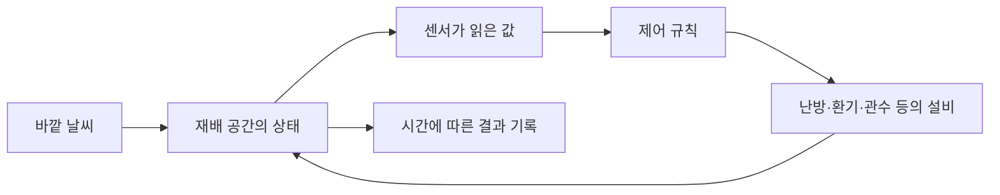

# 스마트팜 시뮬레이터 입문

이 문서는 농업 배경지식 없이 OpenSmartFarmSim의 첫 범위를 판단할 수 있도록 쓴 안내입니다. 아래의 단순한 흐름은 **이 프로젝트를 설명하기 위한 모델**이며, 모든 농장의 표준 구성을 뜻하지 않습니다. 시설재배는 온실이나 수직농장 같은 공간에서 이루어질 수 있고, 수경재배처럼 물을 이용하는 재배 방식도 있습니다. ([USDA 시설재배 보고서](https://ers.usda.gov/publications/108220))

## 스마트팜에서 무엇이 움직이나요?

온실에서는 실제로 온도, 습도, 토양 수분, 빛을 측정하고 관수를 제어하는 사례가 있습니다. ([FAO 온실 센서 사례](https://www.fao.org/platforms/green-agriculture/knowledge/green-practices-repository/detail/low-cost-internet-of-things-sensors-for-greenhouse-monitoring/)) 시뮬레이터는 이 흐름을 컴퓨터 안에서 계산합니다. 같은 상황에서 제어 방법을 바꿨을 때 결과가 어떻게 달라지는지 살펴볼 수 있습니다.

| 말 | 쉬운 뜻 |
| --- | --- |
| 재배 구역 | 온도나 물 공급 상태를 하나로 계산할 공간 |
| 상태 | 지금 공간에 있는 온도나 수분 같은 값 |
| 센서 | 상태를 읽어 제어에 사용할 값을 제공하는 장치 |
| 설비 | 난방기, 환기창, 물 공급 장치처럼 상태를 바꾸는 수단 |
| 제어 규칙 | 센서 값을 보고 설비를 언제 켜거나 끌지 정하는 방법 |
| 시나리오 | 시작 상태·날씨·제어 방법이나 시장 수급·비용 조건을 묶은 가정 실험 |
| 검증 | 계산 결과가 정해 둔 규칙과 참고 자료에 맞는지 확인하는 일 |
| 배지재배 | 흙 대신 코코피트·암면 등 재료에 뿌리를 두고 물과 양분을 공급하는 재배 방식 |
| 작기 | 심고 기르는 때부터 수확까지의 한 재배 기간. 판매와 대금 수령은 뒤에 이어질 수 있음 |
| 결정 시각 `D` | 투자·종묘 주문·계약·정식 중 먼저 확정해야 하는 일을 하기 전, 작물을 고를 수 있는 시점 |
| 자료 판본 | `D`까지 실제 발표되어 볼 수 있었던 통계·시장 자료의 당시 내용. 나중에 고친 수치는 당시 선택의 근거가 아님 |
| 수급 | 시장에 나오는 양(공급)과 사려는 양(수요). 둘 다 출하기 가격과 팔리는 양에 영향을 줄 수 있음 |
| 수확량 / 판매 가능량 / 판매 인정량 | 딴 kg / 선별 뒤 등급을 받아 팔 수 있는 kg / 인도·검수 등 계약 조건을 충족해 실제 매출로 잡는 kg |
| 농가 순수취 단가 | 등급·판매 경로별 정산에서 운송비·수수료 등 약정된 차감을 반영한 농가의 kg당 수취액. 차감 전 계약가격과도 구분 |
| 시장 참고가격 | 도매시장·공식 통계에서 관측한 가격. 해당 농가가 그 가격에 팔았다는 뜻은 아님 |
| 후보 중 최적 | 같은 목표·시설·기간·제약으로 검증된 작물을 비교했을 때의 상대적인 선택. 세상 모든 작물의 절대적인 1등이라는 뜻이 아님 |
| 판단 보류 | 필요한 자료나 검증이 부족해 신뢰할 수 있는 순위를 내지 않는 상태 |

난방 **열수요**는 온실에 필요한 열, **공급열**은 난방기가 온실에 전달한 열입니다. 둘 다 `kWh_th`로 쓸 수 있습니다. 전기 계량기의 `kWh_e`와 연료 사용량(L·kg 등)은 별도입니다. 난방기 효율과 다른 전기 설비의 사용량을 확인해야 실제 구매 에너지를 계산할 수 있습니다.

## 심기 전 선택과 수확 뒤 판매는 어떻게 다르나요?

작물은 심기 직전에만 고를 수 있는 것이 아닙니다. 시설 투자와 종묘 주문에는 준비 기간이 있고, 계약과 판로도 미리 정해야 할 수 있습니다. `D`에 이미 알려진 계약·시장 자료의 당시 판본만 선택의 근거로 삼습니다. 수확은 몇 주에 걸칠 수 있고, 선별한 등급과 판매처의 인수량에 따라 팔리는 kg와 농가 순수취 단가가 달라집니다. 수요·공급, 산지 날씨, 수입, 에너지비·환율 같은 변화는 출하기의 판매량·가격·비용을 함께 흔들 수 있습니다. 미래에는 불확실하므로 첫 시범은 이를 **조건부 시나리오**로만 다룹니다. 자세한 자료·검증 설계는 [시장 설계](MARKET_INTELLIGENCE.md)를 참고하세요.

예를 들어 한 작기를 가정하면, **① 온실 물리 계산**은 과거 날씨와 설비 규칙에서 실내 온습도와 난방 열수요를 계산합니다. **② 미래 시장 상황**은 “출하기 공급이 늘고 납품처 주문이 줄면?”처럼 가정합니다. **③ 농장 경제 계산**에는 사용자가 가정한 수확 100kg, 선별 후 판매 가능 80kg, 인도·검수를 마쳐 판매로 인정된 60kg을 넣습니다. 수확량 중 20kg은 선별에서 빠졌고, 판매 가능량 중 남은 20kg은 아직 매출이 아닙니다. 농가 순수취 단가를 2,500원/kg으로 가정하면 정산 기준 수취액은 15만 원입니다. 이미 차감한 운송비·수수료를 제외한 다른 비용을 18만 원으로 가정하면 차이는 −3만 원입니다. 시장 참고가격이 5,000원/kg이어도 농가의 등급·계약·판매량·차감액이 다르므로 흑자를 뜻하지 않습니다. **이 숫자는 설명용 가정**이며 현재 제품이 미래 가격·수확·판매 가능량·이익을 예측한 결과가 아닙니다.

## 모델은 무엇을 계산하나요?

| 후보 | 사용자가 해 볼 일 | 관찰할 결과 | 첫 버전의 어려움 |
| --- | --- | --- | --- |
| 단일 온실의 온도 제어 | 바깥 온도와 난방·환기 규칙을 바꾸기 | 실내 온도 변화와 모델 난방 열수요·공급열 | 실제 온실을 예측하려면 구조·설비·열 교환을 모델링하고 보정해야 함. 공급열만으로 실제 전기·연료 소비를 알 수 없음 |
| 단일 구역의 관수 제어 | 물 공급 시점과 양을 바꾸기 | 토양 또는 배지 수분 변화와 물 사용량 | 날씨·토양·작물 조건을 정해야 함 |
| 작물 생육·수확 | 재배 조건을 바꾸기 | 생장 과정과 수확량 | 작물 특성과 품종을 포함한 자료와 검증이 필요함 |

온실 환경 모델은 바깥 날씨뿐 아니라 온실 구조와 제어 장치의 영향을 받습니다. ([Wageningen University 온실 모델 연구](https://research.wur.nl/en/publications/a-validated-physical-model-of-greenhouse-climate/)) 관수 모델은 물의 유입과 유출을 일별 균형으로 계산하는 방법이 있으며, [FAO CROPWAT](https://www.fao.org/land-water/resources/tools/software/cropwat/en)가 참고 사례입니다. 생육·수확 모델은 날씨, 작물, 토양, 관리 정보를 요구하고 작물별 특성의 보정·검증이 필요합니다. ([FAO AquaCrop 입력 설명](https://www.fao.org/aquacrop/overview/input-requirements/))

위 표는 계산 모델의 **난이도를 이해하기 위한 비교**입니다. 제품 목표가 지역별 자료 수집부터 3D 재생과 작물 추천까지로 구체화되었으므로, 현재 선택은 [제품 명세](PROJECT_SPEC.md)의 **한 온실 구역 열·수증기 수지 모델**입니다. 바깥 기상, 온실 구조와 설비 규칙으로 안쪽 온도·습도와 난방 열수요를 계산합니다. 난방기가 실제로 쓴 전기나 연료는 효율과 계량값이 있어야 따로 알 수 있습니다. 처음에는 식물의 성장이나 수확을 계산하지 않습니다. 그 상태에서 화면에 식물이 자라는 모습을 그리면 실제 계산과 다른 이야기가 되므로 3D는 계산된 온습도·설비 동작·계산 가능한 열량만 보여줍니다.

작물 비교는 또 다른 단계입니다. 방울토마토를 먼저 검토하고, 오이·파프리카를 비교 후보로 조사합니다. 작물별 생육·수확·비용 검증에 더해, **같은 지역·시설·기간·목표에서 둘 이상 작물을 실제로 비교한 독립 자료**가 있어야 “평가한 후보 중 최적”이라고 말할 수 있습니다. 매번 선택한 장소와 품종이 검증 범위 안인지 다시 확인합니다. 부족한 경우에는 무엇이 빠졌는지 설명하고 **판단 보류**를 표시합니다. 온도가 맞는다는 사실만으로 물·빛·양분·병해·수익까지 맞는다고 볼 수 없습니다.

## 지역, 기후, 종자는 언제 필요한가요?

**이 제품에는 시작부터 지역 좌표와 날씨가 필요합니다.** 대한민국의 좌표를 고르면 관측소의 실제 값과 그 좌표의 차이도 함께 보여줍니다. 관측소 값은 농장 센서값과 같지 않습니다. 종·품종과 작기는 작물 조건을 해석할 때 필요합니다. 아직 품종이 정해지지 않으면 날씨와 온실 계산은 탐색용으로 실행할 수 있지만, 품종별 추천은 보류합니다. FAO의 [AquaCrop 입력 설명](https://www.fao.org/aquacrop/overview/input-requirements/)도 작물 예측에는 기상뿐 아니라 작물·토양·관리 자료가 필요하다고 명시합니다. 이 제품의 첫 범위는 배지재배 온실이므로 AquaCrop의 토양 모델을 그대로 수확 예측에 쓰지는 않습니다.
