# 구현 순서

## 현재 구현 우선순위 — 2026-10-09

[전체 수확 정상 저장·등록·복원](../research/crop-harvest-full-writer-completed-20261009.md)을 로컬 수용했다.
원96517 실제0·producer5,919.306초/fresh211.753초·47,813행 독립 Decimal2200/원값·현재 권리,
인증 backup/정지 DB 뒤 fresh·별도 root3349 실제0·원본2,148/FD·소유 정리·WSL 상한을 확인했다.
3시간/별도900초는 실제 종료 증거로 대체했다. 전체 RHS/writer는 재실행하지 않는다.

[요청 범위 조회/전체 보호 API](../research/crop-harvest-current-read-cost-20261009.md)는6195dd9/bfb038b에서
집중238개·실제 DB와 같은 전체 HTTPS7응답/원70467 실제0·별도 root0으로 수용했다.
summary8.823초/첫64행10.939초/끝1행10.780초로 이전 timeout을 해소했다.
원 manifest는 원 frozen source의 별도 Python으로 검증하고 새 호환 관측은 reader 한 파일 차이만 허용했다.
원량/서명·최초 UTC·현재 권한/끝 검사·읽기 재계산0·30초/2MiB·원본/FD/소유 정리를 유지했다.
[전체 API/대표3D](../research/crop-harvest-full-view-20261009.md)는2a19074에서 원72505/별도 root 실제0으로 수용했다.
실제 같은 DB/API/기존 App의 수확6행/생장10시점/관리5사건·원 C/N/LAI·현재 권한/늦은 정상 응답 정리를 확인했다.
225.535초·23응답·최대 완료 client11.003초/65,064bytes와 원본/FD/소유 정리·WSL 상한을 통과했다.
원75169 도구0의 입구 지연/조기 취소500은 root1로 거부했다. 당시 발견한 조기 종료500은 다음 별도 보완에서 처리했다.
[조기 본문 수신 전 연결 종료](../research/crop-harvest-early-disconnect-20261009.md)는d92ad73에서 수용했다.
새3/집중149개·원89030/별도 root 실제0·같은 원 DB/TLS의500→422/조회0·정상 원 wire/현재 권한과 정리를 확인했다.
37.418초·7응답·최대 정상10.798초/486,219bytes·원본2,148항목/FD·WSL 상한을 통과했다.
[전체 수확 사용자 전환](../research/crop-harvest-full-user-preview-20261009.md)도 로컬 수용했다.
고정 서버7ff954b/관측74557e1·후보20355 종료0/51.814초→원37119 종료0/PG 정리→동일 Nginx reload5173,
전환 후98309 종료0/16.656초→실제 화면58094 종료0/37.668초→별도 root95128 종료0이다.
원 수확3행/같은 UTC WebGL50 C/N·LAI·현재 권한/원 wire·원본/DB/FD·512MiB/1GiB/소유 정리를 확인했다.
앞선 관측 실패4개와 전환 사전 root 실패2개는 보존하고 최종 성공으로 덮어쓰지 않는다.
전체47,813행 독립 대사·fresh 실제 현재 조회/보호 API·대표 화면·조기 종료·사용자 전환을 대조해
`crop-harvest-full-mass-load`/`crop-harvest-replay`를 합성 소프트웨어 범위로 수용했다.
일반 압축 빌드의 WSL 한도 보완은 해당 재생 범위 밖의 별도 보류이며 원 수식을 재실행하지 않는다.

**다음 계산 순서:** 기후/물·양분/구매 에너지 → 사용자 실행/Decimal 경제.
첫 작은 단계는 수용된 순간 수관 교환과 기존 온실 열/수증기의 입력·시간격자·수지 대조,
동적 결합 계약/검증 사례 확정이다. 사용자 접수/진행 상태 U3와 확정 prefix의 계산 중3D는 별도 수용한다.
앞선 미리보기0.5–1.5집중시간 추정은 이번 실제 전환 증거로 대체한다. 다음 계산/API 준비일은 계약 분해 뒤 갱신한다.
U1/U3·최종 통합 UI와 실제 품종/독립 자료/관문은 미수용이다.
현재 사용자 화면은 완료 생장/수확을 조회한다. 실행 상태·새 checkpoint 자동 갱신은 없다. 아래 시각별 관측은 당시 기록이다.

같은 이전921d0e7 hosted Backend37918274666은22:06 KST 확인에서0/4/5 성공·1/2/3 실패·집계 failure로 종료했다.
실패 로그는2/3의 과거 수확 관측 거부74개와1의 소유 프로세스 검사2개를 확인했다.
로컬 관측 판본 보완을 hosted 통과로 대신하지 않는다. 다음 push 전 소유 프로세스 검사2개의 ambient 자식/시험 격리 원인을 재현·보완한다.
실제 종료를 확인했으므로 진행 중 CI를 보존하기 위한 push 보류는 해제됐으며, 잔여 실패 보완은 별도다.

[전체166일 합성 부모의 게시·보존·현재 복원](../research/crop-harvest-full-parent-restored-20261009.md)을 로컬 수용했다.
원95915/36916 실제 도구0·별도 감사0: 모든47,809sample/5event·UTC/121상태 대사,
원 plan/key 정상 게시/인증 backup·원 PG 정리 후 현재 fresh SCRAM/권리·계정 거부·읽기 RHS0,
원본/source/미리보기 보존·512MiB/1GiB 한도·소유 정리를 통과했다. 원95086 실패는 남긴다.
후속 전체2,626.363초이고 단순 source 복원 대기는 해소됐다.

[제한된 실제 전체 부모 조회 비용](../research/crop-harvest-full-parent-read-cost-20261009.md)은
원34669 도구0/자식0·다섯 요청44.194초/300초, 원 record/원량·SCRAM·FD4→4·원본 보존·
읽기 RHS/행 생성/게시0·fresh PG 정리·WSL 한도로 수용했다. 개별 조회7.384–8.383초다.
[현재 조회 사실 묶음](../research/crop-cycle-calculation-query-facts-20261009.md)은 격리 fedd8e7에서
고유69개·실제 전체 부모5요청/권리·원 도구0·소유 정리로 로컬 수용했다. 같은 요청 합40.074→35.413초,
summary snapshot8→6/sample9→7이며 현재 farm4/DB 연결345는 유지했다.
조회 사실 묶음은 main f79ef64에 통합했다. 기존 작은 미리보기를 원83196 실제 종료0으로 정상 정리한 뒤
새 미리보기는 별도 고정 source를 사용한다.

[완료 전체 생장 부모의 보호 API/대표 성장3D와 사용자 전환](../research/crop-full-parent-api-view-preview-20261009.md)을
원7678 도구0/119.766초·고유5시점/5사건·현재 권리/계정·원본/FD/정리·512MiB/1GiB로 수용했다.
원59276 도구0의 전환 뒤 frontend/summary200·47,809시점/1,816,704완료 걸음을 확인했다.
`localhost:5173`에서 원 시점 번호/마지막 시점으로 이동한다. 수확 미등록과 실시간 U3 미완료를 표시한다.
window40개/타입·압축을 끈 제품 빌드는 통과했으며 일반 압축 빌드의 단일 RSS 실패는 별도 보류다.
이전1–3집중시간 추정의 화면 연결 자식은 완료됐고 전체 수확·U1/U3·최종 제품 완료일을 뜻하지 않는다.
**18:12 KST 추가:** [수확 내부 전체 행 검사](../research/crop-harvest-row-verification-20261009.md)를 e2eeb8c에서 로컬 수용했다.
집중70개/실제 SCRAM1개·고유71개·원74739/48655 도구0, 작은3page의 검사 본체 부모 조회6→2와
전체 blob/행 SHA·논리적 응답2MiB·권리 철회/rollback·원본/미리보기/FD·소유 정리·WSL 상한을 확인했다.
전체748page의1,496→2는 호출 구조의 계산이며 전체 wall 실측은 아니다. writer의 생장748page 읽기 비용은 남았다.
당시 다음 `crop-harvest-full-writer-prefix-cost`에서 정상 writer 처음2page·통제 중단/HEAD·DB 미게시를 실제 대사하도록 계획했다.
보존 자료/측정 경로 재사용 조건으로 계약·준비·부분 실측은1–2집중시간 잠정이며, 전체 예산/완료일은 그 실측 뒤 정한다.
**18:37 KST 추가:** [정상 부분 비용](../research/crop-harvest-writer-prefix-cost-20261009.md)을 dc4b5a6에서 수용했다.
원74534/85029 도구0·64개·실제 전체 부모128행/2page·부분56.596초·독립 Decimal2200·원량/UTC·미게시/권리/정리를 확인했다.
단순 읽기 호출 외삽은97.6분이며 전체 wall 실측은 아니다. 다음 정상 전체 writer/registry·독립 대사/backup은
10,800초(3시간), 원 DB 정지 뒤 fresh reader는 별도900초의 감독 상한으로 준비한다.
직전 부분 실측1–2집중시간 잠정은 완료 증거로 대체한다. 전체 종료/감사·수확 API/3D 및 제품 완료일은 별도다.
**19:00 KST 추가:** [정상 전체 writer 실행](../research/crop-harvest-full-writer-running-20261009.md)을
고정 c0cc687/원96517에서18:52:18 KST 시작했다. 원93770 집중81개 종료0, 실제 원47,809sample/5event·
원 artifact/새 합성 profile 연결 사전 검사를 통과했다. 실행480.404초의 durable JSON53개를 관측했으며
DB 등록/인증 backup/전체 대사 marker는 false다. 실행/보호 미리보기 identity가 살아 있고 최종 수용은 아니다.
producer 마감21:52:18 KST·이후 fresh900초 상한을 유지한다. 실제 종료/별도 root 감사 전 전체 writer를 체크하지 않는다.
다음은 **진행 중인 정상 전체 수확 writer/registry·독립 Decimal 대사
→ 수확 인증 보존/fresh reader → 수확 보호 API/대표3D → 기후/물·양분/구매 에너지 → 사용자 실행/Decimal 경제**다.
전체 RHS는 재실행하지 않는다. 부분 실측으로 정한 전체 예산을 사용하며 관측 실패만으로 같은 실행을 재시작하지 않는다.

UI 후보의 [같은 웹 소스 hosted 회귀](../research/crop-ui-web-hosted-regression-20261009.md)는
웹1,028개·Chromium140개/skip0·타입/빌드/audit까지 통과했다. 같은 기능 시험을 변경 없이 반복하지 않는다.
남은 U1 수용은 원3상태 디자인 대조/실제 공동 DB·API·브라우저/WSL 자원·배포다.
현재 미리보기는 완료 전체166일 부모의 저장47,809시점을 읽는다. 자동 결과 선택과 계산 중 상태 갱신은 없다. 같은 실행 상태·확정 checkpoint/계산 시각/갱신 시각·완료 결과 연결은 U3다.
U1/U3·실제 품종/독립 자료·관문은 미수용이며 운영 기반 고정은 유지한다.

**19:13 KST CI 국소 보완:** [수확 보호 복원 시험의 endpoint 형식](../research/crop-harvest-ci-endpoint-binding-20261009.md)을
6fcf6a0에서 로컬 수용했다. 원 CI의 int/str 포트 해시 차이를 정확히 대사하고 원14421 RED1→
같은 TCP/Python3.12.13 원49894 GREEN0·기존 local 원17664 GREEN0과 관련60개/원87796 종료0을 확인했다.
예상 포트 시험 한 줄만 변경했다. 제품 코드/권한·FD·원본/source/진행 중 전체 writer·미리보기/소유 정리는 보존했다.
부모 hosted 분할5/전체 CI는 미수용이고 분할3 pidfd는 다음 별도 국소 수정이다.
전체 writer가 진행 중인 동안 확인된 핵심 경로 CI 실패만 보완하며 계산 순서와 운영 기반 고정은 유지한다.

**19:30 KST pidfd 국소 보완:** [배포본 호환 수정](../research/owned-research-pidfd-compatibility-20261009.md)을2847588에서 수용했다.
원87572의 exact uv3.12.13 RED10→최종 원85784/61087 두 배포본 각30개/0, 실제 pidfd·보호/소유·실패/FD·정리를 대사했다.
원 소유/보호 AST와 진행 중 고정 helper/전체 writer·미리보기는 보존했다. 표준 ctypes 경로 외의 기반 확장은 없다.
두 CI 국소 수정의 동일 판본 hosted 회귀가 다음 검증이며 상위 분할3/5·전체 CI는 아직 체크하지 않는다.
원 전체 writer96517의 진행/마감은 그대로 유지하며 완료/독립 대사·보존/fresh 이후에 수확 API/3D를 평가한다.

**19:51 KST API 연결 준비:** [원 저장/HTTP 대사 검증기](../research/crop-harvest-http-reconciliation-20261009.md)를
b4f2482에서 로컬 수용했다. 원57894/별도 root9112c1 실제0·새29/기존7=36개,
현재 정상 writer 소유6행/보호 ASGI의 summary/첫·끝 행 SHA·UTC/원량·비용 경계를 확인했다.
실제 전체 DB/TLS/API·3D 수용은 아니며 기존30초/2MiB를 유지한다.
원96517은59분/durable JSON473개·DB 등록/backup/전체 대사 전으로 진행 중이다.
전체 writer 종료/fresh·root 수용 후 **같은 고정 backend/manifest의 보호 API 비용→대표 같은 UTC3D**로 간다.
준비에서 발견한 기존 API 두 시험의 과거 artifact code 판본 거부74개는 별도 작은 자식으로 기록했다.
과거 영수증을 변경하지 않으며 전체/hosted 수용은 보류한다. 현재 화면의 실행 상태 자동 갱신은 U3에 남는다.

**20:07 KST API 자료 판본 보완:** [현재 실제 DB 값과 과거 거부](../research/crop-harvest-api-fixture-current-version-20261009.md)를
79cf1fb에서 로컬 수용했다. 원89157의 실제 SCRAM/정상6행·fresh2Python과 원9291의174개,
별도 root081c42 실제0·고유175개·원본/소유 정리·WSL 상한을 확인했다.
과거 signed 영수증은 변경하지 않고 새 정상 원 값을 별도로 고정했다. 앞선74실패의 로컬 자식만 해소했다.
hosted921d Backend는 분할0 성공/1·2 진행/3·4·5 대기다. 새 push로 현재 CI를 취소하지 않는다.
원 전체 writer96517은75분/durable JSON602개·DB 등록/backup/전체 대사 전이며 같은 순서/마감을 유지한다.
전체 writer/fresh→보호 API 비용→대표 같은 UTC3D와 U3·실제 자료/관문은 각각 미수용이다.

## 최종 제품 UI 통합 — 2026-10-09 사용자 요청

현재 `web/src/App.tsx`에는 조사·작성 농장·작업·열/생장 3D·경제·평가의 개별 화면이 있다.
`web/demo/`의 기록 응답 데모와 다르며, **지역 선택부터 작물 생산·자원·경제까지 연결하는 최종 제품 UI는 미수용**이다.
기존 `web-shell`/`web-replay`/`end-to-end-g1`을 완료 처리하지 않는다. 제품 범위는
[명세 §5.4](../docs/PROJECT_SPEC.md#54-최종-제품-ui-통합), 작은 수용 단위는
[작업 목록](todo.md#최종-제품-ui-통합-2026-10-09)에 둔다.

### 구현 순서와 의존성

| 단계 / 확인 가능한 산출물 | 착수 조건과 연결 | 예상 집중 작업량 |
| --- | --- | --- |
| U0 기존 앱의 실제 동시 기동 / 접속 주소·저장 결과 조회 안내 | 완료 전체 합성 부모/수확의 별도 복원 DB/API; 실시간 진행 제외 | [현재 전체 생장·수확 기동 수용](../research/crop-harvest-full-user-preview-20261009.md) |
| U1 같은 농장·작기의 저장 결과 목록 / 새로고침 뒤 재선택 | `product-ui-result-catalog`; 현재 등록/권리 조회 API, 불변 결과 식별자 | 1–2일 |
| U2 지역→자료 근거→시설·품종·작기 입력 / 쉬운 말의 단계형 화면 | `product-ui-region-input`; 기존 조사/수집/작성 API 재사용. 지도 타일 권리는 별도; 좌표·주소 대체 허용 | 2–4일 |
| U3 요청→조사·검토·계산 상태→저장 완료 / 재접속·취소·보류 | `product-ui-execution`; U1/U2와 `crop-execution-link`, 실제 CLI 작업자 접수/현재 상태 | 2–3일 |
| U4 저장 생장→3D·수확→자원·경제 / 같은 실행의 결과 화면 | `product-ui-results`; 저장 생장·수확 전체 수용 이후 `crop-climate-coupling`·물/양분·구매 에너지·`crop-economic-link`를 준비된 순서대로 연결 | 2–4일, 계산 모듈 대기 제외 |
| U5 실제 API/DB/작업자/브라우저의 전체 사용자 경로 / 검증 기록 | `product-ui-integrated-acceptance`; U1–U4, 기존 `end-to-end-g1` 및 운영/권리 증거와 대조 | 2–3일 |

1일은 한 작업자의 6시간 집중 작업을 뜻하는 계획 단위이며 연속 24시간 실행의 환산값이 아니다.
**UI 작업 자체는 9–16집중일(54–96시간)**의 잠정 추정이다. 기존 개별 화면을 재사용하고
새 프레임워크·별도 작업 큐·운영 기반 확장을 도입하지 않는 조건이다. 화면별 계약을 확정하면 다시 추정한다.
독립 자료 확보는 U1/U2와 병행하며 UI 개발을 막지 않는다. 실제 원천이 없으면 자료 부족/보류 경로를 검증한다.

**완료 날짜의 조건:** 지금부터 하루 6시간을 UI에 배정하고 필요한 API가 모두 준비됐다면 단순 합산 범위는
2026-10-18–10-25다. 현재는 기후/자원·작물 경제·사용자 실행 연결이 미완료이고 핵심 계산이 우선이므로
이 날짜를 제품 완료 약속으로 사용하지 않는다. 일정은 `max(각 UI 단계 준비일, 해당 계산/API 준비일)` 뒤에
그 단계 작업량을 더해 갱신한다. 전체 작기 부모/성장·수확 API·대표3D와 사용자 전환은 확인했다.
U1 및 기후/자원/경제·실행 API의 남은 실측으로 후속 날짜를 조정한다. 실제 국내 품종/농장 자료·시장 판본·독립 검증과 배포 계정의
확보일은 미정이므로 **검증된 생산/마진 예측·추천·production 출시일은 아직 산정할 수 없다.**

U0는 사용자가 기존 앱을 확인하는 내부 실행이다. U1/U2 준비를 계산 경로와 병행할 수 있으나
후속 계산 구현 순서는 **생장 계산 → 저장·3D → 생산량·자원·경제**를 유지한다.
상위 작업의 수용은 화면의 존재 또는 합성 화면 시험으로 대신하지 않는다.
현재 U0는 별도 복원 DB의 완료 전체166일 생장/수확 결과를 읽는다. 실행 상태/새 체크포인트를
구독하거나 자동 조회하지 않는다. U3에서 같은 실행의 확정 checkpoint·계산 시각·갱신 시각을
서버 상태 조회로 연결하고 완료 게시된 같은 결과를 U1/U4에서 열어야 한다.
계산 중인 미확정 상태를 그리지 않는다. 계산 중 3D는 현재 권리로 공개 가능한 확정 prefix와
그 경계가 검증된 뒤 별도 작은 작업으로 수용하며, U0의 재생을 그 증거로 사용하지 않는다.

U1은 [서버 목록 계약](../contracts/crop-result-catalog-v1.md)의 metadata 조회 →
보호 API/OpenAPI → 등록 작물 선택 조회/두 SDK → 기존 작성 농장 목록의 결과 선택 → 실제 DB/API/브라우저 수용으로 나눈다.
첫 두 판본은 verified 생장·등록 수확이다. 목록은 현재 권리와 서명 metadata를 확인하며
선택 시 파일/원 수치/현재 권리는 기존 query로 다시 검사한다. 목록 조회에 전체 결과 검증 비용을
붙이거나 목록을 원 파일/관문 승인으로 표시하지 않는다. 기존 기관/구획/startup 판본의 범위도
대사한 뒤 상위 U1을 판단한다. 세부 작업량은 기존 U1의1–2집중일 안에서 실측으로 갱신하고,
현재 실시간 전체 계산 연동과 최종 제품 UI 완료일로 전가하지 않는다.

기존 `FarmAuthoringSummary`/웹 farm catalog에는 crop_id·species/variety가 없다.
결과 목록의 필수 crop_id를 사용자가 추측하는 의존성 누락을
[현재 등록 작물 조회](../contracts/crop-result-farm-selection-v1.md)로 보완한다.
같은 현재 farm graph/원 hash와 사용자 등록 의도를 읽고 선택 시 기존 결과 검사를 유지한다.
이 서버 자식과 SDK 수용 전에는 실제 선택 화면을 게시하지 않는다. 고정 계약의 화면 설계는 병행한다.
[등록 작물 서버 자식](../research/crop-result-farm-selection-implementation-20261009.md)은
집중348개·실제 별도 SCRAM/HTTPS22응답 중 선택8개/원1작물·원 종료0/정리로 로컬 수용했다.
등록 작물 웹 SDK와 목록 SDK의 남은 빌드·실제 선택 화면/U1 및 실시간 U3는 미완료다.

[metadata 서버 자식](../research/crop-result-catalog-metadata-implementation-20261009.md)은
집중30개와 별도 실제 SCRAM/각1건·현재 권리/변조·투영 뒤 철회·원 생성0/정리로 로컬 수용했다.
다음은 보호 API의 실제 시간/bytes·현재 주체 재확인이고, 다수 목록/동률의 실제 DB 경계도 확인한다.
기존 화면과 진행 중인 전체 계산은 유지되며 새 목록/실시간 연동은 아직 UI에 연결되지 않았다.

[보호 API와 필요한 등록 비용 보완](../research/crop-result-catalog-api-implementation-20261009.md)은
최종 집중296개/OpenAPI·실제 SCRAM/HTTPS14응답·생장21건의20+1/동률·수확1건으로 로컬 수용했다.
실제20건30초 초과를 단계별 동일 등록 검사 묶음으로 보완했고 원 조건/권리/응답 bytes를 보존했다.
최대20건6.483초/8,237bytes·원7187 종료0·370source/새FD0/소유 정리를 확인했다.
다음 U1 자식은 SDK/기존 농장 목록에서 결과 선택→실제 DB/API/브라우저다. 실시간 U3는 미완료다.
[SDK 후보](../research/web-crop-result-catalog-client-implementation-20261009.md)는 실제 HTTPS 원문7개와
웹949개/타입 자식 종료0을 확인했으나 당시 동시 자원 한도의 빌드 종료로 수용을 보류했다.
후속 [등록 작물 SDK/현재 두 SDK 수용](../research/web-crop-farm-selection-client-implementation-20261009.md)은
전체1,011개·타입/빌드·원66094 종료0/19.046초·source/미리보기/소유 정리로 이전 빌드 보류를 해소했다.
원 계산/미리보기와 기존 배포 파일을 유지하며 다음은12ui-design 기반 저장 결과 선택 화면→실제 DB/API/브라우저다.
[실제 디자인/HTML 준비](../research/product-ui-result-selector-design-preparation-20261009.md)는4후보 중 A와3상태의
원 이미지/HTML·CLI 종료를 확인했다. 아직 구현/배포하지 않았다. 목록 클릭의 전달에는 기존 CropReplay 최초 판본
선택과 HarvestReplay의 초기 수확 ID/같은 부모 연결도 포함한다. 이를 화면 계약의 작은 선행 자식으로 나눈다.
실제 구현 뒤 원 승인 이미지에 대한12ui improve와 좁은 폭/키보드·취소/권리 검증을 마친다.
[목록 화면 구현 후보](../research/web-crop-result-catalog-screen-candidate-20261009.md)는
농장/등록 작물/같은 결과의 선택을 기존08에 연결하고 새16개+SDK 회귀176개·타입·일반 제품 빌드를 확인했다.
선택 전달 자식 수용과 병행한 개발이며 화면 수용/배포는 아니다. 새8개·선행22개 브라우저 조건,
원 desktop-loaded/desktop-empty/mobile-loaded의 improve와 렌더 대조, 실제 공동 DB/재시작 검증이 남았다.
현재 전체 계산/미리보기의 동시 자원 조건에서 브라우저를 반복하지 않고 전체 게시/보존·source 정리 뒤 수행한다.
이후 같은 실행의 서버 진행/확정 checkpoint→완료 결과 연결은 U3의 별도 계약/수용으로 진행한다.
[실제 hosted UI 실패 보완](../research/crop-ui-hosted-failure-fixes-20261009.md): 원30개 중22통과/8실패를 확인했다.
컨테이너 타입 선언 누락은 같은 제외 조건에서 RED→GREEN, 현재 타입·집중211개/원69406 종료0이다.
목록 접근성 이름과 수확 summary의 부모 검사 순서를 수정했으나 수정판 브라우저/이미지·원 디자인·실제 DB 수용은 남았다.
기존 사용자 미리보기와 전체 계산은 유지하며 U1/U3 체크·배포로 전가하지 않는다.
[수정판 실제 이미지/Compose](../research/crop-ui-application-runtime-hosted-20261009.md)는
별도37893449391/0f865d1의 원 terminal success로 확인했다. PNG export·두 이미지/격리·API/작업자·소비자·scope 경로를 통과했다.
수정판 브라우저30개/원 디자인·실제 DB 선택과 기존 PR 전체 Backend/UID는 별도 미완료다.
[수정판 웹 전체 회귀](../research/crop-ui-web-hosted-regression-20261009.md)는 별도37895265205/58adcdd에서
같은 웹 tree의 타입·1,028단위·일반 빌드/audit·Chromium140개(예정30개 포함)를 통과했다.
기능 회귀의 같은 소스 반복 대신 원3상태 improve/렌더 대조→현재 실제 공동 DB/API·재시작·WSL 브라우저
자원/정리를 확인한다. 이 증거는 U1/U3 수용이나 기존 미리보기 교체가 아니다.
기존 hosted Backend의 실제 수확 인증 감사 실패에 필요한
[초기화 설정 후보](../research/ci-explicit-host-scram-candidate-20261009.md)는 로컬 A/B만 확인했다.
[8dd386d 실제 종료](../research/crop-result-ci-terminal-20261009.md)는 Backend2/3 성공·0/1/4/5/집계 실패다.
세 자식 import와 게시 선언 fixture의 역사적 source 의존을 먼저 재현/수정하며,
역할 정리 교착/자원 감사는 별도 원인을 확인한다. 이 낮은 자원 작업은 전체 복구 계산과 병행할 수 있다.
진행 중 frozen producer와 운영 기반 범위는 유지하고 새 hosted 전체/UID/정리 수용은 별도다.
선언 source 격리와 세 자식 import는 [고유13개·두 실제 소유 DB의 로컬 수용](../research/crop-result-ci-fixture-compatibility-20261009.md)을
확인했다. 원83707 종료0/443.008초·PG2개 정리0·보호4/source/dist 보존이다.
분할5 교착과 분할1/5 잔여 원인·수정 후 hosted18/Backend/UID는 별도 미완료다.
분할1은 원 로그의 구체적인 `reader.pgpass` 경로와 같은 순서의 실제 SCRAM 재현으로
[보존 단위 시험의 파일 누수](../research/crop-harvest-storage-test-cleanup-20261009.md)를 수정/로컬 수용했다.
원86839 종료0·17개와 생성 후 단언 실패의 소유 파일 정리도 확인했다. 분할5 교착/잔여·hosted는 남아 있다.
분할5의 정확한 권한 거부 시험은 원source/CI Python의 [PG16 단일 대조](../research/artifacts/crop-result-ci-role-teardown-probe-reference-20261009.json)에서
재현되지 않았다. 같은 환경의 무조건 반복이나 역할 정리 변경보다 hosted18의 lock/transaction 증거 확보를 다음 조건으로 둔다.

**진행 관측 — 2026-10-09 10:02 KST:** [새 전체 부모 실행](../research/artifacts/crop-harvest-parent-full-started-reference-20261009.json)을09:12 KST 시작했다.
동일 원 모델/입력의 새166일 계산 판본이며10:02 KST 같은 프로세스의 확정 checkpoint는243,447걸음/commit61이다. 완료/수용은 아니다.
원9시간 상한18:12 KST·이전 전체7시간15분 근거의16:12–18:12 종료 추정은 조건부다.
모든 원 행/121상태 대사→정상 게시/인증 보존→원 DB 정리 후 fresh 복원·원 종료/자원 감사 뒤 전체 부모를 평가한다.
수확 writer/API/3D와 기후/자원/경제·실제 자료 관문은 후속이다.

**최신 수용 — 2026-10-09 10:02 KST:** [새 부모의 작은 수확 저장·보존](../research/crop-harvest-storage-preservation-small-implementation-20261009.md)을
원52100 종료0·집중10개/실제 DB1개·DB 정지 후 fresh 현재 조회로 로컬 수용했다.
원5행/UTC·Decimal 독립 대사·서명/최초 시각·현재 권리/계정·조회 재계산0과 원 입력/artifact/FD·소유 정리를 확인했다.
전체249.050초/900초·raw330,541bytes·동시 전체 계산 포함 RSS 합701.11MiB다. 작은 저장 자식만 완료했다.
전체 부모는10:02 KST 같은 프로세스에서243,447걸음/commit61로 진행 중이며 원18:12 마감/수용 보류를 유지한다.
다음은 전체 부모 최종 감사→전체 수확 writer/registry→실제 API/대표3D→기후/자원/Decimal 경제다.
실제 품종/농장 Run/국내 독립 자료0건·G0–G4/생산/미래 마진/추천 hold와 운영 기반 고정을 유지한다.

**선행 수용 — 2026-10-09 09:10 KST:** [정상 producer와 인증 보존의 작은 구성](../research/crop-harvest-parent-production-small-implementation-20261009.md)을
원17264 종료0·집중11개/실제 DB1개·원 DB 정리 후 현재 checkout의 fresh 복원으로 로컬 수용했다.
고정 `dc7b852`의 원392 source guard를 유지하고 작은120걸음/3시점/3사건·121상태/수지를 fresh 대사한 뒤 정상 게시·인증 보존했다.
전체101.710초/600초·raw308,638bytes·단일/소유 RSS130.61/355.31MiB·1,400 source·소유 정리를 확인했다. 작은 구성만 완료다.
다음은 같은 원 모델/입력의 새 전체166일 계산·모든 원값/현재 query 복원→새 source/profile의 전체 수확 writer/등록→실제 API/대표3D다.
전체는 준비부터9시간 상한·이전7시간15분 근거로7–9시간 잠정이며 실제 종료/정리 전에는 수용하지 않는다.
그 뒤 기후/물·양분/구매 에너지→사용자 실행/Decimal 경제다. 실제 품종/농장 Run/국내 독립 자료0건·G0–G4/생산/마진/추천 hold를 유지한다.

**선행 수용 — 2026-10-09 09:00 KST:** [작은 부모 DB·인증 자료 보존](../research/crop-harvest-parent-backup-implementation-20261009.md)을
원90143 종료0·집중11개/실제 DB1개·원 DB 정리 후 fresh Python 복원으로 로컬 수용했다.
원120걸음/3시점·서명/원량/UTC와 현재 권리·계정/변조 거부, 조회 RHS0·1,480 source·소유 정리를 확인했다.
전체81.287초·raw backup307,294bytes·단일/소유 RSS129.76/388.52MiB다. 이 보존 자식만 완료했다.
기존 전체166일의 DB/config/무작위 서명 key 삭제로 원 인증 복원은 불가하다. 후속에는 같은 모델/입력의 새 전체 계산 판본이 필요하다.
다음은 작은 정상 producer+보존 구성→새 전체 계산/원값 대사·현재 query 복원→새 source/profile 판본의 전체 수확 writer/등록
→실제 API/대표3D→기후/물·양분/구매 에너지→사용자 실행/Decimal 경제다.
종전 첫 복원2–4시간 추정은 철회한다. 이전 전체7시간15분을 근거로 준비 검증 후7–9시간 실행·대사를 잠정 잡고 후속 완료일은 실측 뒤 정한다.
실제 품종 입력·농장 작물 Run·국내 독립 자료0건, G0–G4/생산/미래 마진/추천 hold와 운영 기반 고정을 유지한다.

**선행 수용 — 2026-10-09 02:48 KST:** [전체 수확 수량·용량 대사](../research/crop-harvest-full-capacity-implementation-20261009.md)를
원78826 종료0·집중38개·전체 명령85.238초·1,474 source/원본/FD identity·소유 정리로 로컬 수용했다.
원47,809시점/5사건에서47,813행을 RHS0으로 만들고 Decimal 독립 수량/반올림 수지와 단위·목적·미배정을 대사했다.
748page/307,675,603bytes·root/HEAD/atomic 예약 상한311,878,099bytes≤512MiB,
알려진 root95,883bytes·단일/소유 RSS106.55/125.51MiB다. 용량 자식만 완료했다.
실제 전체 writer/DB/API/대표3D와 replay 부모는 미완료다. 다음은 정리된 DB/인증 자료의 실제 전체 부모 복원
→같은 raw profile의 전체 writer/등록·fresh 현재권리→API/대표3D→기후·물/양분·구매 에너지→사용자 실행/Decimal 경제다.
첫 복원은 보존 자료/검증 경로 재사용 조건의2–4집중시간 잠정이며 전체 실행 예산은 실제 복원 뒤 측정한다.
실제 품종 입력·농장 작물 Run·국내 독립 자료0건, G0–G4/생산/미래 마진/추천 hold는 유지한다.

**선행 수용 — 2026-10-09 02:22 KST:** [같은 실제 DB의 수확·생장3D](../research/crop-harvest-view-native-implementation-20261009.md)를
원69379 종료0·2통과/226.498초·828 source/소유 정리로 로컬 수용했다.
원6행/3시점·50 C/N/LAI·현재 권리/계정·취소/늦은 응답을 실제 SCRAM/보호 HTTPS/빌드 App/WebGL로 대사했다.
metadata/시각/응답 대체0·조회 RHS/행 생성/게시0이며 완료200응답9개의 양쪽 bytes/SHA가 같다.
13요청·최대22.722초/32,659bytes·지정 heap/GC/GPU thread의 소유 RSS 합1,030,803,456bytes≤1GiB다.
작은 native/view 부모만 추가 완료했다. 전체166일 새 질량 부하·replay 부모와 일반 운영 용량 수용은 남아 있다.
다음은 원 전체 결과의 RHS0 질량/배정 용량 대사→실제 전체 부하→기후/물·양분/구매 에너지→사용자 실행/Decimal 경제다.
실제 품종 계수·농장 작물 Run·국내 독립 자료0건, G0–G4/생산/미래 마진/추천 hold는 유지한다.

**선행 수용 — 2026-10-09 01:32 KST:** [수확 표/기존 생장3D 화면](../research/web-crop-harvest-view-screen-implementation-20261009.md)을
새 Chromium10개/기존15개(1+14분할)·웹851개·타입/빌드·원13586/24832/30303 종료0·820 source/정리로 로컬 수용했다.
원 목적/단위/미배정·현재 부분 범위/전체 합계·합성 비교/hold를 유지하며 같은 UTC의 실제 캔버스 C/N도 대사했다.
선택/계정/부모·권리 실패/취소/늦은 응답의 이전 값 제거와 모바일/키보드를 확인했다.
소유 fixture의 metadata/시각을 맞춘 실제 App 검증이며 새 공동 DB/백엔드 HTTPS 증거는0회다.
화면 자식만 완료했다. 실제 native/전체166일 질량 부하·view/replay 부모는 미완료다.
다음은 작은 같은 실제 DB/API/대표 WebGL→전체 작기 질량 부하→기후/물·양분/구매 에너지→사용자 실행/Decimal 경제다.
지정 시험 heap/viewport에서 소유 RSS 합1GiB/단일512MiB와 정리를 확인했으며 일반 운영 용량 수용은 아니다.
실제 계수/품종 입력·농장 작물 Run·국내 독립 자료0건, G0–G4/생산/마진 예측·추천 보류는 유지한다.

**선행 수용 — 2026-10-09 00:50 KST:** [저장 생장·수확 범위 결속](../research/web-crop-harvest-growth-binding-implementation-20261009.md)을
집중34개/웹 전체851개(기존817 포함)·타입/빌드·원 도구86385 종료0·777 source/정리로 로컬 수용했다.
같은 농장/부모/원 hash·상태·저장 UTC만 연결하며 대응 시점이 없는 사건은 보간하지 않는다.
현재 범위와 전체 저장 합계·합성/hold를 구분한다. 새 실제 DB/HTTP/화면/WebGL 검증은0회다.
수확 view의 결속 자식만 완료했고 표/3D·실제 통합/전체166일 질량 부하·replay 부모는 미완료다.
다음은 수확 표/기존 생장3D 화면과 선택/취소/권리 실패 제거→실제 DB/API/대표 WebGL이다.
기후/물·양분/구매 에너지→사용자 실행/Decimal 경제·실제 자료/독립 검증은 후속이다.
실제 계수/품종 입력·농장 작물 Run·국내 독립 자료0건, G0–G4/생산/마진 예측·추천 보류는 유지한다.

**선행 수용 — 2026-10-09 00:32 KST:** [등록 수확 결과 웹 SDK](../research/web-crop-harvest-client-implementation-20261009.md)를
집중97개/웹 전체817개(기존720 포함)·타입/빌드·원 종료0·458 source/정리로 로컬 수용했다.
실제 HTTPS 원 응답5개 SHA/길이·원6행/UTC/단위/정확 수량·합성/미배정·관측 비교/hold를 보존했다.
공통 Bearer·30초/2MiB transport와 순차 페이지·전체성/취소/혼합 거부를 연결했다.
SDK와 선행 API를 합친 HTTP/SDK 부모만 추가 완료했다. 수확 표/3D·replay 부모는 미완료다.
선행 합성166일 생장 DB/API/대표3D는 유지한다. 새 수확 경로의 전체166일 질량 부하는 별도다.
다음은 같은 UTC의 수확 목적·미배정 표/기존 생장 수치3D→실제 DB/API/대표 WebGL의 작은 검증이다.
그 뒤 기후/물·양분/구매 에너지→Decimal 경제 연결로 진행한다.
실제 계수/품종 입력·농장 작물 Run·국내 독립 자료0건, G0–G4/생산/마진 예측·추천 보류는 유지한다.

## 작물 생산과 성장 3D 우선순위 (2026-10-04)

최종 목표를 기준으로 다음 순서를 우선한다. 이 절의 현재 계획 뒤에 남긴 날짜별
진행 기록은 당시 상태다. **유량/적용 영역/시간 적분과 불변 합성 연구 저장을
로컬 집중 172개/434.49초·실제 SCRAM으로 수용했다. 저장 조회 API도 집중
316개/194.11초·실제 HTTPS/SCRAM으로 수용했다. `web-crop-replay`도 웹 단위
209개·집중 Chromium 10개·실제 SCRAM/HTTPS/장면 대사 1개로 로컬 수용했다.
원천 감사·과실 구획 명세·50구획 순간 이동도 로컬 수용했다.
명시적 착과/진입 질량의 배분 정책도 독립 대수/수치로 수용했다.
순수 제품 배분도 새 77개/기존 포함 315개로 로컬 수용했다.
문헌식 수요·50구획 순간 결합도 새 86개/기존 포함 401개로 로컬 수용했다.
전체 기관의 순간 결합도 새 43개/기존 포함 444개로 로컬 수용했다.
짧은 과실/기관 적분도 새 44개/기존 포함 488개로 로컬 수용했다.
새 저장 선행 artifact도 530개 집중·512출력/별도 Python·재적분 없는 읽기로 수용했다.
coupled 저장 v2도 실제 SCRAM·두 사례/hold·재시작/별도 Python·현재 권리/
원자성·변조/철회·정리를 **564개 집중**으로 로컬 수용했다.
페이지 조회 API도 새 29개 포함 **207개 고유 검증의 분할 수용**과 실제 HTTPS/SCRAM
19개·512출력·두 runtime 재시작으로 로컬 수용했다. 최대 전체 본문은
11.508339초/649,718 bytes이며 조회 중 재적분하지 않는다
([실제 수용](../research/api-crop-coupled-replay-implementation.md)).
**같은 저장 ID/UTC·50구획 연구 3D도 로컬 수용**했다.
[단위 129개·Chromium 19개·실제 SCRAM/HTTPS/WebGL 1개](../research/web-crop-coupled-replay-implementation.md)로
완료 6시점/과거 hold 1시점/빈 hold·900 C/N mesh·원 수치/단위/잎 면적·권리/정리를 확인했다.
[초기/명시적 착과 정책 조사](../research/crop-fruit-startup-policy.md)는 8개 원천/hash·
9개 독립 보존 사례/5개 hold·W1/RGR 대안/생식기 이전 반례로 수용했다.
[빈 tail의 요청/실현 순수 adapter](../research/crop-fruit-startup-rates-implementation.md)도
새 56개/기존 포함 544개·14개 실제 출력/hold로 로컬 수용했다.
[새 기관 순간 결합](../research/crop-plant-startup-rates-implementation.md)도
새78개/전체622개·독립22사례/4,796수치·원 v1의6사례 값 동일로 로컬 수용했다.
[새 짧은 적분/manifest](../research/crop-startup-integration-implementation.md)도
새56개/전체678개·독립6프로그램/23시점·실제24시간/512출력과 전환/미세 구획의 오차 기록으로 수용했다.
[새 불변 artifact/reader](../research/crop-startup-artifact-implementation.md)도
79개 새/799개 집중·6프로그램/23시점의 기존 적분 결과와 동일·별도 Python/재적분 없는 읽기로 수용했다.
24시간/512출력 파일은 3,519,579 bytes·읽기/검증0.286초/과정 최대93.01 MiB다.
[새 저장 v3의 schema/role/config](../research/crop-startup-storage-schema-implementation.md)도
새20개/184개 고유 분할·실제 SCRAM의17개 잘못된 행/5개 grant 변화·owner 불변 trigger·
정리0개/25개 원 pin 보존으로 로컬 수용했다.
[v3 custody](../research/crop-startup-result-storage-implementation.md)도 새18개/집중119개·
실제 SCRAM/6프로그램/별도 Python·현재 farm/program 권리·HMAC/원자성·변조/commit 전후
철회·재적분 없는 읽기와 역할/schema/비밀번호0개·DB 종료로 10월5일 KST 로컬 수용했다.
[새 페이지 API](../research/api-crop-startup-replay-implementation.md)도 새47개/고유252개 분할·
실제 HTTPS/Bearer·SCRAM19응답·최대512출력/128사건·최대14.248425초/700,084 bytes와
현재 권리/변조/hold·재적분 없음·재시작/정리로 10월5일 KST 로컬 수용했다.
[새 응답/순차 페이지 결합](../research/web-crop-startup-pages-implementation.md)도 새77개/웹 전체376개·
typecheck/build·기록 TLS 원값 대사로 10월5일 KST 로컬 수용했다.
같은 v3 ID/farm/hash/UTC·50 N/C·16누적/4진단, 512/128 전체성·혼합/누락/취소·
소수 초 hold/빈 과거/현재 거부를 검사해 최대16회 순차 요청 뒤 완전한 객체만 반환한다.
[같은 UTC 장면/표/그래프와 실제 브라우저](../research/web-crop-startup-replay-implementation.md)도
웹383개·Chromium31개·실제 SCRAM/TLS/WebGL1개·고유12시점/15번 화면·1,500 C/N mesh로
10월5일 KST 로컬 수용했다. 원량/16누적/4진단·영/극소·같은 UTC·권리/취소/hold와 정리를 확인했다.
새 v3 로그 비교 축을 명시하며 기존 v2 선형/unsafe 대체를 유지한다. Pixel fidelity는 별도다.
`crop-cycle-execution-contract`의 전역 걸음/상태·누적 수지/forcing/event/output cursor,
불변 checkpoint/hash·현재 권리·hold/재시작과 계산/출력 분리를 현재 코드에 대조했다.
chunk 경계로 새로운 RK4 격자를 만들지 않는 정책·독립 경계 대사/보류 목록과
순수 연속 실행 → 저장/페이지 → 실제 작기 부하의 후속 수용 기준을 작성했다.
이 [계약/독립 대사](../research/crop-cycle-execution-contract.md)는 원 solver6프로그램/630걸음,
30분할·23벡터/2,783개 float64·추가 경계/clock 반례와 검토로10월5일 KST 로컬 완료했다.
계약 대사는G0–G4 수용이 아니다. 이후 [실제 순수 continuation](../research/crop-cycle-continuation-implementation.md)도
157개·30실제 분할과 별도 Python6개/726float64·원121벡터/seed/누적/clock·global counters·
phase/원 격자·사건/output/hold로10월5일 KST 로컬 완료했다. 기존4–6시간 예상은 이 수용으로 대체한다.
[불변 입력 reader](../research/crop-cycle-input-stream-implementation.md)도64개·48,000자작 합성 구간/48,003경계·
독립 clock/grid·별도 Python 복원·최대30.23MiB/정리로10월5일 KST 로컬 완료했다.
예정1,440,002걸음의 산술을 실제 RHS 실행으로 표시하지 않는다. 기존4–6시간 예상은 이 수용으로 대체한다.
[별도 긴 실제 RHS 연결](../research/crop-cycle-stream-execution-implementation.md)도144개 집중·
25시간/300구간/11,400실제 걸음·별도 Python7개/847float64·canonical 사건/hash·전역 수지/
hold·263.879초/parent45.44MiB·정리로10월5일 KST 로컬 완료했다.
첫 독립 참조의 사건 정규화 누락을 회귀로 수정했고 원38개 hash/짧은 한도를 보존했다.
기존7–10시간/10월5–8일 예상은 이 수용으로 대체한다.
[cycle 불변 결과/reader](../research/crop-cycle-artifact-implementation.md)도58개 고유 분할·
25시간/11,400실제 걸음·755,868bytes/127파일·별도 Python7개/847float64·실제 강제 종료2개/복구·
읽기0.388759초/RHS0회·정리로10월5일 KST 로컬 수용했다. 기존5–8시간/10월5–7일 예상은 이 실적으로 대체한다.
[cycle 불변 DB 참조 schema](../research/crop-cycle-storage-schema-implementation.md)도74개 고유 분할·
실제 SCRAM/네 기본 role 거부·정상 JSON128KiB/초과·불변/제약/rollback·기존 v3/정리와
원42개 hash 보존으로10월5일 KST 로컬 수용했다. 기존2.5–4시간/10월5–6일 예상은 이 실적으로 대체한다.
[명시 role/config](../research/crop-cycle-storage-roles-implementation.md)도 새21개/고유236개 분할·
실제 네 SCRAM/선택 권한·일곱 drift·누락/false/v3 bytes·정리/원44개 hash로10월5일 로컬 수용했다.
기존1.5–2.5시간/10월5–6일 예상은 이 실적으로 대체한다. 다음 `crop-cycle-result-storage`는
실제 farm/현재 권리·bounded input/root와 서버 계산/서명·DB 게시를 각3–5파일 자식으로 연결한다.
기존 farm 검사의 inline segment 의존성과 파일 SHA만으로 계산 출처를 인증할 수 없는 근거로
[농장/root 결합](../contracts/crop-cycle-farm-binding-v1.md) → 실제 서버 writer/서명된 progress → DB HMAC/atomic 게시로 나눈다.
첫 [농장/root 결합](../research/crop-cycle-farm-binding-implementation.md)은 고유54개 분할·실제 SCRAM/
현재 권리·입력 변경/Unicode 수정·별도 Python/정리와 원44개 hash 보존으로10월5일 로컬 수용했다.
예정120step의 preflight이며 실제 RHS/row/Run0개다. 기존 첫2–3시간 예상은 이 실적으로 대체한다.
[실제 서버 계산/서명 저장](../research/crop-cycle-server-custody-implementation.md)도 고유46개 분할·
실제 SCRAM/현재 권리·강제 종료4개·별도 Python121float64 복원/정리로10월5일 로컬 수용했다.
25시간/11,400실제 걸음의27시점/5사건·서명 저장829,769bytes를 대사했고 마지막 reader 정리 수정 전 참조 판본을 고정한다.
기존 서버3–5시간은 이 실적으로 대체한다. [DB custody](../research/crop-cycle-db-custody-implementation.md)도
고유76개 분할(순수61·실제 DB15개)·원49개 보존/정리로10월6일 KST 로컬 수용했다.
기존 DB2–3집중시간/10월5–7일 예상은 이 실적으로 대체한다. 재시작/fork·물리 변조·정리와 등록25시간의
11,400걸음/27시점/5사건·7원 페이지·RHS0회·같은 DB 참조를 대사했다.
등록25시간의 통합 검증은 첫 private runner의1800초 deadline으로 종료됐고 정리를 확인했다.
권리/서명/파일 검사 비용의 기여도는 미측정이며 원인 추정과 실제 중간 걸음/시간을 구분한다.
그25시간1개는 별도90분 이하 native 예산에서45분32초로 통과했고 정리를 확인했다.
worker128전이/HTTP30초·G0–G4는 변경하지 않았다.
API 대조의 원 manifest 누락도 실제 정상/hold2실패 후 한 줄 수정했고, 최종3개 native 중
새2개/기존 권리 철회1개 재확인을 구분했다. 저장 child/parent를 로컬 수용했다.
후속 `4bb6e53`의 [CI5개](../research/artifacts/crop-cycle-db-custody-ci-20261006.json)도 Backend4,038개·UID4개/
여섯 동일 목록·정리·집계로 DB 저장까지 수용했다.
[공개 투영](../research/crop-cycle-api-projection-implementation.md)은 고유43개 분할·실제25시간 원량/UTC·
출력0/hold·RHS0회/원53개 hash로 로컬 수용했다.
후속 `2c0f0e6`의 [CI5개/Backend4,081개·UID4개](../research/artifacts/crop-cycle-api-projection-ci-20261006.json)도
여섯 동일 목록/DB·비밀 정리·집계와 작성 첫 시도7job로 공개 투영까지 수용했다.
[인증 route](../research/crop-cycle-api-route-implementation.md)도 고유146개 분할·최종41개/원량·한 문맥/
후검사/RHS0·import3순서·기존 OpenAPI 보존으로 로컬 수용했다. 실제 custody/권리·TLS는 다음 runtime이다.
전체 [API 후보 계약](../contracts/api-crop-cycle-pages-v1.md)의 DTO/권한2–3시간+
조립/실제 TLS/예산·정리2–3시간, **4–6집중시간/10월6–8일 KST 잠정**으로 진행한다.
[실제 긴 HTTP 실패와 비용 진단](../research/crop-cycle-api-runtime-progress-20261006.md)으로
시장 원천 검증의 연결 반복이 확인되어 [좁은 읽기 범위](../contracts/crop-cycle-market-read-scope-v1.md)를
runtime의 추가 선행 수정으로 둔다. 기존 검사/Decimal 결과·변경 중 거부/정리 집중 검증 뒤
원25시간 HTTPS를 다시 측정한다. 실패를 반영한 추가 작업은 설계/구현·집중 검증2–3시간과
긴 실제 재시험1회이며, 아래 client/3D 날짜는 이 수용 시점에 다시 갱신한다.
[읽기 범위 구현](../research/crop-cycle-market-read-scope-implementation.md)은 새14개·기존42개/
고유56개 분할과 짧은21 TLS 최대12.764535초·현재 권리/변조/재기동/정리로 로컬 수용했다.
이 수정의 예상2–3시간은 이 실적으로 대체한다. 다음 원25시간 검증1회와 runtime/API 수용 뒤
client2–3시간·3D/실제 브라우저4–6시간을 남긴다. 긴 시험의 경과 시간은 아직 미관측이다.
[실제 긴 runtime/API](../research/api-crop-cycle-runtime-implementation.md)는1통과/1510.65초·
원25시간/11,400걸음/27시점/5사건·11 TLS 최대15.839875초/64,785bytes·재시작/RHS0/
정리로 로컬 수용했다. 위 API 예상과 미관측 상태는 이 실적으로 대체한다. API parent만
완료했으며 다음 client2–3집중시간 → 화면/실제 브라우저4–6시간이다. 실제 작기/생과/자료 관문은 별도다.
[client 후보](../contracts/web-crop-cycle-pages-v1.md)는 같은 summary/참조·한 페이지 단위 iterator와
원량 helper를 연결하며 기존 short 한도/완료 끝점 조건은 가져오지 않는다. API 긴 수용 뒤 착수한다.
[client 실제 수용](../research/web-crop-cycle-pages-implementation.md)도 새120개·집중296개/6.22초·
웹 전체503개/6.47초·타입/빌드·원23 공개 JSON/helper 보존으로 완료했다. 위 client 예상은
이 실적으로 대체한다. 이후 window helper → 화면 → 실제 PG/TLS/WebGL도 아래 실적으로
로컬 완료했다. 이전4–6집중시간/10월6–8일 추정은 현재 일정이 아니다.
실제 품종/작기·생과·자원/경제 날짜는 별도다.
`d61bcb3`의 [종료된 CI](../research/crop-cycle-route-runtime-ci-hold-20261006.md)는
backend5분할 성공/1실패·집계 실패, 웹 감사 실패이며 C0/앱/작성 경로는 성공했다.
hosted 웹 high 감사 실패는
[source-map-js 단일 잠금 보완](../research/source-map-js-audit-fix-20261006.md)으로 로컬 해소했다.
웹503개/타입·빌드·audit0이며 실패한 SHA와 후속 hosted 수용은 구분한다.
[범위 helper](../research/web-crop-cycle-window-implementation.md)도 새19개·웹 전체522개/
타입·빌드·직렬 취소/전체 settlement·원값 보존으로 로컬 수용했다.
[화면 기능](../research/web-crop-cycle-view-implementation.md)도 기록 응답의Chromium16개·기존3개·
웹522개/타입·빌드·원27시점/5사건·C/N2,700 mesh와 원49개/선행7개 보존으로 로컬 수용했다.
[실제 PG/TLS/WebGL·자원/정리](../research/web-crop-cycle-native-implementation.md)도
**1통과/2044.35초·2026-10-06 KST 로컬 완료**다. 원27시점/5사건·31frame·21 HTTPS
최대20.484300초/64,791bytes·RHS0·현재 권리/계정 거부·정리를 확인했고
replay/browser/result-pages 부모를 로컬 수용했다. 이전2–3시간/10월6–8일 추정은 이 실적으로 대체한다.
pixel fidelity·실제 저사양 기기·실제166일/품종·hosted 수정 판본은 별도다.
[3D 후보](../contracts/web-crop-cycle-replay-v1.md)는 전체 원 배열을 쌓지 않고 현재64/8 범위와
같은 UTC·범위의 고정 비교 척도를 표시한다. window helper → 화면 → 실제 브라우저로 분해했으며
window/화면과 browser4 core파일의 fixture/spec·smoke/native 및 전체 생명주기·실제 경로를 수용했다.
두 시험/장면 정리는 `348b162`에 구현했고 웹522개·Chromium16+기존5개와 형식용20범위의
자원 정리를 확인했다. 실제 새25시간/11,400걸음 native는
[signed zero 기대값1실패/1666.57초·정리](../research/web-crop-cycle-native-signed-zero-hold-20261006.md)로
첫 전체 실행은 미수용으로 보존한다. 표현 수정 뒤 재검증은 **실제34분4초/수용**이며 추가 약30분 추정을 대체한다.
실제27시점/5사건과 형식용 많은 범위 이동의 자원 실측을 구분한다.
후속 [실제 작기 부하 후보](../contracts/crop-cycle-burden-v1.md)는 profile → 전체166일 RHS → 저장 조회/중단 복원으로 분해한다.
순수 budget1..10,000과 artifact transition≤128의 비용을 먼저 분리한다. 현재25시간을 source 형태8초 격자에
단순 비례한4.79/52.84시간은 실제 전체 작기 측정이나 완료 날짜가 아니다.
[profile 로컬 수용](../research/crop-cycle-burden-profile-implementation.md)은 순수/shape14개·실제 SCRAM/worker1개,
5시간2,280걸음/원61출력과166일 input plan1,816,704걸음/RHS0·정리로 확인했다.
full-rhs의 [실행 전략](../research/crop-cycle-full-rhs-small-strategy-implementation.md)을3 core파일의
계약/집중17개·실제 자작5시간61출력/별도 Python 재개·정리로 로컬 수용했다.
다음은 고정된 원 입력/격자로 실제166일을 실행한다. global wall6시간을 실험 예산으로 고정했으며
실제166일 성공·완료 날짜로 표시하지 않는다. 전체 종료/수지 검증 전에는 full-rhs가 미완료다.
전체 입력 열기/context31.073760초와 반복 확인 비용은 조회 단계의 추가 수정 근거다.
원 byte/hash/schema/QC/격자·현재 권리·변조 거부를 보존하는 비용 개선을 전체 공개 수용 전에 확인한다.
[원본 byte/hash 별도 관측](../research/crop-cycle-input-byte-cost-observation-20261006.md)은 같은 입력의
749블록/113,920,841bytes·0.485초/RHS0·FD4→4다. cache 조건은 통제하지 않았으며
schema/QC/context/현재 권리/API는 제외했다. reader 코드 SHA와 root/manifest 판본·과거 재현을
보존할 수정과 실제 전체 조회 검증을 기다린다.
[세부 원 검사/context 관측](../research/crop-cycle-input-validation-cost-observation-20261006.md)은
기준33.05초/계측44.70초·동일 원 context/계획·RHS0·FD4→4를 확인했다.
반복 JSON·정규화·canonical 검사를 다음 집중 수정 대상으로 좁혔으며 현재 권리·QC와 판본을 유지한다.
[원 검증 증명 대사 실험](../research/crop-cycle-input-witness-experiment-20261006.md)은 집중16개와
원 발행31.61초/현재749블록 대사0.172·0.180초·동일 원 context/grid/RHS0/FD4→4를 확인했다.
연구용 JSON/HMAC의 비용 근거이며 제품 발행/키·재시작·현재 권리/typed reader·판본/과거 재현과
실제 전체 공개 조회 수용은 별도다.
[서버 영수증 primitive](../research/crop-cycle-input-evidence-implementation-20261006.md)는 집중33개·
원 발행31.34초/별도 Python 재조회0.176초·현재749 blob/원 context/index·RHS0/FD4→4로 로컬 수용했다.
원53 source를 바꾸지 않아 전체 RHS와 병행했다. 결과 조회 타입·과거 재생 연결과
현재 farm/Scope·등록/권리·30초/2MiB/전체 API/3D는 별도다. 원 v1 private 객체 구성/새 code의 재표시로 우회하지 않는다.
독립 primitive 개발은 아래 착수 조건으로 병행하고, 실제 전체 결과/농장/API 연결 수용은 원166일 종료 증거 뒤 진행한다.
[별도 입력 조회 문맥](../research/crop-cycle-input-read-context-implementation-20261006.md)은 집중15개·
원47,811경계/step·같은 context/clock와 별도 Python14경계/3page·RHS0/FD 정리로 로컬 수용했다.
문맥 열기0.380/재시작0.392초·전체 원 경계 대사13.18초·recheck0.182초다.
원 계산 provenance와 조회 판본을 분리했고 v1 engine의 새 타입 거부를 확인했다.
그 다음은 결과 검증·현재 farm/권리·API의 명시적 타입 연결이며 원 manifest/type gate를 우회하지 않는다.
[확정 과거 결과 비용](../research/crop-cycle-result-prefix-read-cost-observation-20261006.md)은
원8,175commit/26,831출력의 수지 검증73.71초·같은 참조 bytes 대사1.03초를 확인했다.
입력 개선만으로 반복 결과 검증을30초에 넣을 수 없어 [결과 영수증 primitive](../research/crop-cycle-result-evidence-implementation-20261006.md)를
3 core파일로 구현했다. 새41개/관련 고유89개·새5시간1,800걸음/61출력/3사건·별도 Python/FD 정리로
로컬 수용했다. 원 QC 발행0.136초/별도 재조회0.013초는 작은 사례의 실측이며 전체 성능은 별도다.
원 math/manifest와 새 증명 판본을 분리하고 발행 시 원 parser/수지 검증을 실제 실행한다.
[별도 결과 조회 타입](../research/crop-cycle-result-read-context-implementation-20261007.md)의3 core파일도
새36개/관련 고유125개·새5시간의 원61출력/3사건 전체·별도 Python/FD 정리로 로컬 수용했다.
원값/UTC·현재 bytes/파일 보안·cache 한도·반환 전 재대사를 원 reader와 확인했다.
다음은 [현재 조회 계약](../contracts/crop-cycle-current-query-v1.md)에 따른3 core파일의
`crop-cycle-query-authority`: 현재 farm/Scope/등록/권리·원 DB/전체 부모 custody 서명 결속과 실제 SCRAM 정리다.
이어 `crop-cycle-query-runtime`: API/create_app/runtime의 명시적 선택 연결·집중 시험·실제 TLS의
30초/2MiB·투영 후 철회·재시작·정리를 확인한다. 기존 math/store/custody source를 바꾸지 않는다.
현재 조회 부모는 두 자식의 증거를 모두 요구한다.
실제 전체 proof 크기/발행은 원166일 종료 뒤 측정한다. 현재 farm/Scope/등록/권리·원 server trace/API →
실제 전체 저장/같은 ID/UTC3D 순서이며 순수 참조 proof를 농장 계산 이력으로 재표시하지 않는다.
현재 [농장/DB 조회 결속](../research/crop-cycle-query-authority-implementation-20261007.md)의 실제 SCRAM8개/631.33초와
[API/runtime 연결](../research/crop-cycle-query-runtime-implementation-20261007.md)의 실제 SCRAM/TLS1개/243.58초를 로컬 수용했다.
원120걸음·3시점/3관리 사건·22 HTTPS·재시작·투영 후 철회·trace/역할 거부·정리를 확인했다.
최대6.306509초/21,514bytes·분할 고유198통과/9건너뜀이며 선행/최종 transport 코드 판본은 구분한다.
현재 조회 부모는 작은 소프트웨어 범위까지 수용했다. 다음은 별도 판본/지속 저장의 전체166일 실험 설계·실행 →
저장 조회/중단 복원 → 같은 ID/UTC3D이며 전체 작기/복원·부하 부모와 관문은 계속 보류한다.

[지속 저장 감독자](../research/crop-cycle-full-rhs-durable-implementation-20261007.md)는 실제5개/22.67초·
child SIGKILL(-9)/원123걸음 checkpoint 재개·연속760걸음/21시점/2사건·121상태 대사로 로컬 수용했다.
원 spec SHA/마감·이전 결과 변조/동시 실행 거부와 FD/child/lock 정리를 확인했다.
원 runner/작은 재개 전략 → 감독자 → 새166일 실제 RHS → 저장 조회/복원 순서다.
조회 개발/독립 자료 확보는 이 계산 실험과 병행하며 원 유실 실험의 예산을 재설정하지 않는다.
[새 실제 시작 관측](../research/artifacts/crop-cycle-full-rhs-durable-started-reference-20261007.json)은
첫123걸음/620RHS·실제 정상 종료 뒤 같은 spec 재개·8,104걸음 진행을 확인했다.
새 고정 deadline은2026-10-07T11:07:36.678777Z이며 종료/전체 수지·복원/조회 수용은 별도로 확인한다.

[새166일 실제 종료 수용](../research/crop-cycle-full-rhs-durable-completed-20261007.md)은10월7일19:49 KST다.
종료0·1,816,704걸음·47,809시점/5사건·원 전체 수지/행 hash·조회 RHS0,
첫123걸음과 복원121상태/seed/clock/cursor 전체 동일·55 source/입력/결과 전수 대사·정리를 확인했다.
준비 포함20,518.836401초로 원6시간 안이며 원 유실 실험을 수용한 것은 아니다.
full-rhs 자식만 완료다. 다음은 새 signed DB 게시 → 전체 등록 계산/저장 비용과 API/동일 UTC3D의
replay-restore 수용이며 전체 부하/관문·수확/자원/경제·외부 자료 완료일은 계속 별도다.

[계산 경로 직접 관측](../research/crop-cycle-farm-input-cost-observation-20261007.md)은 원 `_input`만
같은166일 입력에서22.05/22.22초로 실행했다. 현재 조회 수용은 이 반복 계산 검사를 바꾸지 않았다.
누락된 구현 의존성을 `crop-cycle-calculation-input-context` → `crop-cycle-calculation-artifact`
→ `crop-cycle-calculation-farm-binding`으로 나눈다. [현재 코드 감사](../research/crop-cycle-calculation-context-inspection-20261007.md)에서
기존 artifact의 exact 원 context 의존성을 확인했다. 첫 단계는 [4개 이내 core파일 계약](../contracts/crop-cycle-calculation-context-v1.md)의
공식 factory/새 판본·원 물리값/UTC/checkpoint·수지/hold·변조 거부·별도 복원이다.
새 판본 writer/reader의 불변 저장·별도 Python/QC·조회 RHS0을 확인한 뒤
실제 SCRAM의 현재 계산/표시 권리·등록/Scope 전후 검사와 custody 결속을 검증한다.
입력 증명/감독자 수용 뒤 새 파일만 쓰는 순수 개발을 병행하며 원55 source SHA·현재 입력/spec을 보존한다.
55개 동결 소스 수정은 실제 실행 종료·증거 보존을 기다린다. 원 helper의 고정 import와 새 전용 module 경계가
이 병행의 근거이며 원 reader/engine에 새 token을 주입하지 않는다.
[순수 계산 경로 수용](../research/crop-cycle-calculation-context-implementation-20261007.md)은 새57개/기존33개·
90통과/76.37초·원 checkpoint/clock/counter·별도 Python4개·입력 변조/정리·원55 source 보존을 확인했다.
같은166일 입력의 factory0.386465초/RHS0와 작은120걸음603RHS의 자원을 별도 측정했다.
이 계산 문맥 수용으로 farm/custody·전체166일/저장/API/3D 부모를 완료하지 않는다.
[새 artifact 계약](../contracts/crop-cycle-calculation-artifact-v1.md)은4개 이내 core파일·별도 판본과
진입/반환·HEAD 전 bytes 검사/실제25시간·별도 Python·실제 중단2개·조회 RHS0을 먼저 고정했다.
원475줄/58개 분할 검증·236.264초 참조와 새90개/76.37초를 근거로
계약/이식·검토1–2시간+검증/수정1–2시간,2–4집중시간/10월7–8일 KST 잠정이다.
CI 대기·원166일/전체 등록 경로·독립 자료 확보 완료일은 이 추정에 포함하지 않는다.
[새 artifact 로컬 수용](../research/crop-cycle-calculation-artifact-implementation-20261007.md)은10월7일에
새68개/선행90개·158통과/151.23초와 실제25시간/11,400걸음·27시점/5사건·
별도 Python7개·HEAD 전후 즉시 종료2개/복원·조회 RHS0·원55 source 보존을 확인했다.
실제 참조249.435초·저장758,946bytes/127파일은 이 작은 사례의 관측이다.
다음은 현재 farm/Scope·계산/표시 권리·등록/custody의 작은 SCRAM 결속이며
파일/의존성 감사 뒤 해당 단계의 작업 시간 추정을 갱신한다.
[농장 연결 감사/첫 계약](../contracts/crop-cycle-calculation-farm-binding-v1.md)은 현재 exact 원 reader/binding/custody와
원 artifact/result ID의 SQL 제약을 대사해 부모를 authority → server custody → DB custody로 나눴다.
첫 authority는3 core파일·실제 SCRAM 현재 권리/등록·새 context/서버 proof·두 입력/권리 관측·
별도 프로세스/정리이며1–3집중시간/10월7–8일 KST 잠정이다. 이 자식만으로 계산/서명/DB 부모를 수용하지 않는다.
[첫 authority 로컬 수용](../research/crop-cycle-calculation-farm-authority-implementation-20261007.md)은10월7일 완료했다.
고유12개 분할·실제 SCRAM 현재 등록/권리·fork 재접속과 세 실행의 DB/역할/비밀/PG 정리를 확인했다.
제품 소스는12개/242.84초와 조회 타입 거부를 보강한 해당1개/21.46초 실행에서 동일하다. 합산하지 않는다.
정상 prepare/current2.711/2.713초·5,654bytes는 작은 권한 결속의 실측이며 RHS/새 작물 row/Run0이다.
다음 server custody → DB custody는 각각3–4파일 계약·실제 비용 대사 뒤 날짜를 갱신한다.
[새 서버 실행 계약](../contracts/crop-cycle-calculation-server-custody-v1.md)은 원475줄의 파일/서명 정책을
새 exact 계산/권한/artifact 판본에4 core파일로 연결한다. proof fsync 뒤 권리 재확인과
실제 프로세스 중단·fresh Python 복원/현재 SCRAM 농장의 계산 전후 철회를 확인한다.
이식/검토1–2시간+순수/DB 검증1–2시간으로2–4집중시간/10월7–8일 KST 잠정이며
전체166일·DB 게시/CI·독립 자료 확보 시간은 제외한다. 실제 판본별 비용/검증 뒤 갱신한다.
[서버 자식 로컬 수용](../research/crop-cycle-calculation-server-custody-implementation-20261007.md)은10월7일 완료했다.
순수49개/55.87초+원 signed 이력 공존1개/2.19초·실제 SCRAM12개/423.51초, 고유62개 분할이며 제품 module은 동일하다.
실제 중단4곳/fresh Python·등록 농장7→120걸음 재개·proof 뒤/페이지 뒤 철회·현재 권리/정리를 확인했다.
다음 DB custody는 새 판본 SQL/role·HMAC/metadata·원자 게시/재조회·원 이력 공존을 대조해3–4 core파일로 계약한다.
그 [현행 대조/개발 계약](../contracts/crop-cycle-calculation-db-custody-v1.md)은 구형 표의 ID/ref 제약과
tenant/study/revision 조회를 보존하기 위해 새 표를 사용한다. 실제 의존성에 따라4 core파일씩의
result-schema → result-publication 두 자식으로 진행하며 둘 수용 뒤 DB 부모를 체크한다.
schema는1–2.5집중시간/10월7–8일 KST 잠정이며 SQL/role 이식·검토와 실제 SCRAM/기록을 포함한다.
publication은 현재 binding/실제 port 대사 후 추정한다. 기존 전체166일/관문과 운영 기반 동결은 유지한다.
[schema 자식](../research/crop-cycle-calculation-result-schema-implementation-20261007.md)은10월7일
현재4 source 전후 대사·전체68개/22.68초·실제 SCRAM16.15/원 행 공존·기본 거부/명시 권한·제약/정리로 수용했다.
1–2.5집중시간 잠정 추정은 실제 수용으로 대체한다. 다음은 새 서명 결과 publication이며 SQL 형식 fixture를
실제 등록 계산/HMAC 결과로 보고하지 않는다. operator-config/API runtime 새 판본 연결과 전체166일/3D는 후속이다.
서버 정상 advance26.843초/조회7.915초는 작은 사례 실측이며 전체166일/HTTP 날짜로 외삽하지 않는다.
서비스의 재열기와 `_progress` 전체 prefix 검증은 큰 작기의 누적 비용 실측이 남아 있다.
이는 기존 replay-restore 부하 수용에서 확인하며 작은 서버 자식 수용으로 전체 처리량을 승인하지 않는다.
새 계산 경로의 서명/DB 부모·전체166일/3D·실제 품종/독립 자료와 관문 보류는 유지한다.

후속 [실제 서명 결과 DB 게시](../research/crop-cycle-calculation-result-publication-implementation-20261007.md)는
10월7일 동일 제품 module의 순수81개·실제 SCRAM 고유15개, 고유96개 분할·실제7→120재개/원량·
현재 권리/원자 게시·원 signed 이력 공존·변조·정리로 수용했다. schema+publication으로 DB 부모,
authority+server+DB로 작은 calculation-farm-binding 부모도 완료했다. 위 부모 보류는 이 수용으로 갱신한다.
전체 registered prefix/저장/API/3D·부하와 실제 품종/관문은 계속 미수용이다.
내부 get은7.898755초와 다른 실행39.668745초를 모두 관측했으며 HTTP30초 수용이 아니다.
다음은 누적 비용 측정과 새 결과 proof/현재 조회·공개 판본/operator-config/API runtime 연결이다.
publication1.5–3.5집중시간 잠정은 이 실적으로 대체하며 전체 완료일은 다음 실제 측정 뒤 갱신한다.
[새 조회 의존성 계약](../contracts/crop-cycle-calculation-query-v1.md)은 result evidence → read context →
현재 farm/DB query → 공개 판본/operator-config/API runtime → client/같은 UTC3D의 누락된 구현 작업을 고정한다.
별도 등록 prefix 비용 측정은 읽기 개발과 병행하며 두 경로 모두 전체 replay-restore 수용의 선행이다.
[새 evidence 수용](../research/crop-cycle-calculation-result-evidence-implementation-20261007.md)은
새79개/선행74개·고유153개 분할·자체5시간 정상61시점/3사건·hold60시점/2사건·
별도 Python2개/parser/context/QC/RHS0와 원55 source/FD/PID 정리로 증명 자식만 완료했다.
발행0.200342초/별도 검증0.016934초는 작은 정상 사례이며 전체166일/등록 조회 수용이 아니다.
evidence2–4시간 잠정은 이 실적으로 대체한다. 후속 [조회 전용 타입4 core파일](../contracts/crop-cycle-calculation-result-read-context-v1.md)도
[새49개/선행115개·집중164개](../research/crop-cycle-calculation-result-read-context-implementation-20261007.md)와
원5시간 정상/hold·별도 Python2개·원량/UTC·sample64/event8·2MiB·byte-short/현재 HEAD/선언·FD/cache/PID로 수용했다.
원58 source를 보존했고 reader2–3시간 잠정은 이 실적으로 대체한다.
[현재 farm/DB query](../research/crop-cycle-calculation-current-query-implementation-20261007.md)도 실제 SCRAM12개/1,079.43초·
validation9+8/원 부모 서명·현재 철회/변조·정상/관리 사건/수치 hold·fork·63 source/정리로 수용했다.
query3–6시간 잠정은 이 실적으로 대체한다. 후속 [순수 공개 투영](../research/crop-cycle-calculation-api-projection-implementation-20261007.md)도
새63개/구형42개·고유105개 분할·실제25시간/7페이지·원량/UTC·hold·RHS0·import/FD·67 source로 수용했다.
다음은 명시적 설정/factory2–4시간 → 인증 route/실제 TLS1–2시간이다.
원 operator_config가 서명된 file helper인 근거로 원 파일을 보존하는 별도 loader를 계획한다.
이 시점의 남은3–6집중시간 잠정은 아래 factory 실적/loader 분해로 갱신한다.
현재 앱 CI의 구형 config 필드 거부는 설정 생성 호환 보완으로 분리하며 원 loader/서명 이력을 보존한다.
[로컬 호환 수정](../research/application-operator-policy-compatibility-20261007.md)은 고유125개 분할·실제 SCRAM/TLS·
원 loader/70 source/원 시험 본문·자원 정리로 검증했다. 기존 CI 종료 뒤 hosted Compose 수용은 별도다.
[runtime factory](../research/crop-cycle-calculation-runtime-factory-20261007.md)도 새19개/기존136개·고유155개 분할,
실제 SCRAM same jobs/farm/principal 제공자·네 키/재구성·9거부·계산/게시0·행/입력/FD·import·73 source/정리로 수용했다.
다음은 [별도 loader3파일](../contracts/crop-cycle-calculation-operator-loader-v1.md)1–2집중시간 → route/실제 TLS1–2시간이다.
남은 작은 API 연결2–4집중시간 잠정이며 실제 API 수용 뒤 client/3D 추정을 갱신한다.
별도 등록 prefix/전체166일 비용·CI/자료 확보와 최종 제품 완료일은 이 추정에 포함하지 않는다.
[loader 실제 수용](../research/crop-cycle-calculation-operator-loader-20261007.md)은 새57개/기존155개·고유212개 분할,
실제 SCRAM/TLS 파일·명시 flag/재구성/env service·원 파일/FD·75 source/정리로 위 loader 예상과 operator-runtime을 대체한다.
다음 [인증 route/OpenAPI → runtime/실제 TLS](../contracts/api-crop-cycle-calculation-transport-v1.md)는
route5파일2–3집중시간 + runtime/TLS3파일2–3시간의 **남은 작은 API4–6집중시간 잠정**이다.
전체 OpenAPI 목록/원 응답·실제 새 query/TLS를 별도 검증해야 하므로 이전 route/TLS1–2시간을 이 분해로 갱신한다.
실제 API 수용 뒤 client/3D 추정을 갱신하며 전체166일 등록 비용·CI·생과/자원/경제·외부 자료와 최종 날짜는 제외한다.
[route/OpenAPI 실제 수용](../research/crop-cycle-calculation-route-openapi-20261007.md)은 새63개/관련 회귀221개·고유284개 분할,
ASGI 원량/UTC·한 query/투영 뒤 철회·hold·원48 path/148 schema/78 source·세 import/FD/정리다.
위 route2–3시간 예상은 이 실적으로 대체했다. 후속 [runtime/TLS3 core파일](../research/crop-cycle-calculation-runtime-tls-20261007.md)도
실제3개/runtime19개/회귀315개·고유337개 분할·26 HTTPS 최대5.258614초/23,546bytes·
철회/변조·원량/UTC·FD11→11/81 source·정리로 로컬 수용했다. 작은 API/transport 부모도 체크했다.
runtime2–3시간 잠정은 이 실적으로 대체한다. 다음 [SDK4파일 → 현재 범위/3D → 실제 WebGL](../contracts/web-crop-cycle-calculation-replay-v1.md)은
각2–3/2–4/3–5집중시간, 합7–12집중시간 잠정이다. 실제 실패/통과로 갱신하며
CI·전체166일 등록 비용/복원·생과/자원/경제·실제 자료와 최종 제품 날짜는 포함하지 않는다.
[SDK 실제 수용](../research/web-crop-cycle-calculation-client-20261007.md)은 새178개 포함 웹 전체700개·타입/빌드·
34 공개 JSON/고정 SHA·원량/UTC·검증 정보 대응·순차/byte-short/끝·취소/권리·101 source/정리다.
원 validation code/evidence SHA 대응 누락은 RED1실패/2통과 → GREEN3통과로 보완했다.
SDK2–3시간 추정은 이 실적으로 대체한다. 다음 [범위 helper2파일 → 화면/집중 브라우저](../contracts/web-crop-cycle-calculation-window-v1.md)는
각1–2시간으로 나누고, native3–5시간과 합한 **남은 작은 웹 연결5–9집중시간 잠정**으로 갱신한다.
새 SDK의 실제 HTTP/PG/브라우저는0이며 위 실적을 새3D나 전체166일·품종/관문 수용으로 바꾸지 않는다.
[현재 범위 helper 실제 수용](../research/web-crop-cycle-calculation-window-20261008.md)은 새19개 포함 웹 전체719개·타입/빌드·
원/새 typed source·원량/UTC/전체 검증 정보·byte-short/이전 offset·취소/settlement·원104 source/정리다.
helper1–2시간 추정은 이 실적으로 대체한다. 다음 [화면3파일/집중 browser1–2시간](../contracts/web-crop-cycle-calculation-view-v1.md)과
native3–5시간의 **남은 작은 웹 연결4–7집중시간 잠정**이며 CI·전체166일/자료·경제·최종 날짜는 제외한다.
[화면 실제 수용](../research/web-crop-cycle-calculation-view-20261008.md)은 새 Chromium15개/기존47개·웹719개·
타입/빌드·원27시점/5사건·113 source/정리다. helper와 대사해 window/view 부모까지 완료했다.
화면1–2시간 추정은 이 실적으로 대체하고 **새 실제 PG/TLS/WebGL의3–5집중시간 잠정**을 남긴다.
시험용 HTTP 응답의 화면 수용이며 전체166일 등록/복원·생과/자원/경제·자료/관문·최종 날짜는 별도다.
구형 CI는 [앱/Backend 실패로 종료](../research/artifacts/crop-cycle-calculation-view-ci-terminal-20261008.json)했고,
설정 생성기/fixture의 기존 로컬125개 분할 검증 source와 현재 SHA가 같다.
[10월8일 hosted 수용](../research/artifacts/application-operator-policy-hosted-reference-20261008.json)은
수정 판본 `f2dc10f`의 기존 세 Compose·42개 사건·재시작/철회/정리를 대사했고 호환 작업 부모를 완료했다.
전체 Backend는 진행 중이며 새 수동 native의 hosted 수용은 아니다.
[새 native2파일 계약/실행 시작](../research/web-crop-cycle-calculation-native-started-20261008.md)은
소유 기록 응답의 새/기존 연결·pytest 수집 후 실제 등록 세 사례/현재 조회 준비와25시간 부분 계산을 확인했다.
같은 실제 실행의 HTTP/WebGL/종료·정리 증거가 다음이다. native/웹 부모와 전체166일 등록 부하는 미수용이다.
[후속 실제 종료](../research/web-crop-cycle-calculation-native-tls-hold-20261008.md)는25시간11,400걸음/27시점/5사건을
완료했지만 시험 인증서 만료로 브라우저 전 실패했다. 원118 source/PG/역할/비밀/프로세스 정리를 확인했다.
실제 Vite 만료 거부/신규200을 재현해 계산 후 인증서 발급으로 수정했다.
[수정 실행의 기능 검증](../research/web-crop-cycle-calculation-native-observed-20261008.md)은 시험 로그1통과·
34frame·24 HTTPS·별도 정리를 확인했다. 원 명령 종료 코드 누락으로 최종 native/웹 부모는 보류한다.
[등록 누적 비용3파일 계약](../contracts/crop-cycle-calculation-prefix-cost-v1.md)은 기존 계측기를 재사용해
원량 대사/작은 SCRAM 기준선 → bounded prefix 곡선 → 전체166일 입력의 실제 등록/누적 관측으로 분해했다.
설계는 native와 독립적이지만 PG/계산 실험은 순차 실행한다. 작은 측정2.5–5집중시간 잠정은
전체 입력 등록·성능 개선/전체 실행·자료/관문 완료 날짜와 구분한다.
[계측 코드/수동 시험 준비](../research/crop-cycle-calculation-prefix-cost-prepared-20261008.md)는
경량17개·전체20개 수집을 통과했다. [실제 작은 누적 측정](../research/crop-cycle-calculation-prefix-cost-observed-20261008.md)은
정상/hold와 수정한32회 시험을 분할 확인했다. 3,990걸음·확정9시점/2사건·원값/권리/새 서비스 복원·종료0/정리를 통과했다.
`crop-cycle-calculation-full-registration`은 원 전체 입력/권리와 실제 농장·경제 달력을 먼저 결속하고 RHS0으로 검증한다.
[원 전체 입력 사전 검사](../research/crop-cycle-calculation-full-input-preflight-20261008.md)는 원750파일/47,809출력·
같은 root·새 context·RHS0·종료0/32.051초·FD4→4·123 source 보존을 확인했다. 당시 실제 농장 등록은0회였다.
[명시 달력 판본/실제 등록 수용](../research/crop-cycle-full166-calendar-registration-20261008.md)은
원750파일 보존·+273일/새root·전체 stream/clock/격자와73개 회귀, 실제 SCRAM 농장r1/r2·경제 달력,
현재 prepare/current·기간/권리/계정 거부·RHS0·FD12→12·127 source/정리·종료0을 확인했다.
새 합성 판본의 등록이며 원 순수 실행의 재분류나 전체166일 비용/계산 수용은 아니다.
`f2dc10f`의 [종료 CI](../research/artifacts/full166-calendar-registration-ci-terminal-20261008.json)는
다른4workflow 성공, Backend0/4/5 성공·1/2/3/집계 실패다. 기존19개 집중 검증 수정은 후속 판본이다.
[전체 입력의 초기32회 비용](../research/crop-cycle-full166-prefix-cost-observed-20261008.md)은 같은 새root/증명으로
3,990걸음·105시점/2사건·원 checkpoint/행·현재 권리·조회 RHS0·129 source/정리·종료0/650.849초를 확인했다.
초기/증가 표본 자식만 수용했다. 다음 [후보 읽기 범위](../contracts/crop-cycle-candidate-read-scope-v1.md)는
실제 반복 연결 RED → 호출별1연결/원 검증·산술·권리/변조/감사/정리 → 같은 계산 개선 측정 순서다.
경제 검증/계산 독점280.720초를 SQL 전용 비용으로 단정하지 않으며 입력 proof97.986초 등 남은 비용도 유지한다.
[후보 읽기 연결 개선](../research/crop-cycle-candidate-read-scope-implementation-20261008.md)은 새15/원 회귀21/실제 계산1,
고유37개 분할·연결38→1/원 검사·Decimal·첫3회60.421→30.737초/원량·권리/정리로 로컬 수용했다.
[입력 재검사 개선](../research/crop-cycle-calculation-recheck-cost-implementation-20261008.md)은
고유199개 분할·실제 SCRAM·guard 전체 검사2→1과 현재 정책1회,
같은 첫3회99→85검사/30.737→29.551초·체크포인트 전체/원행·늦은 변조/철회·복원/RHS0·262 source/정리로 로컬 수용했다.
다음 [crop-cycle-calculation-full-budget](../contracts/crop-cycle-calculation-full-budget-v1.md)은 개선 판본의 같은 전체 입력/최대32호출 증가 비용과
남은 입력/권리·prefix 검증·저장/RHS 구조를 대사하고 전체 등록 실행의 예산·중단/재개·수용 절차를 고정한다.
[개선 판본32회](../research/crop-cycle-calculation-full-budget-observed-20261008.md)는 같은 checkpoint 전체/원행·실제 SCRAM·
263 source/정리·종료0/358.024초, 두 개선 전 advance575.494→304.344초로 관측 자식만 수용했다.
실제 delta QC2n/합1,056회와 과거 전체 순회를 확인했으므로 전체 wall 예산은 미고정이고 장시간 실행은 보류다.
[prefix 검증 증명](../research/crop-cycle-calculation-prefix-attestation-implementation-20261008.md)은
재개 입력/HEAD 직전 권한 철회 두 반례를 RED로 확인·복원하고 최종 수정판208개 분할·같은32회 원량/권리·266 source/정리·종료0으로 로컬 수용했다.
delta QC1,056→64회·advance304.344→290.225초·전체339.187초이며 입력 검사839회는 보존했다.
candidate 현재 bytes 검사 뒤 마지막 입력/권한 검사와 atomic HEAD 순서를 검증했다.
기존 terminal 전체 QC와 원량/권리/복원은 유지했다. 다음은 현재 bytes/HMAC/metadata 순회의 증가 비용이다.
[계산 묶음 경계 관측](../research/crop-cycle-calculation-chunk-feasibility-observed-20261008.md)은
이미 지원하는 순수4,096전이와 고정128전이32호출의 비계보 checkpoint 전체/원105출력/2사건을 대사했다.
실제1통과/종료0·순수37.853초·2page/954,171bytes·268 source/FD12→12·정리로 가능성 자식만 수용했다.
해당 가능성 시험에서는 artifact/서버128전이 제한을 유지했다. 새 prefix dependency의 공개 schema/SDK 누락은 실제 RED 뒤 수정했다.
[공개 provenance 연결](../research/crop-cycle-calculation-prefix-api-bridge-implementation-20261008.md)도
API193개/웹720개/Chromium15개·타입/빌드·새34 JSON/원량/UTC·270 source/종료0/정리로 로컬 수용했다.
[제한된 계산 묶음](../research/crop-cycle-calculation-bounded-chunks-implementation-20261008.md)은 요청4,096전이를
RHS 전에 실효128원경계로 제한하고 독립 validator/실제 저장·복원과 명시 서버v3를 검증했다.
고유177개·실제4,096전이/3,990걸음/원105출력·2사건·별도 Python 재개·274 source/종료0/정리로 수용했다.
[등록 묶음 관측](../research/crop-cycle-calculation-registered-chunk-cost-observed-20261008.md)도 실제 SCRAM1통과·
부모/fork 자식의 합8,192전이/7,980걸음·원64commit 결과와 같은210출력/4사건·현재 권리/변조 거부로 수용했다.
두 advance50.212/47.349초·조회 RHS/QC0/현재 bytes·276 source·DB/비밀/PG/원 종료0/정리를 확인했다.
[전체 참조 용량](../research/crop-cycle-calculation-full-capacity-observed-20261008.md)도 고유10개·RHS0·456묶음/
전체47,809출력/5사건·예약 포함481,987,541bytes/512MiB·279 source/종료0/정리로 수용했다.
관측 당시 실행 예산은 미고정이었다. 전체 실제 순수20,518.836초와 남은 bytes/HMAC 순회를 검토한
[후속 실행 계약](../contracts/crop-cycle-calculation-full-registered-run-v1.md)은9시간의 실험 상한과 RSS/중단/재개·정리를 고정한다.
[같은 농장 fresh Python 자식](../research/crop-cycle-calculation-registered-runtime-implementation-20261008.md)은
고유7개·실제 SCRAM40→80걸음/2출력·복원 RHS0·계산 전 SIGKILL-9와 재개/연속 제어 대사·
현재 권리/고정 key 변조·284 source/종료0/정리로 수용했다. 새 소유 설정은 첫 계산 전에 발급한다.
[등록 감독 제어](../research/crop-cycle-calculation-registered-supervisor-control-implementation-20261008.md)도
고유16개·실제 SCRAM40→60→80걸음/2출력·같은 spec/deadline·복원 RHS0·연속 제어 원량/UTC·
native pause/cancel/실제-9·현재 권리·289 source/종료0/정리로 수용했다. 작은 감독자 부모도 로컬 수용했다.
`crop-cycle-calculation-full-registered-run`의 개발 대상은 새 사설 준비/spec와 전체166일 runtime·등록 DB/farm·
별도 DB 게시 key를 결속하고 원9시간 예산/자원 한도 안에서 실제 terminal·전체 원량/행/수지·달력 이동·
DB 게시·현재 권리·원 종료/정리를 검증한다.
[완료 결과 별도 게시](../research/crop-cycle-calculation-registered-terminal-publication-implementation-20261008.md)는
고유9개·실제 SCRAM40→120걸음/3출력·fresh 게시/재시도 RHS0/같은 row1·미완료/권한 거부·
294 source/원 종료0/정리로 작은 자식을 수용했다. 임시 fixture DB는 teardown 시 지워지므로
다음은 같은 DB/farm/artifact를 계산→게시→현재 API/HTTPS→동일 UTC3D까지 유지하는 통합 실행 구성이다.
작은 실제 통합 경로를 먼저 검증하고, 전체 실행의 원량/수지 대사와 후속 조회/3D까지 끝낸 뒤 정리한다.
각 단계의 수용은 별도 증거로 판단하며 원9시간 상한에 준비/검증/연결/정리를 포함한다.
전체166일의 실제 수용은 아래10월8일 종료 기록을 따른다. 외부 독립 농장 자료 확보는 개발과 병행한다.
[작은 같은 DB/보호 App/3D](../research/crop-cycle-calculation-registered-replay-harness-implementation-20261008.md)는
고유2개·실제120걸음/3시점·3사건·fresh 게시·HTTPS8개/원값·권리/계정 거부·303 source/원 종료0/정리로
기능 자식을 수용했다. 이전 descendant RSS 합1,583,595,520bytes 초과 뒤
[작은 자원 자식](../research/crop-cycle-calculation-registered-replay-resource-implementation-20261008.md)도
고유2개·원 종료0/89.680초·원3시점/3사건·392 source/정리로 수용했다.
실제 빌드/Nginx·1024×768/390×844 viewport·Node heap64/2MiB·명시 CDP GC2회의 지정 설정에서
PG/controller 포함 동시 RSS 합1,048,477,696bytes≤1GiB다. 일반 운영/전체 작기 수용은 별도다.
[전체 같은 DB 실행 구성](../research/crop-cycle-calculation-full166-same-db-preparation-implementation-20261008.md)도
고유13시험·실제120걸음/원3시점·3사건/121상태·별도 대사0→게시0→보호 API/대표3D·
원 종료0/준비부터102.476초·PG/controller 포함 RSS 합1,050,714,112bytes≤1GiB·397 source/정리로 수용했다.
준비 전 원 마감과 계산 전 source/input/farm/config/DB key·빌드/Nginx를 결속했다.
원166일 참조의 첫64/마지막1시점·전체5사건/121상태 읽기도 RHS0으로 확인했다.
[별도 전체166일 완료](../research/crop-cycle-calculation-full166-same-db-completed-20261008.md)는10월8일11:41→18:56 KST,
원 종료0/1통과·준비부터26,127.555초·전체47,809행/5사건·121상태/수지 대사→같은 DB 게시/API/대표14시점 WebGL·
권리/계정 거부·398 source/정리로 로컬 수용했다. 원9시간 상한/수식/격자를 유지했고 최종 감사 뒤 source freeze를 해제했다.
표본 RSS 합1,070,809,088bytes≤1GiB의 여유는약2.8MiB이며 지정 시험 설정의 수용이다.
[제거 원장](../research/crop-removal-ledger-implementation-20261008.md)과 [명시 합성 질량 환산](../research/crop-removal-mass-implementation-20261008.md)을 수용했고 다음은 수확 의미 연결이다. 실제 계수/독립 자료 확보는 병행한다.
브라우저 대표 범위 수용을 전체 프레임 대사로 바꾸지 않으며 직접 범위 이동은 후속 사용성 과제다.
원8초RK4/300초 출력과 한도·현재 bytes/입력/권리를 유지한다.
전체 실행/DB/API/대표3D 수용은 위 실제 종료 증거를 따르며 용량/계약이나 초기 구간의 외삽으로 대체하지 않는다.
prefix-cost 부모의 별도 잔여 기준·생산/경제·실제 자료/관문은 후속이다.
[CI 시험 호환 수정](../research/calculation-ci-fixture-compatibility-20261008.md)은 고유19개 집중 검증이며 전체 hosted 수용은 별도다.
[실제 원166일 증명/별도 조회 관측](../research/crop-cycle-full-result-evidence-cost-observation-20261007.md)은
6,111,094bytes/8MiB·원 QC 포함 발행175.675297초·별도 Python 검증1.589495초,
선택 시작/중간/끝129시점/5사건·page 최대2.035086초와 source/FD/PID 정리를 확인했다.
새 판본 증명·farm/DB/HTTP/3D·누적 계산 비용과 전체 부모는 이 관측으로 수용하지 않는다.
전체 RHS 성공을 작은 개발의 추가 착수 조건으로 삼지 않으며, 전체 replay-restore 게시/부하 수용에는
기존 전체 RHS와 실제 등록 계산·저장/API/동일 UTC3D 증거를 모두 유지한다.
관측의44.28초 합을 실제 농장/HTTPS 지연이나 전체 작기 완료 날짜로 외삽하지 않는다.

10월7일 [재개 관측](../research/crop-cycle-full-rhs-missing-state-20261007.md)은 원81574 handle·실험/terminal
보존 경로 부재를 확인했다. 원 최종 상태는 확인 불가이고 같은 실험/예산을 재설정하지 않는다.
새 사설 증거는 지속 저장 경로에 보존하고 작은 결과 조회 개발은 이어간다. 전체 수용은 원 증거 복구 또는
별도 판본의 새 실험·실제 전체 저장/API/3D 증거를 요구한다. 원 실행 source 동결은 부재 확인으로 끝났다.
remote `8fe7dce`의 [CI 종료 보류](../research/crop-cycle-full-rhs-ci-hold-20261006.md)는
Backend5분할 성공/분할2의8실패·집계 실패와 다른4workflow 성공이다. 원 RSS guard의 suite 부모
조건을 재현한 별도 `e310e27` 수정은 당시 로컬18개 통과였고 실행 중 source 보호로 main 반영을 유예했다.
부재를 확인한 현재에는 해당 보존 Git commit을 정상 적용했고 현재 집중/새 hosted 검증을 이어간다.
`4bf9af3`으로 정상 적용했고 현재18개/24.30초·원10개 시험 본문/marker·수학52 source 보존을 확인했다
([통합 증거](../research/artifacts/crop-cycle-full-rhs-test-isolation-integration-20261007.json)). 새 hosted 성공은 별도 확인한다.
전체 실행/복원 날짜는 해당 수정과 실제 종료 상태 뒤 갱신한다. 짧은/복제 fixture와 조기 hold로 전체 작기를 수용하지 않는다.
최초10–15집중시간/10월6–10일 추정은 위 단계 실적으로 대체한다. 실제166일 부하·자료/품종·
생과/자원/경제는 별도이며 CI와 실제 경로에서 발견되는 수정으로 일정을 갱신한다.
저장 custody/API/client/3D는 위 실적으로 로컬 완료했고166일 실제 부하·생과 날짜는
해당 비용 측정/실제 입력 확보 뒤 갱신한다.
[착수 코드 감사](../research/crop-cycle-execution-inspection-20261005.md)는 기관 단독v1의20,000 배열/
100만 step과 현재 기관·과실/startup의128 forcing/128 event·512 output·10,000 step·1일을 구분한다.
현재 output 시각도 RK4 경계에 들어가므로, 화면 출력 선택을 바꾸어 계산 격자를 바꾸지 않도록
새 계약에서 고정 계산 경계와 저장/표시 선택을 분리한다. 계약/원 격자 대사는 로컬 수용했고
새 짧은 driver/실제 모델 재시작과 긴 입력 reader/25시간 실제 RHS 연결도 로컬 수용했고,
그 결과의 불변 파일/reader·현재 farm/서버/DB 저장·새 cycle API와 기록 응답의 화면 기능까지 로컬 수용했다.
새 실제 PG/TLS/WebGL·생명주기/자원까지 로컬 수용했으며166일 실제 작기 부하는 미수용이다.
자동 착과·pre-onset·실제 품종 초기/수확은 계속 hold다.
route/runtime/client/3D·두 CI 수정을 포함한 `7a855a7`의
[hosted5개](../research/crop-cycle-route-runtime-ci-success-20261006.md)도 Backend4,145개/별도UID4개·
여섯 동일 목록/정리·집계와 웹522개/Chromium98개·타입/빌드·audit0으로 성공했다.
후속 profile/full runner/입력 대사 실험·전체166일은 이 SHA 밖이며 해당 수용을 별도로 따른다.
선행 `78b5d17`의 [CI 5개/백엔드 2,840개·별도 UID 4개](../research/artifacts/crop-fruit-transport-allocation-ci-20261005.json)도
여섯 동일 목록/DB·비밀 파일 정리와 집계까지 통과했다.
`784335d`의 [순간 구획/기관 결합 CI 5개](../research/artifacts/crop-fruit-cohort-plant-ci-20261005.json)도
백엔드 2,969개·별도 UID 4개·여섯 동일 목록/정리·집계까지 실제 성공했다.
`d15cf92`의 [시간 적분/artifact·v2 저장 CI 5개](../research/artifacts/crop-coupled-storage-ci-20261005.json)도
백엔드 3,070개·별도 UID 4개·여섯 동일 목록/DB·password 정리·집계까지 실제 성공했다.
이후 새 API·웹 페이지/도형 판본의 hosted 수용은 별도다.
`e70a7f2`의 Backend 파트3은 기존 HTTPS assessment 30초 시간 초과로
531개 통과/1개 실패였다. [단독 로컬 재현/요약 크기 수정](../research/backend-ci-summary-and-timeout-20261005.md)은
동일 제한 아래 10응답 최대 22.118초·13개 요약/목록 회귀를 통과했다.
호스팅 원인/전체 CI를 수용한 것은 아니며 다른 파트 실행을 유지했다.
후속 `590fadc`는 [CI 5개 모두 성공](../research/artifacts/crop-coupled-replay-startup-rates-ci-20261005.json),
백엔드3,157개·별도UID4개·여섯 동일 목록/정리·최종 집계로 수용했다.
이 판본은 coupled API/웹과 순수 startup adapter를 포함한다.
후속 `d105daa`도 [CI5개/백엔드3,370개·별도UID4개](../research/artifacts/crop-plant-startup-math-ci-20261005.json),
여섯 동일 목록/정리·집계로 새 기관 시작 RHS/적분/artifact까지 수용했다.
새 저장까지의 `92cade3`도 [CI5개/백엔드3,408개·별도UID4개](../research/artifacts/crop-startup-storage-ci-20261005.json)를
여섯 동일 목록/정리·집계로 수용했다. API/client/3D까지의 `1555610`도
[CI5개/백엔드3,456개·별도UID4개](../research/artifacts/crop-startup-replay-ci-20261005.json),
여섯 동일 목록/정리·집계로 수용했다. 후속 `fe41e22`도
[CI5개/백엔드3,709개·별도UID4개](../research/artifacts/crop-cycle-stream-ci-20261005.json),
여섯 동일 목록/정리·집계로 continuation/reader/긴 RHS까지 수용했다. cycle artifact/schema/roles의 hosted는 별도다.
기존 HTTPS timeout의 원인을 확정한 것이 아니며 원 실패 기록과 30초 제한을 보존한다.
`bdcade9`의 Application CI에서 새 기본 false policy의 기존 loader 허용 목록 누락으로
실제 API 기동이 실패했다. [최소 policy 회귀 수정](../research/crop-coupled-operator-policy-implementation.md)은
작물 저장 조회의 필수 선행이며 기존 loader/시험 두 파일에 한정했다.
99개·실제 SCRAM/운영 TLS 로컬 통과 뒤 `d15cf92`의
[hosted image/runtime 49개/세 Compose 정리](../research/artifacts/crop-coupled-operator-policy-ci-20261005.json)도
수용했다. 전체 Backend는 이 Application 증거로 수용하지 않는다.
transport/cohort 프로필의 실제 hosted 포장도 수용했다
([한 파일 허용/기존 검사와 실제 증거](../research/crop-fruit-cohort-image-inputs-implementation.md)).
실제 참조 작기의 UTC/면적·수관/초기조건·관리 입력 채택과 재현은 보류다.
운영 기반은 `d19f7c0`의 [완료 범위/전체 CI](../research/crop-priority-and-runtime-freeze-20261004.md)로
고정한다. 결합 원천 Compose 시제품은 미수용 상태로 보류했다.
`application-source-consumers`/`application-compose-runtime`와 전체 G1은 체크하지 않는다.
추가 기반 작업에는 필요한 작물 기능 ID·관문·실패/누락 증거·최소 변경과 수용 기준을
붙여 이 계획에 명시한다. 전체 CI의 재통과나 운영 기능 수 자체는 새 기반 작업의 이유가 아니다.

### 구현과 검증 자료의 병행 경로

```mermaid
flowchart TD
  B["crop-model-baseline: Axiany 한 작기 조사"] --> R["crop-growth-rates: 탄소 유량"]
  B --> Q["crop-input-audit: forcing·초기조건·관리 사건 QC"]
  B --> AP["crop-independent-data-protocol: 권리·분할 준비"]
  AP --> A["crop-independent-data-access: 국내 실측 확보"]
  R --> D["crop-photosynthesis-domain: 작은 수관의 원식 적용 검토"]
  D --> I["crop-growth-integration: 상태 적분"]
  Q --> CAP["crop-cycle-capacity: 47,809시점과 현재 한도 대사"]
  I --> CAP
  CAP --> X["개발 참조 작기 재현"]
  Q --> AQ["실제 UTC/면적·수관/PAR·초기조건/관리 입력 채택"]
  AQ --> X
  I --> X
  I --> S["crop-result-storage: 불변 연구 결과"]
  S --> API["api-crop-replay: 현재 권리/같은 결과 조회"]
  API --> V["web-crop-replay: 표·그래프·성장 3D"]
  B --> FM["crop-fruit-model-spec: 발달식·개수/질량·권리/단위"]
  FM --> FT["crop-fruit-transport: 고립된 순간 이동"]
  FM --> FP["crop-fruit-allocation-policy: 보존/초기/gate"]
  FT --> CR["crop-fruit-cohort-rates: 문헌식 수요/순간 결합"]
  FP --> FA["crop-fruit-allocation-rates: 순수 유입 계산"]
  FA --> CR
  CR --> PC["crop-plant-cohort-rates: 전체 기관/순간 수지"]
  PC --> CI["crop-fruit-cohort-integration: 시간 적분·사건"]
  CI --> AF["crop-coupled-artifact: 불변 입력/결과 파일"]
  AF --> CS["crop-coupled-result-storage: 새 불변 결과 v2"]
  CS --> CP["crop-coupled-operator-policy: 기본 false 기동 회귀 복구"]
  CP --> CA["api-crop-coupled-replay: 재적분 없는 현재 결과"]
  CA --> WP["web-crop-coupled-pages: 페이지 전체성·취소"]
  WP --> WG["web-crop-coupled-geometry: 50개 C/N 수치 도형"]
  WG --> CV["web-crop-coupled-replay: 같은 결과/시점"]
  FM --> ST["crop-fruit-startup-policy: 초기/자동/W1/RGR"]
  ST --> SA["crop-fruit-startup-rates: 요청/실현·빈 tail 유보"]
  SA --> SC["crop-plant-startup-rates: buffer/호흡 함께 연결"]
  SC --> SI["crop-startup-integration: 새 짧은 적분/manifest"]
  SI --> CC["crop-cycle-execution-contract: 전역 격자/연속 상태·재시작·출력"]
  Q -. 원천 형태/현재 한도 .-> CC
  CC --> CONT["crop-cycle-continuation: 원 상태/실제 RHS·재시작"]
  CONT --> STREAM["crop-cycle-input-stream: bounded 원 forcing/anchor/cursor"]
  STREAM --> EX["crop-cycle-stream-execution: 긴 원 입력/실제 RHS 연결"]
  EX --> CART["crop-cycle-result-artifact: 불변 chunk/reader·원량"]
  CART --> CSCH["crop-cycle-storage-schema: 불변 metadata/root 참조"]
  CSCH --> CROLE["crop-cycle-storage-roles: 명시 flag/grant·기본 false"]
  CROLE --> FBIND["crop-cycle-farm-binding: root/현재 농장·권리"]
  FBIND --> SCUST["crop-cycle-server-custody: 실제 writer·서명된 progress"]
  SCUST --> DCUST["crop-cycle-db-custody: HMAC/현재 권리·게시"]
  DCUST --> CSTORE["crop-cycle-result-storage: 자식 수용 뒤 부모 완료"]
  CSTORE --> CDTO["api-crop-cycle-projection: 원량/닫힌 공개 형식"]
  CDTO --> CROUTE["api-crop-cycle-route: 인증 경로/OpenAPI"]
  CROUTE --> CRT["api-crop-cycle-runtime: 동일 조립/실제 TLS"]
  CRT --> CAPI["api-crop-cycle-pages: 자식 수용 뒤 부모 완료"]
  CAPI --> CWEB["web-crop-cycle-pages: 원값/선택 UTC"]
  CWEB --> CWND["web-crop-cycle-window: 현재 범위/같은 UTC·직렬 요청"]
  CWND --> CVIEW["web-crop-cycle-view: 범위 척도·표/성장 연구3D"]
  CVIEW --> CBR["web-crop-cycle-browser: 실제 PG/TLS/WebGL·자원"]
  CBR --> C3D["web-crop-cycle-replay: 자식 수용 뒤 부모 완료"]
  C3D --> PAGES["crop-cycle-result-pages: 자식 수용 뒤 부모 완료"]
  PAGES --> BURDEN["crop-cycle-burden: 긴 실제 RHS·부하/복원"]
  PAGES --> BPROF["crop-cycle-burden-profile: 비용/한도·원 격자"]
  BPROF --> BSMALL["원 runner·작은 재개 전략"]
  BSMALL --> BDURABLE["crop-cycle-full-rhs-durable: 지속 저장/실제 종료·원 spec"]
  BDURABLE --> BFULL["crop-cycle-burden-full-rhs: 실제166일·모든 원 출력"]
  BPROF --> BINPUT["crop-cycle-input-evidence: 원 검사/현재 bytes·별도 키 재시작"]
  BFULL --> BRESTORE["crop-cycle-burden-replay-restore: 같은 상태 복원·실제 조회"]
  BINPUT --> BRCTX["crop-cycle-input-read-context: 조회 타입/원 manifest·clock·격자"]
  BRCTX --> BRESULT["crop-cycle-result-evidence: 원 terminal QC/현재 bytes·증명"]
  BRESULT --> BRESULTCTX["crop-cycle-result-read-context: 원 summary/page·조회 타입"]
  BRESULTCTX --> BQAUTH["crop-cycle-query-authority: 현재 farm/DB·원 전체 서버 서명"]
  BQAUTH --> BQAPI["crop-cycle-query-runtime: 명시적 API/runtime·TLS 예산"]
  BQAPI --> BQUERY["crop-cycle-current-query: 두 자식 수용 뒤 부모"]
  BQUERY --> BRESTORE
  BINPUT --> BCALCCTX["crop-cycle-calculation-input-context: 공식 계산 factory/판본"]
  BDURABLE --> BCALCCTX
  BCALCCTX --> BCALCBIND["crop-cycle-calculation-farm-binding: 현재 권리·등록/custody"]
  BCALCCTX --> BCALCART["crop-cycle-calculation-artifact: 새 판본 writer/reader·원량"]
  BCALCART --> BCALCBIND
  BCALCCTX --> BCALCAUTH["crop-cycle-calculation-farm-authority: 현재 등록/권리"]
  BCALCAUTH --> BCALCSERVER["crop-cycle-calculation-server-custody: 계산/서명 이력"]
  BCALCART --> BCALCSERVER
  BCALCSERVER --> BCALCSCHEMA["crop-cycle-calculation-result-schema: 새 표/명시 role"]
  BCALCSCHEMA --> BCALCPUT["crop-cycle-calculation-result-publication: 현재 권리/서명 게시"]
  BCALCPUT --> BCALCDB["crop-cycle-calculation-db-custody: 두 자식 수용 뒤 부모"]
  BCALCDB --> BCALCBIND
  BCALCBIND --> BRESTORE
  BCALCBIND --> BCALCRE["crop-cycle-calculation-result-evidence: 새 context/artifact QC 증명"]
  BCALCRE --> BCALCRCTX["crop-cycle-calculation-result-read-context: 새 원량/조회 타입"]
  BCALCRCTX --> BCALCQUERY["crop-cycle-calculation-current-query: 현재 farm/DB/원 server trace"]
  BCALCBIND --> BCALCQUERY
  BCALCQUERY --> BCALCAPI["crop-cycle-calculation-api-runtime: 새 공개 판본/명시 조립·TLS"]
  BCALCAPI --> BCALCCLIENT["crop-cycle-calculation-client: 새 SDK/validation·순차 페이지"]
  BCALCCLIENT --> BCALCWHELP["crop-cycle-calculation-window: typed source·현재 범위"]
  BCALCWHELP --> BCALCSCREEN["crop-cycle-calculation-view: 기존 화면의 명시 새 판본"]
  BCALCSCREEN --> BCALCVIEW["crop-cycle-calculation-window-view: 두 자식 수용 뒤 부모"]
  BCALCVIEW --> BCALCNATIVE["crop-cycle-calculation-native-browser: 실제 PG/TLS/WebGL"]
  BCALCNATIVE --> BCALCWEB["crop-cycle-calculation-client-view: 세 자식 수용 뒤 부모"]
  BCALCWEB --> BRESTORE
  BCALCBIND --> BCALCSMALL["crop-cycle-calculation-prefix-small: 작은 기준선/32회 관측"]
  BFULL --> BCALCREG["crop-cycle-calculation-full-registration: 전체 입력·농장/경제 달력"]
  BCALCBIND --> BCALCREG
  BCALCSMALL --> BCALCCOST["crop-cycle-calculation-prefix-cost: 전체 등록 누적 비용"]
  BCALCREG --> BCALCFULLCOST["crop-cycle-calculation-full-prefix-cost: 같은 전체 입력의 증가 비용"]
  BCALCFULLCOST --> BCANDREAD["crop-cycle-candidate-read-scope: 후보 연결 재사용/원 검증"]
  BCANDREAD --> BRECHECK["crop-cycle-calculation-recheck-cost: 현재 입력 검사 의미/중복 비용"]
  BRECHECK --> BFULLBUDGET32["crop-cycle-calculation-full-budget32: 개선 판본 실제 증가 비용"]
  BFULLBUDGET32 --> BPREFIXCHECK["crop-cycle-calculation-prefix-attestation: 현재 bytes/검증 증명 소비"]
  BPREFIXCHECK --> BFULLBUDGET["crop-cycle-calculation-full-budget: 전체 실행 예산/재개"]
  BFULLBUDGET --> BCALCCOST
  BCALCCOST --> BRESTORE
  BRESTORE --> BURDEN
  BURDEN --> CAP
  SI --> SF["crop-startup-artifact: 새 bytes/재적분 없는 reader"]
  SF --> SS["crop-startup-result-storage: 표/명시 role → 현재 권리/custody"]
  SS --> SP["crop-startup-api-replay: 같은 저장 ID/UTC 페이지"]
  SP --> SD["crop-startup-web-pages: 응답 해석/순차 페이지 결합"]
  SD --> SG["crop-startup-web-geometry: 원값/영과 명시 로그 비교"]
  SG --> SL["crop-startup-web-replay: 같은 UTC 표/그래프/성장 3D"]
  CI --> F["crop-fruit-cohorts → crop-harvest-conversion"]
  SL --> F
  CAP --> F
  V --> F
  CV --> F
  F --> C["crop-climate-coupling"]
  B --> CE["crop-canopy-exchange: 순간 E/H/LE 순수 자식 수용"]
  CE --> C
  CI --> HMATH["crop-removal-mass → crop-harvest-events 개발 수용 완료"]
  CAP --> HMATH
  HMATH --> HR["crop-harvest-replay: 질량/배정 저장·API·같은 UTC3D"]
  CV --> HR
  HMATH --> HCAP["crop-harvest-full-capacity: 전체 수량/용량 대사 수용"]
  CAP --> HCAP
  HCAP --> HBACK["crop-harvest-parent-backup: 작은 실제 보존/복원 수용"]
  HBACK --> HPROD["crop-harvest-parent-production-small: 정상 producer/보존 수용"]
  HPROD --> HPARENT["crop-harvest-full-parent-restore: 새 전체 판본/현재 권리"]
  HPROD --> HSS["crop-harvest-storage-preservation-small: 작은 정상 기록/보존 수용"]
  HSS --> HWRITE
  HPARENT --> HWRITE["crop-harvest-full-writer-registry: 전체 기록·fresh 권리 복원"]
  HWRITE --> HNATIVE["crop-harvest-full-api-native: 모든 행/대표 WebGL 분리"]
  HNATIVE --> HR
  HR --> C
  C -. 수관/광 측정 미확보 시 검증된 변환 필요 .-> AQ
  C --> W["crop-water-nutrient"]
  C --> E["crop-energy-purchases"]
  W --> L["crop-execution-link: 같은 farm/batch·계산/저장·결과 선택"]
  E --> L
  HR --> L
  L --> M["crop-economic-link: H/P/S·자원·Decimal"]
  A --> G2["g2-evidence: 국내 독립 측정 비교"]
  I --> CALC["해당 입력/출력의 계산·재현 증거"]
  F --> CALC
  X -. 해외 개발 참조 .-> CALC
  CALC --> G2
  G2 --> G3A["crop-g3a-evidence: 미사용 미래 작기"]
  F --> G3A
  M --> EC["g3a-evidence: 시장/정산 포함 미래 경제 검증"]
  G3A --> EC
  G3A --> P["해당 범위 미래 작물 예측 게시"]
  EC --> PAIR["g3b-evidence: 둘 이상 후보의 대응 자료"]
  PAIR --> REC["crop-ranking 게시: 승인 범위 추천"]
  V --> PUB["g4-operations: 실제 운영 증거 후 공개"]
```



과실 구획의 순수 계산 개발도 권리가 확인된 문헌식/단위·명시적 관리 사건과
미검증 참조 계수로 착수할 수 있다. 실제 Axiany 작기 적용에는 입력 audit와
해당 품종/관리·발달 근거가 추가로 필요하다. 국내 자료 확보는 그 개발과 병행한다.
기관 상태 적분의 합성 시험은 전체 자료 audit 전에도 가능하다. 실제 해외 작기
재현에는 audit가 필요하며, 표·3D 연구 재생은 합성/참조·보류 상태를 분명히 표시한다.
국내 농장 자료 확보에는 이 엔진·KMA·전체 서비스의 완료가 필요하지 않다.

[수관·공기 순간 교환 자식](../research/crop-canopy-exchange-implementation-20261009.md)은
고정 문헌식/단위·권리와 명시 합성 입력으로 전체 수확 registry/국내 자료 확보와 독립 개발해
230개 집중/회귀·원 종료/자원으로 로컬 수용했다. 전체 `crop-climate-coupling`은 미완료다.
후속은 독립 수관/공기 상태·열용량·복사/CO₂/기공 및 물/수증기 에너지의 새 결합 계약이다.
원 열 v1의 잠열 중복과 빈 수관 열용량 특이점에 수용 기준을 먼저 둔다.
그 통합은 전체 부모 감사/수확·저장·대표 3D 뒤에 진행하고 독립 계측 자료 확보는 병행한다.
G2의 최종 판정에는 검증하는 해당 출력의 계산/재현 증거가 필요하다.
해외 Reference의 시간대/입력 보류가 국내 독립 자료 확보나 국내 해당 모델의
검증을 자동으로 막지는 않는다. 독립 국내 입력/계산 증거가 있으면 그 범위로 검증한다.
물·구매 에너지 예측을 열 때는 그 모듈과 해당 실측도 G2/G3a 범위에 포함한다.

미래 작물 생산과 시장·경제 전망의 범위를 분리한다. 시장 G0·ForecastRun은
미래 가격/마진에 필요한 경로이고 탄소 계산이나 성장 3D 개발의 선행 조건이 아니다.
한 후보의 미래 생산 검증으로 다른 후보나 “최적”을 열지 않는다. 비교 엔진의 hold/계산 개발과 G3b 자료 준비는 병행할 수 있고, 위 추천 노드는 게시 수용 조건이다. G0~G4의 정의와
현재 권리·독립 검토/해제 요건은 [제품 명세](../docs/PROJECT_SPEC.md#6-검증과-수용-관문) 그대로다.

### 현재 수용과 다음 한 단계

**2026-10-09 09:10 KST 현재판:** [작은 정상 producer/인증 보존 구성](../research/crop-harvest-parent-production-small-implementation-20261009.md)을
원17264 종료0·집중11개/실제 DB1개·120걸음/3sample/3event·121상태 대사/게시·원 DB 정리 후 현재 코드의 fresh 복원으로 수용했다.
후속 API/웹6파일 변경을 구형 source guard가 거부해, 정상 producer는 고정 dc7b852 worktree의 원392 source를 유지한다.
다음은 같은 원 모델/입력의 새 전체166일 계산 판본·원47,809sample/5event/121상태와 후보 hash 대사·정상 게시/인증 보존·현재 query 복원이다.
원9시간 마감, 이전 전체7시간15분 근거로7–9시간 잠정이며 실제 시작/진행/원 종료를 분리 기록한다.
그 뒤 새 source/profile의 전체 writer/registry→실제 API/대표3D→기후/자원/Decimal 경제다.
구형 서명 우회/임의 행 삽입·기존 수용 판본 덮어쓰기를 금지하고 자료 확보 병행·관문/운영 기반 고정을 유지한다.
아래 날짜별 서술은 각각의 수용 당시 범위와 계획을 보존한 이력이다.

[rate kernel 계약](../contracts/crop-growth-research-v1.md)의 5개 구현 파일과
[실제 86개 집중 시험/60개 참조 수치](../research/crop-growth-rates-implementation.md)로 순간 탄소
유량을 로컬 수용했다. 입력/계수·원문/단위·검토 범위와 결과 파일을 고정했다.
이 수용은 전체 작기 적분·생과 수확·성장 3D·전체 G1 또는 국내 예측 완료가 아니다.

[작은 LAI/온도/CO₂의 원식 적용 정책](../contracts/crop-photosynthesis-domain-v1.md)을
독립 영역 32개/기존 유량 86개로 수용했다. 원식을 유지하고 영역 밖에서는 중단한다.
실제 품종 초기기관/forcing QC는 별도 hold다.
[시간 적분](../contracts/crop-growth-integration-v1.md)은 새 28개/기존 118개와
독립 원식 2사례의 165수치·해석해·수렴/수지·사건·실패 증거로 수용했다.
사용자는 [시계열/manifest](../research/artifacts/crop-growth-integration-reference-20261004.json)를 확인한다.

[불변 연구 저장](../research/crop-result-storage-implementation.md)은 기존 농장/원천과
명시적 프로그램 권리를 고정 입력/코드/계수·결과에 묶고 실제 SCRAM으로 수용했다.
172개에는 새 저장 8개·기존 권한/농장 회귀 18개·생장 146개가 포함된다.
실제 [저장 packet](../research/artifacts/crop-result-storage-reference-20261004.json)을 확인한다.

[저장 연구 결과 조회 API](../research/api-crop-replay-implementation.md)는 인증된 현재 권리로 정확한
farm/result ID·등록/모델/입력 hash와 UTC/단위·연구 scope/hold를 읽고, 원문/비밀을
공개하지 않는다. 혼합·권리 철회·DB 변조·미저장/수치 hold·재적분 없음과 기존 조립을
316개로 확인했고 HTTPS 10개 본문 최대 5.580219초였다. [실제 응답](../research/artifacts/api-crop-replay-reference-20261004.json)을 확인한다.

[성장 연구 3D](../research/web-crop-replay-implementation.md)는 같은 저장 ID/farm/hash/UTC
sample의 탄소량·LAI를 표·그래프·실제 잎 면적/기관 비교 막대에 연결했다.
웹 단위 209개(작물 49개)·집중 Chromium 10개·실제 SCRAM→HTTPS→브라우저 1개,
최대 전체 본문 5.9015초와 도형 면적 오차 4.163336342344337e-17m²를 확인했다.
[desktop](../research/artifacts/crop-replay-final-desktop.png)·
[mobile](../research/artifacts/crop-replay-final-mobile.png)·
[hold](../research/artifacts/crop-replay-final-hold.png)는 개발 전용 공개 합성 응답 재생이다.
이는 5분/6시점 연구 소프트웨어 수용이며 실제 품종 전체 작기/생과 생산량은 미수용이다.

[실제 Reference303 입력 감사](../research/crop-forcing-audit.md)와
[판본/권리/QC 등록부](../research/crop-forcing-register.json),
[forcing 채택 계약](../contracts/crop-forcing-v1.md)을 작성하고 실제 8개 CSV/2개 PDF를
대사했다. file/hash·시간/단위·결측·형식·면적/초기조건·관리/QC와 보류 목록의
감사를 수용했다. 버전 있는 streaming QC 도구의 재실행·원본 불변/줄 수 대사도 통과했다.
**실제 forcing 0개·새 모델 Run 0개**다. 감사 완료로 실제 자료 G0를 열지 않는다.
시간대/면적·수관/초기기관·사건 누락, CO₂ 음수/결측, 수확 날짜와 품질 header의
원천 문제를 보류한다. 국내 독립 자료도 0건이다.

[과실 구획 명세](../research/crop-fruit-cohorts-baseline.md)와
[21개 값/상수·원천 등록부](../research/crop-fruit-source-register.json),
[작은 계산 계약](../contracts/crop-fruit-cohorts-v1.md)도 수용했다. 원 PDF hash·
6페이지 식/표·일반 코드의 구획 부재를 대사했다. 원 배분식 9.36/9.37의 보존 문제와
W1/초기 seed·빈 sink·gate 차이/생과 환산은 보류한다. 계산/Run은 생성하지 않았다.

[고립된 순간 이동](../research/crop-fruit-transport-implementation.md)은 새 92개/기존 포함
238개·0.71초, 15사례·독립 3,090수치와 두 보존·입력 거부/불변을 통과했다.
크고 비슷한 상태의 유량 차감 반례 3개를 원식과 동등하게 수정하고 underflow를
hold로 고정했다. 독립 참조 생성 코드를 추가해 버전/해시·byte-identical 재생성을 확인했다.
새 Run/실제 한 작기/생과 수확은 만들지 않았다.

먼저 `crop-fruit-transport-image-inputs`에서 현재 Docker가 제외하는 새 고정 프로필
한 파일만 포함하고 실제 context/hash·cases 제외·읽기 전용 loader/정리를 확인한다.
새 기능의 필수 입력 경로이며 추가 기반의 구체적 근거는 이 파일의 제외다.

**배분 정책의 조사/개발 수용**은 [별도 정책/원천 대사](../research/crop-fruit-allocation-policy.md)에
기록했다. 원/epsilon 분모를 각각 4개 반례로 확인하고 명시적 S/W1의 보존 변형을
독립 6개 정상/4개 hold·600개 유입 값으로 수용했다. 자동 착과/W1/초기 seed와
실제 품종은 미채택이며 이것은 제품 배분 구현의 통과가 아니다. 당시 정책 수용 기준은 다음과 같다.

1. 원 9.36/9.37의 탄소 보존 문제·W1 Gompertz 경계/초기 seed·빈 sink·gate의
   원 구현/추가 근거를 대사한다. 원식과 수정/가정을 분리하고 새 판본을 명시한다.
2. 채택 가능한 정책은 독립 고정 수치/대수와 `sum(A_j)=F`·착과 개수/질량,
   유입 0·빈/고갈·초기/onset 경계에서 검증 가능해야 한다.
3. 실제 품종/생과 계수의 미확인은 채우지 않는다. 근거 부족은 hold로 남기고
   명확한 순수 계산/관리 범위를 그 계약 안에서 작게 구현한다.
4. 다음 전체 과실 적분/사건에 필요한 buffer/기관/구획의 양과 이중 차감 방지,
   독립 참조·수렴/재현·저장 새 판본의 수용 절차를 연결한다.

**순수 제품 배분도 로컬 수용했다**([실제 구현/315개와 독립 600개 값·4개 hold](../research/crop-fruit-allocation-implementation.md)). 당시 구현/수용 범위는
`backend/app/crop_fruit_allocation.py`, `backend/tests/test_crop_fruit_allocation.py` 두 파일이다.
수용 기준은 [개발 계약](../contracts/crop-fruit-allocation-v1.md)의 닫힌 입력/단위·길이/유한성,
독립 600개 탄소/개수 유입과 4개 hold의 제품 대사, 두 수지/ULP·underflow/overflow
거부·입력 불변/같은 hash/판본·반복이다. 새 생물 계수/자동 S/W1/실제 Run/3D는 만들지 않는다.
전체 `crop-fruit-cohorts`는 수용한 이동과 위 제품 배분 뒤 고정 Gompertz 수요·
기관/buffer·개수/탄소 적분과 명시적 관리 사건으로 연결한다.
국내 측정 접근과 실제 입력 보류 해소, 전체 작기 처리 계약을 병행한다.

**문헌식 수요·50구획 순간 결합도 로컬 수용했다**([401개/독립 24사례·8,592수치](../research/crop-fruit-cohort-rates-implementation.md)). 당시 기준은 아래와 같다.
수용 기준은 원 9.38–9.42/50구획·17–23°C의 값/단위/권리와 고정 판본,
독립 GR/가중 수요 수치와 계수/영역/빈 상태 거부, 명시적 S/W1·RGR/초기/관리의
입력 경계, 기존 기관과 buffer/구획 호흡을 한 번만 계산하는 미분/수지 계약이다.
이후 작은 시간 적분/사건·수렴/두 보존과 저장 새 판본을 검증한다.
자동 착과/실제 품종/생과/G2/G3/G4는 이 개발 계약으로 열지 않는다.

**전체 기관의 순간 결합도 수용했다**([444개/독립 684수치](../research/crop-plant-cohort-rates-implementation.md)).
기존 source/profile 호환·fruit 합계 파생/유지 호흡 교체와 성장 단일 차감·전체 수지를 확인했다.
**짧은 시간 적분/사건도 수용했다**([488개/1,309수치·해석해 250개](../research/crop-plant-cohort-integration-implementation.md)). 당시 계약/기준은 아래와 같다.
[고정 계약](../contracts/crop-plant-cohort-integration-v1.md)에 최대 24시간/128구간·512출력/
10,000step의 첫 연구 범위, RGR/S/W1/초기와 같은 비율 N/C 관리 제거·RK4/manifest를 정의했다.
수용은 독립 Decimal/개수 해석해·간격 수렴과 누적 호흡/terminal, 사건/구간 경계·
두 저장/외부 수지·같은 재현/시간/자원/실패 hold다. 시계열/두 수지·사건 journal을 확인한다.
이후 전체 작기 처리와 새 저장 결과/API·같은 계산 시점의 3D를 연결한다.
**새 v2 저장/API와 `web-crop-coupled-replay`도 로컬 수용했다**. 아래는 당시 장면 개발 경계다.
저장 564개/실제 SCRAM·API 207개 분할 검증/HTTPS 19개·최대 11.508339초의
수용은 새 50구획 장면을 대신하지 않는다. 페이지 조립/수치 geometry → 기존 화면 연결 →
실제 저장→HTTPS→브라우저의 세 작은 구현 경계로 진행한다.
같은 ID/UTC의 원 수치·triangle 잎 면적/공통 scale의 C/N 비교, 혼합/권리 철회/
취소/hold와 접근성·WebGL 대체/정리를 확인한다. [다음 계약](../contracts/web-crop-coupled-replay-v1.md)을 따른다.
기존 v1 결과나 accepted Run의 scope를 바꾸지 않는다.
`crop-fruit-startup-policy`는 빈 초기 tail/양의 남은 유입과 생식기 이전·자동/초기
근거를 별도 판본으로 해소하는 전체 작기 필수 경로다. 현 순간 부분을 최종 성공으로 줄이지 않는다.
이번 [정책 조사 수용](../research/crop-fruit-startup-policy.md)은 명시적 생식기 유입의
빈 tail 유보를 새 판본으로 정의했다. 제품 순수 adapter → 새 기관 buffer/호흡 결합 →
짧은 적분/불변 저장·동일 UTC 3D 판본을 각각 수용한다. pre-onset·자동/실제 입력은 별도 hold다.

추가 기반은 현재 Docker 허용 목록이 새 프로필/제3자 고지를 제외하는 실제 파일
공백에 한해 `crop-rate-image-inputs` 3파일로 보완했다. 해당 입력/라이선스 포함·해시와
관련 없는 파일 제외·실제 실행/정리는 [hosted 이미지 검사](../research/crop-rate-image-inputs-implementation.md)로 수용했다.
`d251df9`의 전체 backend CI는 2,671개·별도 UID 4개, 같은 목록 해시와 정리를
통과했고 같은 판본의 CI 5개 모두 성공했다. `d76410f`의 웹/C0/실제 앱 이미지·Compose도
통과했다. 새 작성 경로의 실제 저장/HTTPS/3D 대사도 통과했다.
`d76410f`의 전체 backend도 2,671개·별도 UID 4개, 여섯 동일 목록/정리·집계까지
통과해 CI 5개 모두 성공했다([실제 선행 CI](../research/artifacts/crop-fruit-predecessor-ci-20261005.json)).
새 과실 코드 판본의 hosted 검증은 별도로 실행한다.

`0f3ce74`의 웹/C0는 성공했지만 실제 앱 이미지 build가 실패했다.
`web-crop-replay`의 fixture import/디자인 자산이 기존 COPY/허용 목록에 빠진
근거로만 `crop-web-image-inputs`를 추가했다. 기존 e2e 경로로 같은 fixture를 옮기고
9개 파일만 허용해 로컬 RED→GREEN을 확인했다. 실제 context/17개 제외 probe·
image/TLS·UID/읽기 전용/정리는 `d76410f`의 실제 hosted 전체 성공으로 수용했다
([진단·최소 변경](../research/crop-web-image-inputs-implementation.md)).

### 단계별 확인 지점

1. **계산 확인:** kernel/적분의 독립 참조·수지·수렴과 고정 입력/매개변수 파일을 확인한 뒤 저장 단계로 간다. 참조 forcing 감사와 국내 자료 상태를 함께 보고한다.
2. **성장 재생 확인:** 저장/API/웹의 같은 결과 ID·시각·단위, 실제 브라우저와 표 대체를 확인한 뒤 생산량 확장으로 간다. 계산한 잎 면적과 모식 형태의 경계를 화면에서 확인한다.
3. **생산/사업성 확인:** 과실/수확·물/성분·구매 에너지 수지와 동일 배치 원장 대사를 통과한 범위만 연결한다. 외부 계량/품종 변환/정산·시장 판본 누락은 출력별 hold로 보고한다.

### 일정 추정의 근거와 외부 의존성

순수 유량 kernel은 2026-10-04 09:25~09:58 UTC 약 33분의 이 턴에서 구현·
로컬 집중 시험/원문 대조까지 수용했다. 전체 성장 엔진의 실적은 아직 없으므로 아래는 **한 명의 순차 작업자, 하루의
집중 개발·검증 시간 약 4시간**을 가정한 잔여 작업량 추정이다. 작은 수관 적용 검토도
같은 날 완료했다. 시간 적분의 계약/독립 참조/146개 집중 수용은 10:32~11:10 UTC
약 38분의 관측 범위다.
불변 저장의 계약·구현/실패 진단·집중 수용은 같은 날 11:32~12:16 UTC 약 44분이었다.
조회 API는 12:44~13:11 UTC 약 27분의 계약/구현·실패 진단·집중 수용 관측 범위다.
성장 3D의 계약/구현·디자인·실제 저장 연결·최종 집중 수용은 13:25~14:17 UTC
약 52분의 관측 범위다. 실제 전체 작기 처리 속도와 과실 모델 개발 실적은
미관측이다. 완료한 저장/API/성장 3D를 잔여 작업량에서 제외했다. 자료 권리/단위 audit가 멈추면
합성 연구 경로로 진행 상태를 표시하고 실제 자료 완료 날짜를 미루어 기록한다.

| 묶음 | 계획 작업량 | 확인 가능한 산출물/조건 |
| --- | --- | --- |
| forcing 파일/채널 감사 | **완료·실제 채택 보류** | 8 CSV/2 PDF·단위/시각/면적·초기조건/관리/QC·불변 재검사·보류 목록 |
| 유량 kernel | **로컬 완료** | 86개/0.12초·원문/참조 대조. 이미지/전체 CI는 별도 |
| 작은 수관 적용 정책 | **로컬 완료** | 원식 영역/대안 검토·32개 추가 시험·실제 품종 초기조건 hold |
| 상태 적분 | **로컬 완료** | 146개/0.53초·165수치·수렴/수지/사건·재실행. 전체 CI는 별도 |
| 실제 참조 작기 재현 | **자료 감사 뒤 재추정** | 실제 forcing/초기기관/관리 QC·G0/재계산. 현재 미수용 |
| 불변 합성 연구 저장 | **로컬 완료** | 실제 SCRAM·별도 프로세스·172개 집중/변조/철회/정리 |
| 결과 조회 API | **로컬 완료** | 316개/194.11초·같은 저장 ID·현재 권리/혼합 거부·실제 TLS |
| 성장 3D 연결 | **로컬 완료** | 웹 209개·집중 Chromium 10개·실제 저장/HTTPS/장면 대사 1개, 5분 연구 범위 |
| 과실 발달식/구획 계약 | **조사 완료·전체 배분/실제 채택 보류** | 원식/21개 값·단위/권리·보존/초기/gate hold·독립 검증 계획 |
| 과실 순간 이동 계산 | **로컬 완료** | 새 92개/기존 포함 238개·독립 15사례/3,090수치·두 수지/수치 반례/hold |
| 명시적 착과 배분 정책 | **개발 정책 수용** | 5개 원천 대사·독립 6개 정상/4개 hold·600개 유입; 자동 착과/실제 품종 미채택 |
| 순수 제품 배분 | **로컬 완료** | 2파일·새 77개/기존 포함 315개·독립 600개 값/4개 hold·이진 수지/수치/불변/판본 |
| 과실 수요/순간 결합 | **로컬 완료** | 새 86개/기존 포함 401개·독립 24사례/8,592수치·세 수지/호흡/hold |
| 전체 기관 순간 수지 | **로컬 완료** | 새 43개/기존 포함 444개·독립 6사례/684수치·derived fruit/호흡·전체 탄소/개수/hold |
| 짧은 기관/과실 적분 | **로컬 완료** | 488개·독립 1,309수치/해석해 250개·수렴/두 수지·512출력/8,687step/57.85초 |
| coupled artifact | **로컬 완료** | 530개·두 사례/별도 Python/hold·512출력, 3,683,992 bytes·읽기 0.3055초·동일 계산 결과 |
| coupled farm 결합 저장 v2 | **로컬 완료** | 564개/850.85초·SCRAM·두 사례/hold·별도 Python/같은 bytes·현재 권리/변조/철회·원자성·정리 |
| coupled 페이지 조회 API | **로컬 완료** | 207개 고유 분할 검증·실제 HTTPS 19개/512 sample/128 event·두 runtime 재시작·최대 11.508339초/649,718 bytes·현재 권리/정리 |
| coupled 웹 페이지 조립 | **로컬 완료** | 새 73개 포함 135개·기록 TLS bytes 대사 1개·512시점/50배열·취소/혼합·마이크로초 hold·typecheck/build. 새 화면/브라우저는 별도 |
| coupled 수치 도형 | **로컬 완료** | 새 17개 포함 103개·기록 TLS 512시점/51,200개 C/N·triangle 면적의 CPU 대사 1개·0/large/underflow·해제 |
| coupled 성장 연구 3D | **2026-10-05 KST 로컬/hosted 완료** | 단위129개·Chromium19개·실제SCRAM/HTTPS/WebGL1개·900 C/N mesh·권리/정리; 후속1555610의5CI도 성공. 전체 작기/품종·pixel fidelity 미수용 |
| 초기/자동 착과 정책 | **다음 연구/정책 집중 2–4시간 잠정** | 기존 고정 원천/배분 근거를 재사용해 빈 tail·W1/S/RGR·생식기 이전과 독립 보존/hold 사례 검토. 새 코드/품종 채택은 별도 |
| startup 성장 연구 3D | **2026-10-05 KST 로컬/hosted 완료** | 웹383개·Chromium31개·실제 경로1개·1,500 C/N mesh·16누적/4진단·권리/정리;1555610의5CI·3,456backend+UID4/동일 목록/정리;pixel fidelity·품종 미수용 |
| 전체 작기 실행 계약/작업 분해 | **2026-10-05 KST 로컬 완료** | 원 solver6프로그램/630걸음·30분할 grouping·2,783float64·추가 경계/정확한 clock 반례·후속 검증표; 실제 driver/작기 미수용 |
| 순수 cycle continuation | **2026-10-05 KST 로컬 완료** | 157개·30실제 분할/JSON 복원·별도 Python6개/726float64·원 수지/사건/hold; 긴 실행/실제 품종 미수용 |
| bounded cycle 입력 reader | **2026-10-05 KST 로컬 완료** | 64개·48,000자작 합성 구간/48,003경계·독립 clock/grid·별도 Python 복원/정리·30.23MiB; 실제 RHS 미실행 |
| 긴 cycle RHS 실행 연결 | **2026-10-05 KST 로컬 완료** | 144개·25시간/11,400실제 걸음·별도 Python7개/847float64·canonical 사건/hash·원 수지/hold·정리; source166일/실제 품종은 미수용 |
| cycle 불변 결과 artifact | **2026-10-05 KST 로컬 완료** | 58개 고유 분할·25시간/11,400실제 걸음·755,868bytes/127파일·별도 Python7개/847float64·실제 강제 종료2개/복구·읽기0.388759초/RHS0회·정리; 농장/웹·hosted 별도 |
| cycle 저장 참조 schema | **2026-10-05 KST 로컬 완료** | 74개 고유 분할·실제 SCRAM/기본 네 role·정상 JSON128KiB/초과·불변/변조/rollback·기존 v3/정리·42pin; farm/file·HMAC/current rights/hosted는 별도 |
| cycle 명시 role/config | **2026-10-05 KST 로컬 완료** | 새21개/고유236개 분할·네 SCRAM/선택 SELECT·INSERT·일곱 drift·기존 v3/default false·정리 |
| cycle 현재 범위·실제 성장 연구 3D | **2026-10-06 KST 로컬 완료** | 웹522개·Chromium16+기존5개·실제PG/TLS/WebGL1개/2044.35초·원27/5·21 HTTPS 최대20.484300초/64,791bytes·RHS0·자원/정리; 수정 판본CI/품종/현장·pixel fidelity 별도 |
| 전체 작기 비용 측정 | **2–3집중시간 잠정** | profile3 core파일·순수/저장/현재 권리/DB/page 비용과 다른 예산/복원 동일성·자원/정리·global budget 근거 |
| 전체166일 실제 처리/복원 | **profile/한도 실측 뒤 추정** | 실제 연속 RHS → 완전 저장/조회·같은 상태 중단 복원; 짧은/복제 fixture·조기 hold로 전체 작기 수용 없음 |
| 과실 발달 구획 계산 | **문헌식/관리 계약 뒤 추정** | 독립 참조와 개수/기관 질량·사건 수지; 품종 적용성 미검증 유지 |
| 생과 수확·자원·경제 | **각 변환/계량 근거 뒤 추정** | 수확/등급·물/성분·구매 에너지·동일 배치 Decimal 대사 |

첫 계산 기반 성장 연구 3D는 **2026-10-04 로컬 수용 완료**다. 이전의 10월 7~10일
추정은 저장/3D가 미완료였던 잠정치이며 현재 일정으로 사용하지 않는다.
입력 감사도 **2026-10-05 KST(10-04 UTC) 완료**했다. 실제 archive 선택 추출
14:27 UTC부터 등록부/QC 수용 약 15:00 UTC까지 약 33분이며 포장 실패 진단을
병행한 관측 범위다. 이전 10월 5~6일의 감사 보고서 추정은 완료 실적으로 대체한다.
실제 Axiany 입력/작기 재현은 자료 보류 해소·전체 작기 실행 계약 뒤 다시 추정한다.
과실 문헌식/계수·구획 계약도 **2026-10-05 KST 완료**했다. 고립된 순간 이동
모듈은 15:56~16:15 UTC 약 19분의 계약·참조/구현·반례 수정·238개 집중 검증
관측 범위다. 코드의 첫 수용이며 보고/포장·새 전체 CI와 실제 생산 검증의 실적은 아니다.
이전 0.5~1작업일의 순간 모듈 추정은 이 완료 실적으로 대체한다.
명시적 입력 배분의 RED 16:49:11~집중 GREEN 16:52:47 UTC는 약 4분의 순수 구현/
시험 관측 범위다. 앞선 원천 조사/대수와 이후 보고·hosted 시간은 포함하지 않는다.
이전 0.5~1작업일의 순수 배분 추정은 로컬 완료 실적으로 대체한다.
자동 착과/실제 품종의 W1·초기/gate는 별도 근거 뒤 추정한다.
순간 과실/기관 결합은 이번 2026-10-05 KST의 실제 로컬 수용으로 대체했다.
짧은 coupled 적분은 구현/RK4 상태·누적량, 독립 Decimal/선형 N 해석해,
사건/수렴/자원·실패, 보고의 네 묶음이다. 기존 기관 적분 약 38분과 이번 새
기관 결합의 43개/444개 시험·684수치 대사 실적을 근거로, 하루 집중 4시간의
순차 작업이면 **2026-10-05~06 KST에 로컬 수용을 시도하는 잠정치**다.
이미지/전체 hosted 회귀·초기 정책/실제 전체 작기 수용은 이 날짜에 포함하지 않는다.
추가 domain/numeric 반례가 나오면 고친 뒤 실적으로 추정을 갱신한다.
위 짧은 적분의 잠정치는 **2026-10-05 KST 로컬 완료** 실적으로 대체한다.
독립 참조/구현·snapshot 반례/첫 487개 집중은 약 18:26~18:56 UTC의 관측 범위다.
기관 유지 호흡 underflow 반례와 최종 488개·현재 코드의 24시간 자원 검사는
19:17:24 UTC에 기록한 최종 증거로 대체한다.
이 실적은 보고·hosted/실제 자료 검증이나 전체 작기를 포함하지 않는다.
artifact의 실제 RED→첫 GREEN은 19:27~19:29 UTC, 512출력 자원 확인은
19:31:59 UTC에 완료했다. 집중 530개는 19:32~19:33 UTC의 관측 범위다.
다음 DB 저장은 farm/program 권리와 새 표/명시 role·immutable 거래·재시작/변조/
철회/정리의 네 묶음으로 분해한다. 앞선 v1 저장의 약 44분·실제 SCRAM 실적과
현재 16 MiB artifact/24시간 계산 HTTP 분리의 추가 경계를 근거로 **집중 개발·검증
2~4시간(하루 4시간 기준 0.5~1작업일)**을 잠정 배정한다. 순차 작업의 로컬 수용
시도는 2026-10-05~06 KST이며 hosted 전체 회귀/실제 자료 수용 날짜는 별도다.
이 저장 잠정치는 **2026-10-05 KST 로컬 완료**로 대체한다. 실제 CLI/구현은
19:45 UTC부터, 첫 600초 시험 timeout/동일 전체 재검사와 정리는 20:25:14 UTC까지의
관측 범위다. 최종 564개/850.85초·임시 DB/password 파일 정리를 확인했다.
[조회/API 계약](../contracts/api-crop-coupled-replay-v1.md)의 1~3시간 잠정치는
**2026-10-05 KST 로컬 완료** 실적으로 대체한다. 실제 현재 CLI turn은
20:56:04 UTC부터이며 실패 진단 뒤 최종 제품 코드 206 passed/fixture 1 failed는
21:37:37 UTC에 완료했다. fixture 입력만 수정한 OpenAPI 전체 61개도 48.58초에 통과했다.
합계는 **207개 고유 검증의 분할 수용**이다. 실제 HTTPS 19개/512시점 최대
11.508339초/649,718 bytes·두 runtime 재시작/정리를 확인했다.
다음 [50구획 연구 3D](../contracts/web-crop-coupled-replay-v1.md)는 decoder/페이지,
수치 geometry, 기존 화면/접근성, 실제 저장→TLS→브라우저 대사의 네 묶음이다.
기존 v1 웹 209개/Chromium 10개/실제 저장 장면 1개의 재사용과 새 50배열/페이지를
근거로 **집중 개발·검증 2–4시간**, 로컬 수용 시도 **2026-10-05~06 KST**를 잠정 배정한다.
전체 hosted·실제 작기/생과 생산 예측은 이 날짜에 포함하지 않는다.
[페이지 조립](../research/web-crop-coupled-pages-implementation.md)은 2026-10-05 KST에
135개/기록 TLS bytes 1개·타입/build로 로컬 수용했다.
[수치 도형](../research/web-crop-coupled-geometry-implementation.md)도 103개/기록 TLS CPU 대사 1개로 수용했다.
잔여는 기존 화면/접근성·디자인 정합 → 실제 저장/TLS/브라우저이며 부모 장면 수용은 미완료다.
기존 v1 화면/실제 브라우저 약 52분과 새 50배열/페이지를 근거로 잔여 **집중 1–3시간**을
잠정 배정한다. 2026-10-05~06 KST 연구 장면 목표이며 실제/전체 생산 예측 날짜는 아니다.
수확·자원·경제 모듈은 문헌식·변환/품종 근거와 작은 착수 계약을 확보한 뒤 추정한다.
[환산 조사](../research/crop-harvest-conversion-baseline-20261006.md)의 출처·차원 검토는
2026-10-06에 완료했다. 실제 DMC·수확/등급·면적/밀도·당시 판본은 보류이며,
구현/국내 검증 완료 날짜를 새로 확정할 근거는 없다. API→client→같은 UTC3D→
작기 부하→생과/자원/경제의 의존성과 병행 독립 자료 확보는 위 DAG를 따른다.
[생과 환산 v1 후보](../contracts/crop-harvest-v1.md)는 F 내부를 `crop-removal-ledger` →
`crop-removal-mass` → `crop-harvest-events`로 나눈다. 전체 작기 부하/구획 선행과 F 부모를 유지하고
첫 원 C/N 분리는 [10월8일 로컬 수용](../research/crop-removal-ledger-implementation-20261008.md)했다.
[명시 합성 eta/DMC 환산](../research/crop-removal-mass-implementation-20261008.md)도 로컬 수용했다. 다음은 수확/적과/폐기 배정이며,
실제 계수/수확 근거의 확보·게시 조건은 바뀌지 않는다.
독립 국내 농장/작기 자료는 현재 **0건**이며 동의·자료 범위·미사용 기간이
정해지지 않아 G2/G3a·최종 추천/production 완료일을 정할 근거가 없다.

10월7일 [국내 연구 온실 접근 후속](../research/crop-domestic-validation-access-followup-20261007.md)은
HR17/HR24·2022/2023 실험 논문의 첨부 식별자를 확인했다. 선행에서는 DOCX가 미수신이었으나,
[정상 출판사 부록 접근 후속](../research/crop-domestic-supplement-access-20261007.md)에서 공식 API가
연결한 `1730694/data-sheet/1` 판본1의 실제 DOCX와 표/그림의 문서 구조를 확인했다.
다음은 이 파일의 권리 범위 대사이며, 동기화 원측정·독립성·`available_at`은 미확인이다.
[권리 후속 조사](../research/crop-domestic-supplement-rights-20261007.md)는 저자 권리 출판물의 CC BY 기본
조건을 확인해 공개 부록 적용의 조건부 근거를 남겼다. 파일별 credit/제3자 예외와 특정 외부 서비스
범위는 미확인으로, 해당 SHA의 고지를 먼저 대사한 뒤 확인된 범위의 제목/열·시간키/단위를 검토한다.
[내부 고지 후속](../research/crop-domestic-supplement-credits-20261007.md)은 XML/rels·속성·제한된 이미지 metadata의
후보0개와 동일 파서 별도 재계산/원본 보존을 대사했다. 픽셀/OCR·외부 template·비표준 고지는 남아 있으며,
조건부 baseline을 전체 파일의 무조건 허가로 바꾸지 않는다. 확인된 범위의 내부 고지/schema 검토가 다음이다.
원행이 없으면 별도 공개 제품/제공 자료가 필요하다. 이 조사는 계산 개발과 병행하며
품종/계수 채택·독립 자료 확보나 생과 환산의 선행 수용을 변경하지 않는다.

[HR24 공식 품종명 대조](../research/crop-domestic-cultivar-hr24-identity-20261007.md)도 제품/등록 ID
대응을 확인하지 못했다. 자료 접근과 별도로 원 시험 종자의 명칭·식별 대응 근거가 남아 있다.
[현재 카탈로그 후속](../research/crop-domestic-cultivar-hr24-catalog-followup-20261007.md)은
목록2회/고유21개 상세 범위에서도 미확인으로 종료했다. 같은 HTML 범위의 반복 조회 대신
논문 명칭을 공식 명칭/ID에 직접 잇는 별도1차 근거가 다음 식별 의존성이다.

## 이전 구현 진행 기록

작성 Run의 후속 연결은 `authored-economic-execution → authored-calculation-assessment →
authored-financial-selection → web-authored-economic-assessment` 순서로 검증한다([세부 작업](todo.md#작성-run-경제평가-연결-2026-10-01)).
첫 단계인 [별도 경제 입력/영수증 V3](../contracts/authored-economic-execution-v1.md)와
현재 작성 부모/경제 가정의 서버 결합 뒤에 [평가 입력 V3](../contracts/authored-calculation-assessment-v1.md)의
완료 부모·해제·문맥 결합을 확인했다([SCRAM·HTTPS 증거](../research/authored-calculation-assessment-implementation.md)).
[경제 입력·작업 이력 조회](../contracts/authored-financial-selection-v1.md)도 서버에서 현재 작성 부모에 고정했다
([집중 시험 59개](../research/authored-financial-selection-implementation.md)).
[07 작성 Run 경제·평가](../contracts/web-authored-economic-assessment-v1.md)에서 같은 계정의 저장 부모 선택,
V3 경제 접수·금액/현금·보류·이력 복구와 같은 3D Run을 연결했다
([웹 단위 122·Chromium 19·실제 HTTPS/SCRAM 1개](../research/web-authored-economic-assessment-implementation.md)).
다음은 `source-farm-selection → api-source-farm-selection →
farm-economic-candidate-selection → web-source-farm-authoring` 순서로
일반 지역 조사/수집과 농장·경제 입력 선택을 잇는다
([세부 작업](todo.md#지역-원천에서-농장-작성-연결-2026-10-01)).
첫 [원천 참조 제공자](../contracts/source-farm-selection-v1.md)는 정확한 완료 조사·수집과
이미 저장된 원래 스냅샷/서명 문맥을 읽기 범위로 검증하며 조회 중 새 자료를 발급하지 않는다.
[인증 HTTP/표준 조립](../contracts/api-source-farm-selection-v1.md)도
[집중 66개·실제 HTTPS 12개 응답](../research/api-source-farm-selection-implementation.md)으로 확인했다.
같은 원천 문맥의 [저장 경제 후보 제공자](../contracts/farm-economic-candidate-selection-v1.md)도
[SCRAM 5개](../research/farm-economic-candidate-selection-implementation.md)로 확인했다.
[인증 목록/현재 선택 API](../contracts/api-farm-economic-candidate-selection-v1.md)는
[집중 64개·HTTPS 20개 전체 응답](../research/api-farm-economic-candidate-selection-implementation.md)이 통과했다.
다음은 이 선택을 일반 농장 작성 화면에 연결하는 단계다.
[웹 연결 계약](../contracts/web-source-farm-authoring-v1.md)의 첫
[브라우저 읽기/참조 제공자](../research/source-farm-client-implementation.md)는 집중 95개와
typecheck/build가 통과했다. [화면 연결 후보](../research/source-farm-web-implementation.md)는
저장된 완료 조사·수집과 경제 판본을 작성 폼에 연결하고 조합 변경·복구를 Chromium 14개로 확인했다.
실제 HTTPS/SCRAM 신규 등록→검토/Run→3D의 직접 입력·원천 선택 2개도 통과했다.
3개 화면 대조는 낮은 일치율로 정밀 수용을 주장하지 않는다.
[같은 새 Run의 경제/평가 연속 검증](../research/source-farm-financial-continuation-implementation.md)은
실제 HTTPS/SCRAM 1개가 통과했다. 해당 판본의 호스팅 작성 7개 묶음·웹/C0도 통과했다.
[화면 보완](../research/source-farm-layout-refinement-implementation.md)은 참조 상세 펼치기·나란한 요약과
키보드 구역 이동을 집중 시험·세 상태/세 폭에서 확인했다. 낮은 디자인 일치율을 기록하고
`93e30a7`의 [최종 소프트웨어 수용](../research/source-farm-web-implementation.md#final-software-ui-acceptance-2026-10-01)은
웹 154/50개와 작성 브라우저 4개에서 원천 선택→신규 농장 등록→경제/평가·동일 3D를 확인해 웹 작업을 체크했다.
27개 전체 본문 최대 26.3284초이며 낮은 디자인 일치율은 기록된 한계다.
[등록 응답 미확인 잠금](../research/source-farm-registration-lock-implementation.md)도
연결 변경·다른 접수/부모 전환을 차단하고 동일 바이트 재확인/확정 거부의 해제를 집중 검증했다.
기존 고정/농장 재생 경로,
실제 제품 CLI·독립 해제·전체 G1 수용과 새 원천 코드의 호스팅 CI는 별도 관문으로 유지한다.

같은 호스팅 작성 워크플로의 별도 경제 브라우저는 미확인 평가 접수에서 실패했다.
[권한 감사 조회 보완](../research/runtime-role-audit-batching-implementation.md#all-role-query-batching-follow-up-2026-10-01)은
모든 현재 권한 검사를 유지하고 로컬 보안 109개·실제 HTTPS/브라우저 1개를 확인했다.
29개 전체 본문 최대 24.5048초이며 30초 제한은 그대로다. `runtime-role-audit-batching`의
`7f49f52`의 호스팅 전체 백엔드 2,253개·UID 4개, 작성 139회·웹/C0와 정리가 통과해 이 소프트웨어 보완을 체크했다. 큰 손익분기 격자의 비동기 검증 경로와 독립 G1/G4는 이어 간다.

앞선 전체 백엔드 CI는 [150분 실행 한도](../research/source-farm-web-implementation.md#hosted-ci-and-resource-checkpoint)로
취소됐다. [분할 계약/후보](../contracts/backend-ci-partition-v1.md)는 기존 기본 수집 2,205개를
6개 파일 묶음에 중복·누락 없이 배정하며 UID/cleanup과 집계 검사를 유지한다.
[로컬/호스팅 증거](../research/backend-ci-partition-implementation.md)에서 전체 2,205개 실행,
UID/cleanup과 같은 전체 해시를 확인했다. 기존 OpenAPI 기대값 1개의 실패를 집계가 거부했고,
V3 계약에 맞춘 집중 수정 2개가 통과했다. `5dc63f3`의
[후속 호스팅 수용](../research/backend-ci-partition-implementation.md#hosted-acceptance-after-the-openapi-correction)은
전체 2,205개·전 묶음/UID/cleanup과 최종 집계가 통과하여 CI 분할 작업을 체크했다.
후속 UI 판본의 호스팅 검증과 실제 제품 CLI·독립 G1/G4는 계속 별도 관문이다.

2026-10-01 사용자 지시로 개발·제품 실행 모델을 변경했다.
[모델 이전 계약](../contracts/cli-model-policy-migration-v1.md)과
[161개 집중 시험 기록](../research/cli-model-migration-implementation.md)을 추가했다.
기존 원본·서명·실제 과거 호출은 보존한다. 새 모델의 제품 CLI 호출과 독립 해제,
전체 G1 수용은 후속이다. 완료 열·경제 작업의 [웹 평가 연결](../contracts/web-calculation-assessment-v1.md)은
접수·저장 보류 조회·재연결을 구현했다([브라우저·실제 HTTPS/SCRAM 증거](../research/web-calculation-assessment-implementation.md)).
다음에는 지역 조사부터 지원하는 농장·경제·평가 부모 선택을 잇고, 새 모델의 제품
CLI와 독립 실행/해제·G1 증거를 확보한다. 작성 농장의 웹 경제·평가 부모 선택은 위 후보에 연결했고,
하드 새로고침 때 미확인 접수의 의도를 저장·복구하는 기능은 후속 경로다.

작성 농장의 저장 Run 전체를 다시 찾는 [테넌트별 목록 API](../contracts/api-authored-thermal-run-v1.md)를
추가했다([PostgreSQL·HTTPS 검증](../research/authored-run-catalog-implementation.md)).
목록은 현재 표시 승인 전의 식별자 인덱스이며, 정확한 Run 조회에서 해제·권리를
재검사한다. 내부 웹은 농장 선택 없이 목록을 찾고 현재 단건 조회 후 3D로 이동한다.
실제 CLI·독립 G1은 후속이다.

저장 원천 작업의 [테넌트별 목록·연결 단건 조회](../contracts/api-owned-source-history-v1.md)를
웹 작업 화면에 연결했다([검증](../research/owned-source-history-implementation.md)). 재연결 후
조사와 최근 수집·검토 한 쌍을 다시 찾고 같은 조사의 이전 시도를 페이지별로
복원하며 현재 원천·문맥을 재검사한다. 실제 CLI·독립 G1/G0/G4 수용은 후속이다.

완료된 지역 조사에서 기존 원본 수집·수집 입력 검토 API를 차례로 접수하고
상태/보류를 읽는 [내부 웹 후보](../contracts/web-owned-source-workflow-v1.md)를
연결했다([검증](../research/web-owned-source-workflow-implementation.md)).
이는 UI 연결이고 자동 수집·독립 해제·전체 G1 수용은 후속이다.

작성 농장 입력의 [테넌트별 저장 판본 목록](../contracts/api-farm-authoring-v1.md)을
기존 작업 저장소와 웹 조회에 연결했다([검증](../research/authored-farm-catalog-implementation.md)).
[검토·계산 작업 이력 후보](../research/authored-farm-activity-implementation.md)도
같은 판본의 불변 작업 기록에서 복원한다. 선택 시 현재 권리/해시 단건 조회와
실제 작업 상태를 다시 확인한다. 완료 Run 전체 목록도 별도 조회한다. 실제 CLI와
전체 `web-shell`/`end-to-end-g1` 수용은 후속이다.

경제/시장 입력 화면은 [저장 가정 조회 계약](../contracts/api-market-user-source-read-v1.md)의 사용자 소유 목록·지정 판본을 사용해 기존 입력을 불러오고, 명시적 수정은 기존 접수 계약의 새 판본으로 등록한다. 조회는 원본/최초 작업과 대사하며 승인·최신 판본 선택·미래 수치를 만들지 않는다. [검증 증거](../research/market-user-source-read-implementation.md)는 소프트웨어 연결 범위이며 전체 `api-flow`/`web-shell`/G1 수용은 계속 남는다.

**공유 CLI 계약 조립 진행:** [세 실제 서비스 조립](../contracts/owned-cli-contracts-v1.md)이 조사·수집 검토·초기 평가를 같은 작업/열 저장소와 합성 등록부에 묶는다. 실제 제품 CLI·독립 검토/해제·전체 농장 시나리오·브라우저 G1 수용은 후속이다.

작성된 농장 입력의 실제 CLI 검토를 위한 별도 실행 스모크를
[준비](../research/authored-cli-smoke-preparation.md)했다. 현재 CLI 세션 안에서
다시 CLI를 실행하지 않았고, 실제 실행 결과와 독립 해제/전체 G1은 미확인이다.
같은 문서의 `--authored-full` 선택 경로는 브라우저 작성 등록부터 실제 CLI 검토,
합성 해제·작업자·저장 3D까지 한 시험으로 준비했다. 실제 CLI 호출·독립 해제
결과는 아직 없으므로 `end-to-end-g1`은 보류한다.

**초기 계산 평가 연결 진행:** [실제 완료 작업 결합](../contracts/calculation-assessment-v1.md)은 열·경제 영수증/재계산·같은 서명 문맥을 평가 의도로 고정한다. 공유 CLI 검증은 처음부터 보류와 누락 사유를 유지한다. [소프트웨어 증거](../research/calculation-assessment-implementation.md) 뒤에도 전체 농장/경제 시나리오·실제 CLI·독립 실행/해제·브라우저 G1과 후속 G0/G2/G3/G4 수용이 필요하다.

상태: **2026-09-27 C0 기본 구조는 호스팅 시험으로 수용됐고, C1 계약과 G1 구현은 진행 중이다.** 제품 주장은 [제품 명세](../docs/PROJECT_SPEC.md), 객체·절차 계약은 [아키텍처](../docs/ARCHITECTURE.md), 소프트웨어는 [기술 스택](../docs/TECH_STACK.md), 금액 계산은 [경제 계약](../docs/ECONOMICS.md), 시장 자료의 시점은 [시장 명세](../docs/MARKET_INTELLIGENCE.md)를 따른다. [첫 구현 범위](../docs/IMPLEMENTATION_SLICE.md)는 초기 구현 경계를 정하고, [구현 준비 현황](../docs/IMPLEMENTATION_READINESS.md)은 확인된 공백을 기록한다. 체크 가능한 일은 [작업 목록](todo.md)에 있다. 작업 체크는 해당 작업의 증거만 뜻한다.

최대 손익분기 처리량은 [접수 성능 작업](todo.md#최대-손익분기-접수-성능-2026-10-02)에서
실제 256개 접수의 30초 초과 반례 → 연결 병목 프로파일 → 현재 권리/서명 회귀 →
동일 최대 격자 재측정 순으로 확인한다. 접수 기준을 통과한 뒤 최대 계산·검증·
완료 읽기의 보호된 TLS 전체 응답과 취소/재시도/철회 증거를 이어 간다.
접수 성능 보완은 같은 256개 ASGI 접수 29.5103초와 집중 47개·작업자/현재 조회/
두 시험값의 TLS 11개로 로컬 수용했다. 같은 `c3ff00e`의 호스팅 백엔드
2,305개·별도 UID 4개, 작성 141회·웹 160/51·C0도 통과했다
([기록](../research/break-even-admission-performance-implementation.md#terminal-hosted-regression-at-c3ff00e)).
표준 Bearer의 실제 최대 HTTPS 접수는 30초 시간 초과 반례가 있어,
효과가 확인되지 않은 참조 권한 확인 묶음은 되돌렸다. 같은 최대 프로파일이
관측한 입력 검증을 보완한 `04c517c`는 같은 256개 표준 인증 HTTPS 본문 EOF
29.6373초·동일 재접수 29.0140초와 집중 55개·호환/진단 12개로 로컬 접수를 수용했다
([기록](../research/break-even-admission-performance-implementation.md#protected-maximum-admission-accepted-locally)).
최초 여유는 0.3627초이며 새 호스팅 회귀·최대 계산/검증/완료 조회는 계속 별도로 확인한다.
별도 [최대 HTTPS/계산/검증 시험 후보](../backend/tests/break_even_maximum_full_smoke.py)는
먼저 두 시험값의 운영자/서버 연결을 확인하고, 최대 접수 기준 통과 뒤 같은 256개
원천과 실제 별도 Python 작업자·현재 결과 읽기를 측정한다. 준비된 시험 코드는 실행 증거가 아니다.

## 기존 열·시장·운영 경로의 의존성

```mermaid
flowchart LR
  repo-bootstrap --> provenance-g0 --> thermal-synthetic-parameters --> thermal-contract --> fixture-policy --> thermal-engine
  repo-bootstrap --> compose-runtime --> durable-jobs --> decision-evidence-store --> cli-worker-store-bridge --> cli-worker
  repo-bootstrap --> db-driver-bootstrap --> durable-jobs
  durable-jobs --> job-intent-idempotency --> api-flow
  compose-runtime --> backend-ci
  db-driver-bootstrap --> backend-ci
  provenance-g0 --> cli-worker
  provenance-g0 --> market-context --> economic-ledger --> sales-settlement --> market-scenario --> economic-break-even
  fixture-policy --> economic-ledger
  fixture-policy --> market-scenario
  market-context --> market-scenario
  economic-ledger --> economic-break-even
  thermal-contract --> thermal-engine
  cli-worker --> api-flow
  cli-worker --> source-collection-worker --> api-flow
  fixture-policy --> source-collection-worker
  decision-evidence-store --> source-collection-worker
  market-context --> market-hold-store --> api-flow
  thermal-g1-publisher --> market-hold-store
  thermal-engine --> thermal-decision-clock-contract --> thermal-g1-publisher --> api-flow
  decision-evidence-store --> thermal-g1-publisher
  thermal-g1-publisher --> thermal-scenario-store
  market-hold-store --> thermal-scenario-store --> api-flow
  cli-worker --> thermal-g1-publisher
  market-scenario --> api-flow
  economic-break-even --> api-flow
  api-flow --> web-shell --> web-replay --> end-to-end-g1
  cli-worker --> end-to-end-g1
  compose-runtime --> end-to-end-g1
  durable-jobs --> deterministic-job-discovery --> deterministic-worker-loop
  durable-jobs --> protected-api-operator-config
  protected-api-operator-config --> application-images
  compose-runtime --> application-images --> application-services-ci
  deterministic-worker-loop --> application-services-ci
  application-services-ci --> cli-dispatch-loop --> authority-services-ci --> application-source-consumers
  application-services-ci --> collection-consumer --> collection-services-ci --> application-source-consumers
  application-source-consumers --> application-compose-runtime --> end-to-end-g1
  provenance-g0 --> g0-authority-store
  durable-jobs --> g0-authority-store
  g0-authority-store --> kma-g0
  g0-authority-store --> market-source-g0
  thermal-contract --> kma-g0
  cli-worker --> kma-g0
  market-context --> market-source-g0
  cli-worker --> market-source-g0
  crop-independent-data-access --> g2-evidence
  kma-g0 -.->|기상 입력을 검증 범위에 쓸 때| g2-evidence
  end-to-end-g1 -.->|전체 경로 주장의 계산 증거| g2-evidence
  market-source-g0 --> forecast-engine
  g2-evidence --> forecast-engine
  market-scenario --> forecast-engine
  forecast-engine --> g3a-evidence --> crop-ranking --> g3b-evidence
  economic-ledger --> g3a-evidence
  market-context --> g3a-evidence
  end-to-end-g1 --> service-economics --> g4-operations
  end-to-end-g1 --> g4-operations
  kma-g0 -.->|실제 원천 공개 시| g4-operations
  market-source-g0 -.->|시장 원천 유래 경로 공개 시| g4-operations
```

### 앱 운영 조립의 당시 관측 공백 — 2026-10-02 기록

2026-10-02 현재 두 Dockerfile의 실행은 `/bin/false`이며 `.dockerignore`는
의존성 manifest만 포함한다. C0 체크는 DB/의존성 이미지의 수용이다.
기존 `ApiRuntime`/전경 서비스의 사설 운영자 factory는
[보호된 구성](../contracts/operator-config-v1.md)의 파일/typed config 경로로 조립한다.
경제·손익분기 작업자의 한 UUID 실행은 발견/전경 소비가 자동 호출하며 집중 37개로
확인했다. 전체 이미지·서비스와 새 접수를 연결하는 앱 배포는 아직 구성하지 않는다.

[운영 조립 작업](todo.md#실제-앱-운영-조립-2026-10-02)은
보호된 구성 읽기 → 소유 결정적 작업 발견 → 전경 소비 루프 → 앱 Compose 기동 순으로
진행한다. 구성과 발견은 서로 독립이며, 발견/루프의 실제 SCRAM 프로세스 시험이
앱 기동의 선행이다. CLI supervisor/수집 서비스는 기존 경계를 재사용한다.
구성은 집중 45개/5.61초, 발견은 47개/22.11초, 전경 소비는 37개/130.07초의
로컬 소프트웨어 수용을 기록했다. 앱 Compose 기동과 같은 판본 호스팅 회귀는 후속이다.
이 소프트웨어 조립 뒤에도 실제 CLI 세 단계·독립 해제·같은 3D/브라우저와
실패/재시작 증거를 갖춰야 `end-to-end-g1`을 체크한다. 기존 C0/G0~G4 범위를 바꾸지 않는다.

### 사용자 요청에 따른 중단 지점 — 2026-10-02

주간 한도 2% 안내에 따라 새 구현·시험·모델 호출을 멈추고 goal을 일시 정지한다.
현재 요구 모델은 개발/제품 런타임 모두 `gpt-6.1-sol` / `xhigh`다.
보호된 구성은 로컬 커밋 `bfc0ab0`, 수용 문서/상태는 `754fee7`에 보존했고,
집중 45개/5.61초가 통과했다. 이 두 커밋은 아직 push하지 않았다.

원격 `chore/bootstrap-c0`는 `c9bc689b138a8eee4292a6a041af26252defbc9b`다.
[백엔드 실행 36978991443](https://github.com/KIMSUNGHOON/OpenSmartFarmSim/actions/runs/36978991443)은
중단 확인 시 partition 0/2 성공, 1/3 실행 중, 4/5 대기였다. 같은 head의 웹 160/51,
작성 141회/7묶음과 C0는 로그/정리를 확인했다. 호스팅 실행은 취소하지 않았다.
소유한 로컬 API·시험·결정적 소비·임시 SCRAM 프로세스는 남아 있지 않았다.

재개 시 먼저 해당 backend run의 실제 종결 상태·시험/UID/정리 로그와 로컬/원격 head를
확인한다. 기존 회귀를 취소하지 않도록 처리한 뒤 미게시 커밋을 push하고 새 구성의
호스팅 회귀를 확인한다. 다음 구현은 `application-compose-runtime`이다. 이번 턴에는
Compose merge·이미지/프록시 자료와 기존 진입점을 읽었으며 앱 이미지·Compose·workflow
코드는 아직 변경하지 않았다. 실제 제품 CLI·독립 해제/G1/G4 수용도 계속 미완료다.

### 재개와 CI 집계 수정 — 2026-10-03

goal의 active 상태와 clean `05a5f56`/원격 `c9bc689`를 확인하고 재개했다.
기존 backend run `36978991443`은 여섯 파트 성공·최종 집계 실패로 종료됐다.
발견 커서 반례의 수집 시 무작위 UUID가 시험 ID/해시를 바꾸는 결함을 로컬에서
재현했고 `d9550f6`으로 입력·ID를 고정하고 실제 전체 목록 반복 수집 회귀를 추가했다.
[수용 기록](../research/backend-inventory-repeatability-implementation.md): RED 1개,
GREEN 집중 18개/7.31초, 여섯 목록의 동일 해시와 정확한 합집합 2,436개.
이 수집 개수는 전체 시험 실행 수용이 아니다. 미게시 운영자 구성과 함께 수정본을
게시하고 같은 head의 백엔드/UID/정리·집계 및 웹/작성/C0를 확인한다.
이후 `application-compose-runtime`과 실제 CLI/독립 G1 경로를 이어간다.

### 운영 이미지 수용과 서비스 연결 — 2026-10-03

`4867c1f`의 실제 전체 백엔드 2,436개·별도 UID 4개, 동일 목록/집계·정리와
웹 160/51·작성 141회·C0가 통과했다. 수집 개수와 실제 실행 개수를 분리해 기록했다.
[앱 이미지](../research/application-images-implementation.md)는 Docker 디렉터리 제외
반례 수정 뒤 두 앱 target·비특권/읽기 전용·정상 TLS/잘못된 상위 DNS 거부·정리를
호스팅에서 수용했다. [Compose API/웹/자동 경제 후보](../contracts/application-compose-runtime-v1.md)는
실제 기동·접수/자동 완료·현재 결과·재시작·권한 변경·정리를 검증한다.
첫 기동 실패 뒤 정상화된 tmpfs가 YAML 쉼표로 다섯 경로에 분리된 반례를 수정했다.
같은 저장 결과 재시작에서 재배정된 임시 포트를 다시 찾는 수정 뒤 `7e451a5`의
실제 [서비스 CI](../research/application-compose-runtime-implementation.md)가 통과했다.
API/웹/자동 경제·현재 결과·재시작·권한 변화·정리를 수용했다. 다음은
`application-source-consumers`의 조사/수집 자동 소비와 별도 서비스 연결이다.
`ci/application-runtime` 별도 게시로 기존 전체 회귀를 취소하지 않았다.
수집/제품 CLI 운영 소비와 독립 자격증명/해제, 전체 G1/G4는 다음 별도 경계다.

2026-10-04 [authority 전경 소비](../research/cli-dispatch-loop-implementation.md)는
기존 RPC를 반복하며 응답 유실/불일치/미완결에는 추가 요청 없이 멈춘다.
새19+기존17개 실제 Unix 소켓 시험과 신호 추출 후 기존37개 실제 SCRAM 회귀가
통과했다. 같은 `7225546`의 [hosted 회귀](../research/runtime-consumers-hosted-regression-20261004.md)도
백엔드2,455/별도UID4·작성141·웹160/51·C0/앱 서비스를 통과했다.
[수집 자동 발견/소비](../research/collection-consumer-implementation.md)는 실제 SCRAM95개로
자동 완료·취소/복구·부모 증거 훼손/권한 철회·정리를 수용했다.
같은 `394ff78`의 [전체 hosted 회귀](../research/runtime-consumers-hosted-regression-20261004.md#collection-consumer-regression-at394ff78)는
백엔드2,489/건너뜀0·별도UID4/동일 목록·작성141·웹160/51·C0/앱과 모든 정리를 통과했다.
[`098d1d3`의 실제 수집 Compose 단계](../research/collection-compose-runtime-implementation.md)도
표준 TLS/SCRAM 접수→자동 원본3개 저장·동일 재시작·부모 철회422·권한 변화503/exit3·
UID/자원/마운트·정리를 통과했다. 뒤의 authority 단계 실패로 전체 workflow는 미수용이며,
조사 RPC/실제 모델 호출·독립 해제/G1/G4 연결을 이어간다.
후속 [`b8df8f9` 실제 RPC 수용](../research/authority-compose-runtime-implementation.md#corrected-actual-hosted-acceptance)은
지역 접수→서명/캡처/현재 보류·소유 수집 거부422·별도 UID/사설 파일·소켓 제거/동일 재시작·
권한 변화503/dispatcher exit3와 모든 정리를 통과했다. 같은 workflow의 별도 경제·수집도 통과했다.
새 전체 회귀, 결합된 소유 원천 조사→수집 검토/평가와 실제 모델·독립 관문은 후속이다.

점선 선행 조건은 표시된 실제 원천 유래 공개 경로에만 적용된다. `market-source-g0`는 기존 출처·시장 계약, 영속 G0 승인 저장소와 CLI 작업자 뒤에서 병행할 수 있으며, 첫 합성 G1의 선행 조건이 아니다. 시장 자료에서 유래한 시나리오·근거 카드와 후속 미래 전망에는 해당 시장 G0가 필요하다.

`repo-bootstrap`의 예정 파일은 `backend/pyproject.toml`, `backend/uv.lock`, `web/package.json`, `web/package-lock.json`, `.gitignore` 다섯 개다. `repo-bootstrap`의 잠금·설치 확인은 완료됐다. 후속 `compose-runtime`의 정적 골격 파일은 정확히 `compose.yaml`, `.env.example`, `backend/Dockerfile`, `web/Dockerfile`, `.dockerignore` 다섯 개다. Compose는 모듈형 백엔드의 web·API·수집·CLI·수치 계산 별도 서비스/작업자 역할과 PostgreSQL·영속 POSIX 아티팩트를 정의한다. `depends_on`의 시작 순서만 믿지 않고 PostgreSQL `pg_isready` 건강 검사와 `service_healthy` 조건을 쓴다. `.env.example`은 비밀값 없이 두고 실행 시 비밀 파일/관리자로 서비스별 최소 권한을 주입하며 PostgreSQL은 `POSTGRES_PASSWORD_FILE`을 쓴다. 비밀·제한된 원본 자료는 저장소와 빌드 문맥에서 제외한다. 실제 검증한 기반/배포 이미지의 버전·digest를 고정하고, PostgreSQL 18을 선택한다면 데이터 볼륨은 `/var/lib/postgresql`에 둔다. CLI 작업자에는 Docker 소켓을 마운트하지 않는다. `db-driver-bootstrap`은 Psycopg 잠금·로컬 연결과 JSON Schema 시험 의존성을 별도 확인해 `durable-jobs`의 다섯 파일 범위를 지킨다. `durable-jobs`는 작업 입력 복원과 게시 원자성을 다루고, `decision-evidence-store`는 실패·취소를 포함한 CLI 시도별 변경 불가 원문/JSONL 감사 보존을 별도로 검증한다. `cli-worker-store-bridge`는 단계별 임대, 검증된 보류의 열람 경로, 실행 사건 결합을 실제 CLI 작업자보다 먼저 검증한다. `g0-authority-store`는 형식 계약과 실제 서버 승인·보관 경계를 분리한다. 모듈형 Python 백엔드 하나에서 FastAPI, HTTPX 제공자 연결 도구, PostgreSQL 임대 작업, 제한된 **실제 Codex CLI `gpt-6.1-sol`/`xhigh` 작업자**, 결정적 NumPy/SciPy/Pint 열 모델, `Decimal` 농장 계산을 분리한다. React/TypeScript/Vite, MapLibre, Three.js, ECharts, HTML 표는 같은 API 기록을 읽는다. 이 계획은 LangChain, LangGraph, Deep Agents, Hermes 계층을 추가하지 않는다.

## 확인 지점과 필수 경로

| 확인 지점 | 완료 증거 | 허용되는 주장 범위 |
| --- | --- | --- |
| C0 — 실행 가능한 기본 구조 | `repo-bootstrap` 수용 뒤 Docker/Compose 호스트에서 `docker compose config -q`로 비밀값을 출력하지 않고 정식 모델 검증, 그 단계의 파일만으로 가능한 이미지 빌드, 앱 소스 없이 PostgreSQL의 `pg_isready` 준비와 재생성 후 데이터 보존 확인. 두 작업의 증거가 모두 필요하다. **수용:** [C0 Actions run 36303540834](https://github.com/KIMSUNGHOON/OpenSmartFarmSim/actions/runs/36303540834)에서 두 Compose 모델·의존성 이미지 빌드·PostgreSQL 18.6 건강/재생성/데이터 보존·정리가 성공했다. 사용자 홈의 PostgreSQL 16.15는 별도 로컬 SQL 시험용이다. | 도구·구성·DB 기동/영속성 확인에 한정. web/API/작업자 전체 기동, 장애 복구, 실제 CLI 세 단계와 UI는 후속 작업이다. |
| C1 — 계약 확정 | 출처·권리·판본과 `MarketContext` 시험, 확정한 열·수증기 방정식·단위·제어 및 별도 합성 열 매개변수·포화압 법칙·사전 수용 한계, 작성자와 해시가 있는 합성 당일 출하·검수 및 명시적 사용자 시장 스트레스 입력. | 외부 자료 G0나 현장 정확도는 확인하지 않음. |
| C2 — 지속 백엔드 | 중복 처리·임대·복구되는 작업, 구조화 출력·보류·감사를 갖춘 실제 CLI 세 단계, 재실행 가능한 열·수증기와 `Decimal` 경제 원장, 날짜·판본·권리·계약·재고 제약을 지키는 수요·공급·거시 공동 시나리오, 시험값마다 전체 경로를 다시 계산하는 세 목표 손익분기, 버전 관리 API. | 근거를 표시한 조건부 계산에 한정; 거시 정밀도·미래 전망 주장 없음. |
| C3 — 첫 전체 사용자 경로 | 좌표 → 과거 기간 → 한 구역 → 실제 CLI 조사·검토·평가 → 변경 불가한 합성 입력 스냅샷 → Run → `unavailable`의 사용자 소유·명시 가정만 사용하는 조건부 공동 충격·날짜별 경제 결과 → 3D·그래프·표 → 최종 `hold`와 재시도·재시작 시험. 가짜 MarketSnapshot·자료 유래 전망·작물 순위는 내지 않는다. | **합성 자료 G1 계약 추적 시험**에 한정하며 검증된 전망은 없음. |
| C4 — 권리를 확인한 실제 원천 | 기상청 경로의 정확한 제품 권리·시각 의미·보유율·QC와 별도 시장 원천 경로의 정확한 제품 ID·발표/이용 가능/조회 시각·판본·권리·단위/등급/채널/지역/날짜 적합성·원본 해시·QC. 각각 승인 스냅샷 또는 사유가 있는 보류로 끝난다. | 해당 원천·범위의 G0에 한정. 두 실제 원천 경로는 첫 합성 G1의 선행 조건이 아니다. |
| C5 — 후속 구현과 주장 관문 | `g2-evidence` 뒤 `forecast-engine`의 버전 고정 ForecastRun과 보류, 독립 rolling-origin 증거에 따른 `g3a-evidence`, 이어서 `crop-ranking`의 대응 비교/보류와 `g3b-evidence`. 별도 `service-economics`의 요청별 실제 원가·서비스 수지·용량 시험을 거쳐 배포 계정·권리·운영 증거로 `g4-operations`를 평가한다. | 엔진 구현만으로 G3a/G3b를 열지 않는다. G4도 별도 관문이며 해당 기능의 증거 범위에 한정된다. |

구현의 필수 경로는 `repo-bootstrap → compose-runtime + db-driver-bootstrap → durable-jobs → decision-evidence-store → cli-worker-store-bridge → cli-worker`, `provenance-g0 → thermal-synthetic-parameters → thermal-contract → fixture-policy → thermal-engine → thermal-decision-clock-contract → thermal-g1-publisher`, `market-context + fixture-policy → economic-ledger → sales-settlement → market-scenario → economic-break-even`, 그리고 이들이 합쳐지는 `api-flow → web-shell → web-replay → end-to-end-g1`이다. `api-flow`에는 완료 조사에서 원본 기록으로 연결하는 `source-collection-worker`, 영속 `market-hold-store`, `market-scenario`, `economic-break-even`이 모두 선행하고, `end-to-end-g1`에는 `compose-runtime`도 선행한다. 첫 경로는 좌표·기간·구역·합성 원천을 각각 하나씩 쓰고 당일 출하·검수 원장을 다룬다. `unavailable`이면 첫 G1 조건부 스트레스는 `origin=user`, `evidence_level=assumed` 가정만 받고 Assessment는 `hold`다. `available`이면 유효한 권리·판본과 `available_at <= decision_at`을 갖춘 G0 승인 MarketSnapshot을 요구한다. 조건부 시나리오의 계산 재현은 미래 수확·가격·마진·거시 변수의 예측 정확도를 입증하지 않는다. 필수 런타임 CLI와 최종 보류가 포함되며 모의 작업자로 완료할 수 없다. 열 매개변수·계약과 합성 후보 엔진의 연산 순서·잔차는 수용됐다. `run_status=candidate`의 실제 CLI 실행·출력 증명, 서버 입력 연결, 독립 재계산, 승인 trace 두 개의 최종 해시 재결속과 원자 게시가 `cli-worker`와 `thermal-g1-publisher`의 연결에서 입증될 때까지 G1 Run은 막는다. 고정 manifest v2의 보류를 소급 삭제하지 않고 새 해제 증거 판본을 기록한다. 기존 날씨·경제 fixture v1은 바꾸지 않고 새 열 매개변수와 함께 manifest v2로 묶는다. 중요한 경제 입력이 빠지면 0으로 채우지 않고 미확인으로 둔다.

후속 미래 전망 경로는 `market-context + cli-worker → market-source-g0`, `kma-g0 + end-to-end-g1 → g2-evidence`, `market-source-g0 + g2-evidence + market-scenario → forecast-engine → g3a-evidence → crop-ranking → g3b-evidence`다. `g3a-evidence`에는 `economic-ledger`와 `market-context`도 선행한다. 엔진의 계약 시험은 독립 농장 기록의 G3a 검증이나 대응 후보의 G3b 검증을 대신하지 않는다. 공개 조건부 서비스 경로는 `end-to-end-g1 → service-economics → g4-operations`이고 G3a/G3b 또는 시장 원천 G0가 무조건 선행하지 않는다. 실제 기상청 원천 또는 시장 원천 유래 기능을 공개할 때에는 각각 해당 G0와 권리 검사가 추가된다.

## 병행 가능한 외부 증거 경로

전문 Codex CLI 조사는 합성 자료 소프트웨어를 만드는 동안 [기상청 관측소 메타데이터](https://data.kma.go.kr/tmeta/stn/selectStnList.do?pgmNo=123), [ASOS 시간자료 보유율/QC](https://data.kma.go.kr/data/grnd/selectAsosRltmList.do?pgmNo=36&tabNo=2), [API 필드](https://apihub.kma.go.kr/apiList.do), 제품별 [권리](https://data.kma.go.kr/cmmn/static/staticPage.do?page=pageCr)를 조사할 수 있다. 실제 자료 연결 도구는 제품 ID·권리·`SI` 구간/`TM` 경계·시범 대상의 측정된 보유율이 입증될 때까지 `hold`다. 목록에 있다는 이유만으로 시범 관측소·기간을 고르지 않는다. 합성 자료 경로는 그 실제 자료 증거 없이 진행할 수 있지만, 표시와 기록으로 G0 통과로 잘못 취급되지 않게 해야 한다.

시장 원천도 아직 선택하거나 채택하지 않았다. `market-source-g0`는 실제 연결할 제품의 정확한 ID·원본 판본·공표 및 접근 가능 시각·용도별 권리·적합성·QC를 확인한 경우에만 MarketSnapshot을 게시한다. 권리 또는 과거 판본을 복원할 수 없으면 Market hold report를 남긴다. 이 대기 상태는 첫 합성 G1을 막지 않지만 시장 자료 유래 경로와 ForecastRun은 막는다.

협력 농장의 동의와 센서·정산·계약 접근권도 동시에 추진할 수 있다. G2에는 국내 현장의 독립 기후 측정과 주장할 물리량에 대응하는 계량이 필요하다. `forecast-engine`은 승인 시장 스냅샷과 G2/현장 근거 위에서 연구용 실행 또는 명시적 보류를 구현한다. G3a에는 시점을 분리한 수확·등급·판매·재고·정산·비용·현금 기록과 결정 당시 판본으로 한 독립 검증이 필요하다. `crop-ranking`은 그 뒤 후보 대응 비교와 구별 불가 시 보류를 구현한다. G3b에는 같은 실행 가능한 결정에서 비교할 작물 후보 간 대응 자료가 추가로 필요하다. **G3b 협력 자료 조사는 첫 G1 구현의 선행 관문이 아니다.** 사용자가 전문 농업 판단을 할 필요는 없다. CLI 조사가 증거와 아직 풀리지 않은 질문을 정리한다. 이는 코드 완료 여부와 다른 외부 접근 문제다.

G3a/G3b 없이도 조건부 서비스에 대한 G4 평가는 가능하다. 그 전에 `service-economics`에서 무료·유료·실패·재시도 요청과 실제 CLI 청구·자료 API/타일·컴퓨트·저장·백업·지원비, 유료 매출·고정비를 별도 원장으로 대사한다. 실제 배포 계정, 작업마다 별도 비특권 CLI 컨테이너·임시 파일시스템·제한된 외부 통신과 스키마 시험, 허가된 원천·지도 타일, 백업·복구, 실측 한도·비용·수요·운영 재원도 필요하다. 장기 실행 Compose CLI 서비스나 C0만으로 이 격리를 입증하지 않는다. C3나 C4만으로 공개 운영 준비 또는 전망 주장을 인정하지 않는다.

사용자 가정 원천의 후속 진행 후보는 [저장 계약](../contracts/market-user-source-store-v1.md)과 [구현 증거](../research/market-user-source-implementation.md)에 기록했다. API source factory에 연결할 7종 읽기 인터페이스와 실제 작업 pin을 제공하며, 시장/경제 전체 작업의 선행 증거와 미완료 범위는 기존 작업 목록을 유지한다.

열 게시기·지속 작업 다음의 [명시적 simulation 실행 후보](../contracts/thermal-simulation-worker-v1.md)를 추가했다. 서명 검토가 준비된 작업의 Run/완료를 원자적으로 연결하는 프로세스이며, 실제 검토·release·API 제출·평가와 전체 G1의 기존 선행 증거는 여전히 필요하다.

**원본 수집 연결 진행:** [고정 합성 원본 수집 계약](../contracts/owned-fixture-collection-v1.md)과 [구현 증거](../research/owned-fixture-collection-implementation.md)는 서버가 완료 조사 선택·보관 증거·입력/원본 해시·현재 권한을 재검증하는 첫 어댑터를 기록한다. 수집 검토·스냅샷 채택·실제 CLI/독립 격리·전체 API/브라우저 수용은 후속 단계이며 기존 초기 조사 레지스트리의 보류를 해제하지 않는다.

**수집 검토 연결 진행:** [수집 결합 검토 입력](../contracts/owned-collection-review-v1.md)은 수집 작업/원본 기록 해시와 기존 스냅샷/서명 문맥을 고정한다. 스냅샷 후보는 검토 작업 생성보다 먼저 같은 거래에 기록되며, 현재 자료·문맥·권한 검사 실패는 모두 롤백한다. 새 검토 계약과 선택적 게시기 연결의 [증거](../research/owned-collection-review-implementation.md)는 실제 CLI·독립 실행/해제 또는 전체 G1 수용을 대신하지 않는다.

**공유 CLI 큐 연결 진행:** [계약 선택](../contracts/cli-contract-router-v1.md)은 보호된 운영자 조립에서 단계·입력 판본을 기존 조사/수집 검토/평가 계약에 결합한다. 실제 완료 수집과 서명 문맥 검사는 선택된 검토 계약이 계속 맡는다. [소프트웨어 증거](../research/cli-contract-router-implementation.md) 이후에도 전체 API 조립·실제 CLI/독립 실행·브라우저 수용이 필요하다.

**수집·검토 HTTP 연결 진행:** [합성 원본 접수](../contracts/api-owned-collection-v1.md)는 실제 부모·원본·문맥 아래 수집/검토 의도를 등록하고 선택적 운영 조립이 같은 authority 저장소에 연결한다. [소프트웨어 증거](../research/api-owned-collection-implementation.md) 이후에도 실제 조사 승인·CLI/독립 실행·완전한 시나리오/평가·브라우저 수용이 필요하다.

**서명 문맥 조사 연결 진행:** [선택적 합성 원본 조사](../contracts/owned-research-v1.md)는 기존 초기 보류와 별도인 보호된 운영자 등록을 실제 원본/문맥 해시와 결합한다. 절차적 계획만 허용하며 자료·과학적 주장·관문 채택은 하지 않는다. [소프트웨어 증거](../research/owned-research-implementation.md) 이후 실제 계획/CLI/독립 운영 조립과 전체 평가·브라우저 수용이 필요하다.

**첫 웹 접수·조회 연결 진행:** [후보 계약](../contracts/web-location-shell-v1.md)은 구현된 좌표 조사 접수·공개 작업/보류 HTTP 경로를 첫 화면에 연결했다. [검증](../research/web-location-shell-implementation.md)은 실제 TLS/SCRAM 브라우저와 가짜 CLI의 소프트웨어 범위다. `api-flow`의 전체 시나리오 연결과 `web-shell`의 경제/시장·지도·실제 CLI 수용은 여전히 선행/미완료이며, `web-replay`와 전체 G1 완료로 처리하지 않는다.

## 경제 웹 입력·계산 연결 후보 (2026-09-29)

손익분기 웹의 다음 `economic-break-even`/`api-flow` 연결은 큰 격자의 전체 완료 검증을 별도 비동기 작업으로 분리하고 기존 계획·완료 증명·현재 권리 검사에 결합한다. 그 접수·조회·취소·철회와 최대 격자 부하 검증은 운영 성능/G4 수용에 선행하며, 2개 시험이나 바이트 제한만으로 완료하지 않는다.

[재계산 참조 기록 후보](../contracts/break-even-replay-evidence-v1.md)는 전체 격자가 실제 조회한 참조·권리·문맥의 해시를 수집하고 현재 제공자를 재조회한다([집중 43개 검증](../research/break-even-replay-evidence-implementation.md)). 이후 비동기 작업은 이 서버 기록을 부모 계산·불변 입력·임대 시도·완료 게시에 결합해야 한다. 현재 기록은 영속 승인이나 비동기 접수/조회 구현이 아니며, 전체 격자 부하와 기존 관문 수용은 남아 있다.

후속 [비동기 검증 접수·작업자](../contracts/break-even-verification-v1.md)는 실제 완료 부모의 바이트·현재 구현을 고정하고, 임대한 전체 재생과 비공개 증거/영수증의 원자 게시를 연결한다([검증 기록](../research/break-even-verification-implementation.md)). [256개 결과 바이트 경계](../research/break-even-capacity-implementation.md)는 보완했으며, 다음 의존성은 실제 게시 증거와 현재 권리·참조를 검사하는 결과 읽기 → 보호된 운영자/HTTP·웹 조립 → 256개 SCRAM 부하·취소·재시도·철회 검증이다. 완료 증거는 역사적 재계산이며 추천/G1/G4 승인이 아니다.

[내부 완료 결과 읽기](../contracts/break-even-verified-result-v1.md)는 실제 검증 게시 증거와 현재 부모·자료/권리 참조를 재확인해 재계산 없이 기존 조건부 결과를 반환한다([SCRAM 집중 11개](../research/break-even-verified-result-implementation.md)). 이제 보호된 운영자/HTTP·웹 연결과 최대 256개 실제 DB 부하·취소·재시도·철회, 30초 전체 응답 검증을 이어 간다. 기존 전체 작업/독립 CLI/G1/G4 수용은 유지한다.

[HTTP·보호된 작업자 연결 후보](../contracts/api-break-even-verification-v1.md)는 실제 완료 계산의 비동기 재검증 접수·재접수와 완료 읽기를 표준 Bearer HTTPS에 연결했다([검증 기록](../research/api-break-even-verification-implementation.md)). 별도 Python 작업자가 게시한 2개 시험의 전체 HTTPS 응답도 확인했다. 다음 의존성은 SDK/웹 연결 → 실제 256개 SCRAM 전체 경로와 30초 응답·취소·재시도·철회 검증 → 보호된 운영 조립과 독립 CLI/G1/G4 수용이다.

[SDK·웹 비동기 검증 후보](../contracts/web-break-even-verification-v1.md)는 계산 완료 확인과 검증 접수·별도 작업 조회·현재 완료 결과를 연결했다([검증 기록](../research/web-break-even-verification-implementation.md)). 응답 유실은 같은 부모로 재확인하며 완료 전·취소·불일치에는 금액을 표시하지 않는다. 다음 의존성은 실제 256개 SCRAM 전체 경로·30초 응답·취소/재시도/철회 검증과 자동 작업자·보호된 운영 조립이다. 실제 CLI·독립 해제/G1/G4의 기존 수용 증거도 별도로 필요하다.

최대 격자 준비 중 [계산 완료 잠금 보완](../research/break-even-calculation-fence-implementation.md)은 전체 재계산 동안 취소 요청이 작업 행 잠금에 막히는 문제를 실제 DB에서 재현했다. 두 재계산을 잠금 밖으로 옮기고 완료 거래에서 관측 참조·현재 권리·검사된 계획 행을 대사하는 후보의 집중 회귀 45개가 통과했다. 이후 실제 256개 접수·작업자·조회 부하와 취소/재시도/철회·30초 응답을 확인한다. 두 시험값의 잠금 시험은 최대 처리량이나 독립 G1/G4 수용이 아니다.

[경제 화면 계약](../contracts/web-economic-workspace-v1.md)과 [검증 기록](../research/web-economic-workspace-implementation.md)은 사용자 소유 숫자 가정의 새 판본 등록, 실제 원장·공동 충격 선택, 시나리오/계산 접수와 완료 서버 금액·보류 조회를 연결한다. 금액은 서버 문자열/null을 그대로 표시하며 응답 유실은 같은 단계의 입력·키로 재확인한다. 새 숫자의 권리·공동 가정 판본 등록·선택 후보를 추가했다([기록](../research/web-joint-amendment-implementation.md)). [월별 현금 조회 후보](../contracts/api-economic-cash-flow-v1.md)는 같은 완료 증명·읽기 권한·원장 재계산을 검사하고 한국 월 구분·UTC 최저 잔액 시각을 표로 연결한다([검증 기록](../research/web-economic-cash-implementation.md)). [손익분기 화면 후보](../contracts/web-break-even-workspace-v1.md)는 실제 저장 판매·수금과 순서가 있는 공동 가정 판본을 계획·완료 결과에 연결하며, 응답 유실 시 고정 제출 해시로 저장 접수 기록을 조회한다([검증 기록](../research/web-break-even-workspace-implementation.md)). 일반 원장·정산 작성, 전체 농장 입력, 자동 시험 가정 생성·새로고침/미저장 접수 복구·실제 CLI·최종 작물 평가·3D/전체 G1과 독립 G0/G2/G3/G4 수용은 남아 있다. 기존 작업 체크와 관문을 해제하지 않는다.

## 농장 재생 계획 접수 연결 후보

사용자의 2026-09-29 우선순위에 따라 농장 경제 실행 연결 뒤
[첫 내부 열 재생 뷰어](../contracts/web-thermal-replay-v1.md)를 부분 구현했다
([검증 기록](../research/web-thermal-replay-implementation.md)). 같은 농장 계획의
열·경제 완료 기록을 [공통 Assessment 연결 후보](../contracts/farm-calculation-assessment-v1.md)로
묶었다([진행 기록](../research/farm-calculation-assessment-implementation.md)). 실제 HTTPS
접수·재요청·가짜 CLI 보류 조회와 혼합 거부·거래 롤백·기존 경로 호환 시험을 확인했다.
다음 부분 작업은 전체 농장 입력 작성이다.
[입력 작성 모듈 순서](../CAPABILITIES-farm-authoring.md)에 따라
[명시적 입력·수치 변환](../contracts/farm-inputs-v1.md), 권한·권리와 변경 불가
등록/스냅샷, 실제 실행 연결, 전체 작성 화면을 순서대로 구현한다. 첫 제공자는
새 시설·제어값을 기존 열 수식의 실제 입력으로 변환하며, 저장된 판본을 선택하는
기능으로 전체 작성을 대체하지 않는다. 등록/독립 검토/해제 전에는 새 수치 입력을
기존 승인 Run으로 게시하지 않는다.
[제공자 구현 기록](../research/farm-inputs-implementation.md)은 명시적 입력 검증과
실제 열 수식의 120개 시점 일치·수정값 영향, 기존 열/경제 회귀를 확인했다.
현재 권한·권리/원천을 확인하는 변경 불가 등록 후보까지 구현했다.
작성된 스냅샷의 검토·해제와 전체 농장 작성의 수용 체크는 유지한다.
[내부 영속 등록 후보](../contracts/farm-authoring-storage-v1.md)는 실제 소유된
조사·서명 문맥·시장 보류·경제 후보와 사용자 권리 선언을 하나의 변경 불가
입력으로 결합한다([실제 SCRAM 시험](../research/farm-authoring-storage-implementation.md)).
다음에는 작성된 수치 입력을 독립 검토/해제하는 스냅샷 경계와 실제 작업자
실행을 연결한다. 내부 등록만으로 전체 농장/G1 체크를 해제하지 않는다.
[작성 입력 CLI 완료 검증 후보](../contracts/farm-authored-review-completion-v1.md)는
저장 작업·결정·캡처·서명 실행 증거의 동일 입력을 확인한다
([시험 기록](../research/farm-authored-review-completion-implementation.md)).
다음 독립 스냅샷 해제는 이 증명을 소비해야 하며, 제품 CLI 호출과 승인 Run·3D는
별도로 검증한다.
[작성 입력 해제 검증 후보](../contracts/farm-authored-release-v1.md)는 현재 완료
증명·서버 코드/잠금 판본과 별도 검토자 서명/보고서 원문을 대사한다
([시험 기록](../research/farm-authored-release-implementation.md)).
외부 검토자가 실제로 발급한 해제를 영속 보존하고 동일 패킷을 승인 Run 작업자가
다시 검사하는 경로가 다음 선행 조건이다. 합성 키의 통과를 G1로 세지 않는다.
[해제 패킷 저장 후보](../contracts/farm-authored-release-store-v1.md)는 서명
바이트/보고서와 작업 연결을 변경 불가로 보존하고 권한 역할·현재 근거를 검사한다
([시험 기록](../research/farm-authored-release-store-implementation.md)).
[작성 Run 준비 후보](../contracts/farm-authored-run-preparation-v1.md)는 저장 해제와
현재 농장 판본을 재확인해 최종 두 궤적·이어짐 해시·Run ID를 계산한다
([시험 기록](../research/farm-authored-run-preparation-implementation.md)).
실제 외부 발급과 작성 Run 게시기/작업자의 원자 게시, 별도 3D 조회가 다음 경계다.
[작성 Run 저장 후보](../contracts/farm-authored-run-store-v1.md)는
별도 불변 테이블과 선택적 authority 전용 v8 권한을 마련하고
합성 Run의 단독 커밋 거부·같은 거래 작업 완료·서명 재조회 경계를 시험했다
([시험 기록](../research/farm-authored-run-store-implementation.md)).
실제 입력 접수·작업자가 이 거래를 호출하고 별도 API/3D로 조회하는 경로는 아직 남아 있다.
[작성 simulation 접수 후보](../contracts/farm-authored-simulation-v1.md)는 현재
작성 입력·해제·준비 패킷을 재검사해 멱등 작업을 등록한다
([시험 기록](../research/farm-authored-simulation-implementation.md)).
접수만으로 Run은 게시되지 않는다.
[작성 simulation 작업자 후보](../contracts/farm-authored-simulation-worker-v1.md)는
실제 임대와 Run·영수증·작업 완료를 한 거래에 묶고 취소·만료·오류 롤백을
시험했다([기록](../research/farm-authored-simulation-worker-implementation.md)).
별도 인증 API/3D 연결과 제품 CLI·독립 해제/G1 증거가 다음 경계다.
[작성 Run 읽기 후보](../contracts/api-authored-thermal-run-v1.md)는 작업·게시·영수증과
별도 작성 Run의 120시점 요약을 인증 경계에 투영한다
([시험](../research/api-authored-thermal-run-implementation.md)).
작성 Run의 [3D 브라우저 연결 후보](../contracts/web-authored-thermal-replay-v1.md)는
합성 응답으로 실제 장면·그래프·표의 시각 일치를 확인했다
([시험](../research/web-authored-thermal-replay-implementation.md)).
표준 HTTPS [작성 Run 조립 후보](../contracts/api-runtime-authored-run-v1.md)를
추가했고 커밋 `bf53a36`의 작성 API CI에서 실제 저장 Run의
SCRAM/HTTPS/브라우저 소프트웨어 시험 두 개를 통과했다
([명시 시험](../backend/tests/web_authored_thermal_replay_smoke.py)). 제품
CLI·독립 해제/G1은 후속이다.
저장된 완료 Run의 3D·그래프·표를 먼저 확인하는 부분 슬라이스이며,
공통 Assessment와 전체 농장 입력 작성·실제 CLI/독립 G1의 기존 의존성 및
`web-shell`/`web-replay` 수용 체크는 유지한다. 실제 작물 생장·수확의 3D는
관련 모델과 독립 현장 증거를 확보한 후 별도 검증한다.

[열 실행 후보](../contracts/farm-thermal-execution-v1.md)는 동일한 계획 판본을 열 접수·작업자·완료 조회에 연결했다([집중 검증](../research/farm-thermal-execution-implementation.md)). [경제 실행 후보](../contracts/farm-economic-execution-v1.md)는 경제 입력/영수증과 금액/현금 조회가 이 계획과 실제 완료 열 작업을 함께 검사하도록 연결한다([검증 기록](../research/farm-economic-execution-implementation.md)). 첫 내부 3D 이후 공통 Assessment·전체 입력 화면과 실제 CLI/독립 G1의 기존 수용 절차를 진행한다.

[등록 계약](../contracts/farm-replay-scenario-v1.md)과 [증거](../research/farm-replay-scenario-implementation.md)는 기존 조사·열·경제 입력을 같은 결정 시각·시장 문맥과 불변 판본에 연결한다. 후속 `api-flow`의 공통 Assessment 연결, `web-shell`의 전체 입력 작성과 `web-replay`의 전체 수용, 실제 CLI·전체 G1의 기존 선행 증거는 남아 있다. 기존 작업 체크와 관문은 유지한다.

## 2026-10-05 성장 3D 수용과 다음 작은 단계

위 장면의 잠정치는 [실제 로컬 완료](../research/web-crop-coupled-replay-implementation.md)로 대체한다.
`crop-fruit-startup-policy`의 [원천/권리·단위/초기·빈 tail/생식기 이전/W1·S·RGR·
독립 보존/hold 표](../research/crop-fruit-startup-policy.md)를 연구 범위로 수용했다.
[순수 adapter](../research/crop-fruit-startup-rates-implementation.md)는 새56개/전체544개·14개 실제
출력/hold를 통과했다. [새 기관 순간 결합](../research/crop-plant-startup-rates-implementation.md)도
새78개/전체622개·6.99초·독립22사례/4,796수치로 **10월5일 KST 로컬 완료**했다.
[새 짧은 적분](../research/crop-startup-integration-implementation.md)도 새56개/전체678개·
독립6프로그램/23시점·실제24시간/512출력·전환/미세 구획 오차 기록으로 **10월5일 KST 로컬 완료**했다.
기존 10월5–7일 목표를 실제 완료로 갱신한다. tail 불연속에서 4차 수렴을 가정하지 않는다.
[새 artifact/reader](../research/crop-startup-artifact-implementation.md)·
[farm 저장 v3](../research/crop-startup-result-storage-implementation.md)·
[페이지 API](../research/api-crop-startup-replay-implementation.md)도 10월5일 KST 로컬 수용했다.
[응답/순차 페이지 결합](../research/web-crop-startup-pages-implementation.md)도 새77개/웹 전체376개·
typecheck/build로 10월5일 KST 로컬 완료했다.
[동일 UTC 3D/실제 브라우저](../research/web-crop-startup-replay-implementation.md)도 웹383개·
Chromium31개·실제 SCRAM/TLS/WebGL1개·고유12시점/1,500 C/N mesh·정리로10월5일 KST 로컬 완료했다.
기존1.5–3시간 잠정치는 실제 수용으로 대체한다. [전체 작기 실행 계약/분해](../research/crop-cycle-execution-contract.md)도
원6프로그램/630걸음·30분할/2,783float64·추가 경계/clock 반례와 검토로10월5일 KST 로컬 완료했다.
[실제 continuation](../research/crop-cycle-continuation-implementation.md)도157개·30실제 분할/JSON 복원·
별도 Python6개/726float64·사건/hold·검토로10월5일 KST 로컬 완료했다.
[bounded root/input reader](../research/crop-cycle-input-stream-implementation.md)도64개·48,000자작 합성 구간/
48,003경계·독립 clock/grid·별도 Python 복원/정리로10월5일 KST 로컬 완료했다.
[실제 긴 RHS 연결](../research/crop-cycle-stream-execution-implementation.md)도144개·25시간/11,400걸음·
별도 Python7개/847float64·사건 정규화 회귀/원 수지·hold/정리로10월5일 KST 로컬 완료했다.
다음 artifact는 contract/budget1–2시간+writer/reader2–3시간+대사/변조·복원/검토2–3시간의
5–8집중시간, 하루4시간/CI 대기 제외10월5–7일 KST 잠정이다. custody/API/client/3D·166일 실제
부하 날짜는 그 저장 크기/검증 실적 뒤 갱신한다.
전체 작기·생과/자원/경제는 후속이다.
cycle 저장/조회 부모는 [todo의 여섯 자식](todo.md)으로 분해했다. artifact → 저장 schema →
현재 권리 custody → API → client → 같은 UTC 3D의 순서이며, 각3–5파일의 실제 증거 뒤 체크한다.
다음 artifact는 원 input/context·checkpoint/누적량과 sample/event 분할의 불변 저장/reader,
2MiB 이하 페이지·유한 전체 budget·원량/순서·별도 Python·atomic/변조·정리로 수용한다.
pure artifact는 farm/current rights/HMAC/HTTP의 수용을 대신하지 않는다.
자동 착과·pre-onset/실제 초기 계수는 hold이며 전체 작기 처리/수확 변환을 이어간다.
국내 독립 농장 자료 확보를 개발 선행으로 잠그지 않는다. 실제 품종/forcing/초기/관리 채택,
생과·자원/경제·미래 추천 게시의 근거·G0–G4는 유지한다. 외부 작기/계량 자료가 0건인 현재
생산 예측·추천의 완료 날짜는 산정하지 않는다. 운영 기반은 d19f7c0으로 고정한다.

### 위 다음 단계 추정의 갱신 — cycle 파일 수용 (2026-10-05)

위 artifact 예정은 [58개 고유 분할·실제25시간 저장/복구 수용](../research/crop-cycle-artifact-implementation.md)으로
대체한다. 같은 원 UTC/값·27sample/5event·755,868bytes/127파일, 별도 Python7개/847float64와
실제 강제 종료2개를 확인했고 조회의 RHS/advance/원 적분은0회다.
저장/조회 부모는 현재 [todo](todo.md)의 **일곱 자식**: artifact → 불변 DB 참조 schema →
명시 role/config → 현재 권리 custody → API → client → 같은 UTC3D다.
위 schema 잠정도 [74개 고유 분할·실제 SCRAM/정리 수용](../research/crop-cycle-storage-schema-implementation.md)으로
10월5일 로컬 완료로 대체한다. 다음은5파일 명시 role/config·선택 grant/호환/전체 감사·정리,
집중1.5–2.5시간/10월5–6일 KST 잠정이다. 현재 모델/독립 농장 자료 관문을 유지한다.
SHAfe41e22의 [CI 첫 시도 보류/재시도 기록](../research/artifacts/crop-cycle-stream-ci-hold-20261005.json)은
authored-browser7passed/정리 성공 뒤25분 job deadline 취소와 같은 SHA 재시도를 분리한다.
그 [재시도 terminal](../research/artifacts/crop-cycle-stream-authored-retry-ci-20261005.json)은
7passed/1,207.46초·정리와 workflow 성공으로 수용했다. 이후
[동일 SHA 전체 수용](../research/artifacts/crop-cycle-stream-ci-20261005.json)으로 Backend3,709개/UID4개·여섯 동일 목록/정리·집계도 확인했다.
후속 `ff6eb3d`의 [CI5개/Backend3,862개·UID4개](../research/artifacts/crop-cycle-artifact-schema-roles-ci-20261005.json)는
작성 첫 시도7job와 여섯 동일 목록/정리·집계로 cycle artifact/schema/roles까지 수용했다.
그 뒤 `0f2925f`의 [CI5개/Backend3,962개·UID4개](../research/artifacts/crop-cycle-farm-server-ci-20261005.json)도
작성 첫 시도7job와 여섯 동일 목록/DB·비밀 파일 정리·집계로 농장 결합/서버 실행까지 수용했다.
DB 후보와 새 cycle API/client/3D는 이 SHA 밖이다.
위 role/config 예정도 [실제 로컬 수용](../research/crop-cycle-storage-roles-implementation.md)으로 대체한다.
농장 결합/서버 실행의 후속 CI도 위0f2925f에서 수용했다. DB는 로컬 수용했고 다음은 같은 ID의 cycle API다.
진행 중 CI를 후속 push로 취소하지 않는다.
