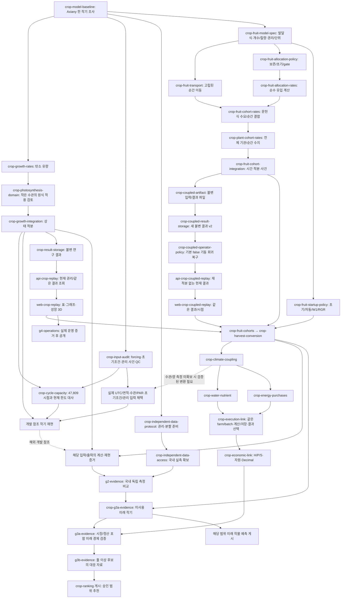

# 구현 순서

## 작물 생산과 성장 3D 우선순위 (2026-10-04)

최종 목표를 기준으로 다음 순서를 우선한다. 이 절의 현재 계획 뒤에 남긴 날짜별
진행 기록은 당시 상태다. **유량/적용 영역/시간 적분과 불변 합성 연구 저장을
로컬 집중 172개/434.49초·실제 SCRAM으로 수용했다. 저장 조회 API도 집중
316개/194.11초·실제 HTTPS/SCRAM으로 수용했다. `web-crop-replay`도 웹 단위
209개·집중 Chromium 10개·실제 SCRAM/HTTPS/장면 대사 1개로 로컬 수용했다.
원천 감사·과실 구획 명세·50구획 순간 이동도 로컬 수용했다.
명시적 착과/진입 질량의 배분 정책도 독립 대수/수치로 수용했다.
순수 제품 배분도 새 77개/기존 포함 315개로 로컬 수용했다.
문헌식 수요·50구획 순간 결합도 새 86개/기존 포함 401개로 로컬 수용했다.
전체 기관의 순간 결합도 새 43개/기존 포함 444개로 로컬 수용했다.
짧은 과실/기관 적분도 새 44개/기존 포함 488개로 로컬 수용했다.
새 저장 선행 artifact도 530개 집중·512출력/별도 Python·재적분 없는 읽기로 수용했다.
coupled 저장 v2도 실제 SCRAM·두 사례/hold·재시작/별도 Python·현재 권리/
원자성·변조/철회·정리를 **564개 집중**으로 로컬 수용했다.
페이지 조회 API도 새 29개 포함 **207개 고유 검증의 분할 수용**과 실제 HTTPS/SCRAM
19개·512출력·두 runtime 재시작으로 로컬 수용했다. 최대 전체 본문은
11.508339초/649,718 bytes이며 조회 중 재적분하지 않는다
([실제 수용](../research/api-crop-coupled-replay-implementation.md)).
다음은 `web-crop-coupled-replay`의 같은 저장 ID/UTC·50구획 연구 3D**다.
[다음 한 단계의 계약/수용 기준](../contracts/web-crop-coupled-replay-v1.md)은
페이지 전체성·원 수치/단위의 잎 면적/C/N 비교·hold/취소와 실제 저장→TLS→브라우저 대사다.
선행 `78b5d17`의 [CI 5개/백엔드 2,840개·별도 UID 4개](../research/artifacts/crop-fruit-transport-allocation-ci-20261005.json)도
여섯 동일 목록/DB·비밀 파일 정리와 집계까지 통과했다.
`784335d`의 [순간 구획/기관 결합 CI 5개](../research/artifacts/crop-fruit-cohort-plant-ci-20261005.json)도
백엔드 2,969개·별도 UID 4개·여섯 동일 목록/정리·집계까지 실제 성공했다.
새 시간 적분/artifact·v2 저장 코드의 hosted 수용은 별도다.
`bdcade9`의 Application CI에서 새 기본 false policy의 기존 loader 허용 목록 누락으로
실제 API 기동이 실패했다. [최소 policy 회귀 수정](../research/crop-coupled-operator-policy-implementation.md)은
작물 저장 조회의 필수 선행이며 기존 loader/시험 두 파일에 한정했다.
99개·실제 SCRAM/운영 TLS 로컬 통과 뒤 `d15cf92`의
[hosted image/runtime 49개/세 Compose 정리](../research/artifacts/crop-coupled-operator-policy-ci-20261005.json)도
수용했다. 전체 Backend는 이 Application 증거로 수용하지 않는다.
transport/cohort 프로필의 실제 hosted 포장도 수용했다
([한 파일 허용/기존 검사와 실제 증거](../research/crop-fruit-cohort-image-inputs-implementation.md)).
실제 참조 작기의 UTC/면적·수관/초기조건·관리 입력 채택과 재현은 보류다.
운영 기반은 `d19f7c0`의 [완료 범위/전체 CI](../research/crop-priority-and-runtime-freeze-20261004.md)로
고정한다. 결합 원천 Compose 시제품은 미수용 상태로 보류했다.
`application-source-consumers`/`application-compose-runtime`와 전체 G1은 체크하지 않는다.
추가 기반 작업에는 필요한 작물 기능 ID·관문·실패/누락 증거·최소 변경과 수용 기준을
붙여 이 계획에 명시한다. 전체 CI의 재통과나 운영 기능 수 자체는 새 기반 작업의 이유가 아니다.

### 구현과 검증 자료의 병행 경로



과실 구획의 순수 계산 개발도 권리가 확인된 문헌식/단위·명시적 관리 사건과
미검증 참조 계수로 착수할 수 있다. 실제 Axiany 작기 적용에는 입력 audit와
해당 품종/관리·발달 근거가 추가로 필요하다. 국내 자료 확보는 그 개발과 병행한다.
기관 상태 적분의 합성 시험은 전체 자료 audit 전에도 가능하다. 실제 해외 작기
재현에는 audit가 필요하며, 표·3D 연구 재생은 합성/참조·보류 상태를 분명히 표시한다.
국내 농장 자료 확보에는 이 엔진·KMA·전체 서비스의 완료가 필요하지 않다.
G2의 최종 판정에는 검증하는 해당 출력의 계산/재현 증거가 필요하다.
해외 Reference의 시간대/입력 보류가 국내 독립 자료 확보나 국내 해당 모델의
검증을 자동으로 막지는 않는다. 독립 국내 입력/계산 증거가 있으면 그 범위로 검증한다.
물·구매 에너지 예측을 열 때는 그 모듈과 해당 실측도 G2/G3a 범위에 포함한다.

미래 작물 생산과 시장·경제 전망의 범위를 분리한다. 시장 G0·ForecastRun은
미래 가격/마진에 필요한 경로이고 탄소 계산이나 성장 3D 개발의 선행 조건이 아니다.
한 후보의 미래 생산 검증으로 다른 후보나 “최적”을 열지 않는다. 비교 엔진의 hold/계산 개발과 G3b 자료 준비는 병행할 수 있고, 위 추천 노드는 게시 수용 조건이다. G0~G4의 정의와
현재 권리·독립 검토/해제 요건은 [제품 명세](../docs/PROJECT_SPEC.md#6-검증과-수용-관문) 그대로다.

### 현재 수용과 다음 한 단계

[rate kernel 계약](../contracts/crop-growth-research-v1.md)의 5개 구현 파일과
[실제 86개 집중 시험/60개 참조 수치](../research/crop-growth-rates-implementation.md)로 순간 탄소
유량을 로컬 수용했다. 입력/계수·원문/단위·검토 범위와 결과 파일을 고정했다.
이 수용은 전체 작기 적분·생과 수확·성장 3D·전체 G1 또는 국내 예측 완료가 아니다.

[작은 LAI/온도/CO₂의 원식 적용 정책](../contracts/crop-photosynthesis-domain-v1.md)을
독립 영역 32개/기존 유량 86개로 수용했다. 원식을 유지하고 영역 밖에서는 중단한다.
실제 품종 초기기관/forcing QC는 별도 hold다.
[시간 적분](../contracts/crop-growth-integration-v1.md)은 새 28개/기존 118개와
독립 원식 2사례의 165수치·해석해·수렴/수지·사건·실패 증거로 수용했다.
사용자는 [시계열/manifest](../research/artifacts/crop-growth-integration-reference-20261004.json)를 확인한다.

[불변 연구 저장](../research/crop-result-storage-implementation.md)은 기존 농장/원천과
명시적 프로그램 권리를 고정 입력/코드/계수·결과에 묶고 실제 SCRAM으로 수용했다.
172개에는 새 저장 8개·기존 권한/농장 회귀 18개·생장 146개가 포함된다.
실제 [저장 packet](../research/artifacts/crop-result-storage-reference-20261004.json)을 확인한다.

[저장 연구 결과 조회 API](../research/api-crop-replay-implementation.md)는 인증된 현재 권리로 정확한
farm/result ID·등록/모델/입력 hash와 UTC/단위·연구 scope/hold를 읽고, 원문/비밀을
공개하지 않는다. 혼합·권리 철회·DB 변조·미저장/수치 hold·재적분 없음과 기존 조립을
316개로 확인했고 HTTPS 10개 본문 최대 5.580219초였다. [실제 응답](../research/artifacts/api-crop-replay-reference-20261004.json)을 확인한다.

[성장 연구 3D](../research/web-crop-replay-implementation.md)는 같은 저장 ID/farm/hash/UTC
sample의 탄소량·LAI를 표·그래프·실제 잎 면적/기관 비교 막대에 연결했다.
웹 단위 209개(작물 49개)·집중 Chromium 10개·실제 SCRAM→HTTPS→브라우저 1개,
최대 전체 본문 5.9015초와 도형 면적 오차 4.163336342344337e-17m²를 확인했다.
[desktop](../research/artifacts/crop-replay-final-desktop.png)·
[mobile](../research/artifacts/crop-replay-final-mobile.png)·
[hold](../research/artifacts/crop-replay-final-hold.png)는 개발 전용 공개 합성 응답 재생이다.
이는 5분/6시점 연구 소프트웨어 수용이며 실제 품종 전체 작기/생과 생산량은 미수용이다.

[실제 Reference303 입력 감사](../research/crop-forcing-audit.md)와
[판본/권리/QC 등록부](../research/crop-forcing-register.json),
[forcing 채택 계약](../contracts/crop-forcing-v1.md)을 작성하고 실제 8개 CSV/2개 PDF를
대사했다. file/hash·시간/단위·결측·형식·면적/초기조건·관리/QC와 보류 목록의
감사를 수용했다. 버전 있는 streaming QC 도구의 재실행·원본 불변/줄 수 대사도 통과했다.
**실제 forcing 0개·새 모델 Run 0개**다. 감사 완료로 실제 자료 G0를 열지 않는다.
시간대/면적·수관/초기기관·사건 누락, CO₂ 음수/결측, 수확 날짜와 품질 header의
원천 문제를 보류한다. 국내 독립 자료도 0건이다.

[과실 구획 명세](../research/crop-fruit-cohorts-baseline.md)와
[21개 값/상수·원천 등록부](../research/crop-fruit-source-register.json),
[작은 계산 계약](../contracts/crop-fruit-cohorts-v1.md)도 수용했다. 원 PDF hash·
6페이지 식/표·일반 코드의 구획 부재를 대사했다. 원 배분식 9.36/9.37의 보존 문제와
W1/초기 seed·빈 sink·gate 차이/생과 환산은 보류한다. 계산/Run은 생성하지 않았다.

[고립된 순간 이동](../research/crop-fruit-transport-implementation.md)은 새 92개/기존 포함
238개·0.71초, 15사례·독립 3,090수치와 두 보존·입력 거부/불변을 통과했다.
크고 비슷한 상태의 유량 차감 반례 3개를 원식과 동등하게 수정하고 underflow를
hold로 고정했다. 독립 참조 생성 코드를 추가해 버전/해시·byte-identical 재생성을 확인했다.
새 Run/실제 한 작기/생과 수확은 만들지 않았다.

먼저 `crop-fruit-transport-image-inputs`에서 현재 Docker가 제외하는 새 고정 프로필
한 파일만 포함하고 실제 context/hash·cases 제외·읽기 전용 loader/정리를 확인한다.
새 기능의 필수 입력 경로이며 추가 기반의 구체적 근거는 이 파일의 제외다.

**배분 정책의 조사/개발 수용**은 [별도 정책/원천 대사](../research/crop-fruit-allocation-policy.md)에
기록했다. 원/epsilon 분모를 각각 4개 반례로 확인하고 명시적 S/W1의 보존 변형을
독립 6개 정상/4개 hold·600개 유입 값으로 수용했다. 자동 착과/W1/초기 seed와
실제 품종은 미채택이며 이것은 제품 배분 구현의 통과가 아니다. 당시 정책 수용 기준은 다음과 같다.

1. 원 9.36/9.37의 탄소 보존 문제·W1 Gompertz 경계/초기 seed·빈 sink·gate의
   원 구현/추가 근거를 대사한다. 원식과 수정/가정을 분리하고 새 판본을 명시한다.
2. 채택 가능한 정책은 독립 고정 수치/대수와 `sum(A_j)=F`·착과 개수/질량,
   유입 0·빈/고갈·초기/onset 경계에서 검증 가능해야 한다.
3. 실제 품종/생과 계수의 미확인은 채우지 않는다. 근거 부족은 hold로 남기고
   명확한 순수 계산/관리 범위를 그 계약 안에서 작게 구현한다.
4. 다음 전체 과실 적분/사건에 필요한 buffer/기관/구획의 양과 이중 차감 방지,
   독립 참조·수렴/재현·저장 새 판본의 수용 절차를 연결한다.

**순수 제품 배분도 로컬 수용했다**([실제 구현/315개와 독립 600개 값·4개 hold](../research/crop-fruit-allocation-implementation.md)). 당시 구현/수용 범위는
`backend/app/crop_fruit_allocation.py`, `backend/tests/test_crop_fruit_allocation.py` 두 파일이다.
수용 기준은 [개발 계약](../contracts/crop-fruit-allocation-v1.md)의 닫힌 입력/단위·길이/유한성,
독립 600개 탄소/개수 유입과 4개 hold의 제품 대사, 두 수지/ULP·underflow/overflow
거부·입력 불변/같은 hash/판본·반복이다. 새 생물 계수/자동 S/W1/실제 Run/3D는 만들지 않는다.
전체 `crop-fruit-cohorts`는 수용한 이동과 위 제품 배분 뒤 고정 Gompertz 수요·
기관/buffer·개수/탄소 적분과 명시적 관리 사건으로 연결한다.
국내 측정 접근과 실제 입력 보류 해소, 전체 작기 처리 계약을 병행한다.

**문헌식 수요·50구획 순간 결합도 로컬 수용했다**([401개/독립 24사례·8,592수치](../research/crop-fruit-cohort-rates-implementation.md)). 당시 기준은 아래와 같다.
수용 기준은 원 9.38–9.42/50구획·17–23°C의 값/단위/권리와 고정 판본,
독립 GR/가중 수요 수치와 계수/영역/빈 상태 거부, 명시적 S/W1·RGR/초기/관리의
입력 경계, 기존 기관과 buffer/구획 호흡을 한 번만 계산하는 미분/수지 계약이다.
이후 작은 시간 적분/사건·수렴/두 보존과 저장 새 판본을 검증한다.
자동 착과/실제 품종/생과/G2/G3/G4는 이 개발 계약으로 열지 않는다.

**전체 기관의 순간 결합도 수용했다**([444개/독립 684수치](../research/crop-plant-cohort-rates-implementation.md)).
기존 source/profile 호환·fruit 합계 파생/유지 호흡 교체와 성장 단일 차감·전체 수지를 확인했다.
**짧은 시간 적분/사건도 수용했다**([488개/1,309수치·해석해 250개](../research/crop-plant-cohort-integration-implementation.md)). 당시 계약/기준은 아래와 같다.
[고정 계약](../contracts/crop-plant-cohort-integration-v1.md)에 최대 24시간/128구간·512출력/
10,000step의 첫 연구 범위, RGR/S/W1/초기와 같은 비율 N/C 관리 제거·RK4/manifest를 정의했다.
수용은 독립 Decimal/개수 해석해·간격 수렴과 누적 호흡/terminal, 사건/구간 경계·
두 저장/외부 수지·같은 재현/시간/자원/실패 hold다. 시계열/두 수지·사건 journal을 확인한다.
이후 전체 작기 처리와 새 저장 결과/API·같은 계산 시점의 3D를 연결한다.
**새 v2 저장/API는 로컬 수용했고 다음 핵심은 `web-crop-coupled-replay`**다.
저장 564개/실제 SCRAM·API 207개 분할 검증/HTTPS 19개·최대 11.508339초의
수용은 새 50구획 장면을 대신하지 않는다. 페이지 조립/수치 geometry → 기존 화면 연결 →
실제 저장→HTTPS→브라우저의 세 작은 구현 경계로 진행한다.
같은 ID/UTC의 원 수치·triangle 잎 면적/공통 scale의 C/N 비교, 혼합/권리 철회/
취소/hold와 접근성·WebGL 대체/정리를 확인한다. [다음 계약](../contracts/web-crop-coupled-replay-v1.md)을 따른다.
기존 v1 결과나 accepted Run의 scope를 바꾸지 않는다.
`crop-fruit-startup-policy`는 빈 초기 tail/양의 남은 유입과 생식기 이전·자동/초기
근거를 별도 판본으로 해소하는 전체 작기 필수 경로다. 현 순간 부분을 최종 성공으로 줄이지 않는다.

추가 기반은 현재 Docker 허용 목록이 새 프로필/제3자 고지를 제외하는 실제 파일
공백에 한해 `crop-rate-image-inputs` 3파일로 보완했다. 해당 입력/라이선스 포함·해시와
관련 없는 파일 제외·실제 실행/정리는 [hosted 이미지 검사](../research/crop-rate-image-inputs-implementation.md)로 수용했다.
`d251df9`의 전체 backend CI는 2,671개·별도 UID 4개, 같은 목록 해시와 정리를
통과했고 같은 판본의 CI 5개 모두 성공했다. `d76410f`의 웹/C0/실제 앱 이미지·Compose도
통과했다. 새 작성 경로의 실제 저장/HTTPS/3D 대사도 통과했다.
`d76410f`의 전체 backend도 2,671개·별도 UID 4개, 여섯 동일 목록/정리·집계까지
통과해 CI 5개 모두 성공했다([실제 선행 CI](../research/artifacts/crop-fruit-predecessor-ci-20261005.json)).
새 과실 코드 판본의 hosted 검증은 별도로 실행한다.

`0f3ce74`의 웹/C0는 성공했지만 실제 앱 이미지 build가 실패했다.
`web-crop-replay`의 fixture import/디자인 자산이 기존 COPY/허용 목록에 빠진
근거로만 `crop-web-image-inputs`를 추가했다. 기존 e2e 경로로 같은 fixture를 옮기고
9개 파일만 허용해 로컬 RED→GREEN을 확인했다. 실제 context/17개 제외 probe·
image/TLS·UID/읽기 전용/정리는 `d76410f`의 실제 hosted 전체 성공으로 수용했다
([진단·최소 변경](../research/crop-web-image-inputs-implementation.md)).

### 단계별 확인 지점

1. **계산 확인:** kernel/적분의 독립 참조·수지·수렴과 고정 입력/매개변수 파일을 확인한 뒤 저장 단계로 간다. 참조 forcing 감사와 국내 자료 상태를 함께 보고한다.
2. **성장 재생 확인:** 저장/API/웹의 같은 결과 ID·시각·단위, 실제 브라우저와 표 대체를 확인한 뒤 생산량 확장으로 간다. 계산한 잎 면적과 모식 형태의 경계를 화면에서 확인한다.
3. **생산/사업성 확인:** 과실/수확·물/성분·구매 에너지 수지와 동일 배치 원장 대사를 통과한 범위만 연결한다. 외부 계량/품종 변환/정산·시장 판본 누락은 출력별 hold로 보고한다.

### 일정 추정의 근거와 외부 의존성

순수 유량 kernel은 2026-10-04 09:25~09:58 UTC 약 33분의 이 턴에서 구현·
로컬 집중 시험/원문 대조까지 수용했다. 전체 성장 엔진의 실적은 아직 없으므로 아래는 **한 명의 순차 작업자, 하루의
집중 개발·검증 시간 약 4시간**을 가정한 잔여 작업량 추정이다. 작은 수관 적용 검토도
같은 날 완료했다. 시간 적분의 계약/독립 참조/146개 집중 수용은 10:32~11:10 UTC
약 38분의 관측 범위다.
불변 저장의 계약·구현/실패 진단·집중 수용은 같은 날 11:32~12:16 UTC 약 44분이었다.
조회 API는 12:44~13:11 UTC 약 27분의 계약/구현·실패 진단·집중 수용 관측 범위다.
성장 3D의 계약/구현·디자인·실제 저장 연결·최종 집중 수용은 13:25~14:17 UTC
약 52분의 관측 범위다. 실제 전체 작기 처리 속도와 과실 모델 개발 실적은
미관측이다. 완료한 저장/API/성장 3D를 잔여 작업량에서 제외했다. 자료 권리/단위 audit가 멈추면
합성 연구 경로로 진행 상태를 표시하고 실제 자료 완료 날짜를 미루어 기록한다.

| 묶음 | 계획 작업량 | 확인 가능한 산출물/조건 |
| --- | --- | --- |
| forcing 파일/채널 감사 | **완료·실제 채택 보류** | 8 CSV/2 PDF·단위/시각/면적·초기조건/관리/QC·불변 재검사·보류 목록 |
| 유량 kernel | **로컬 완료** | 86개/0.12초·원문/참조 대조. 이미지/전체 CI는 별도 |
| 작은 수관 적용 정책 | **로컬 완료** | 원식 영역/대안 검토·32개 추가 시험·실제 품종 초기조건 hold |
| 상태 적분 | **로컬 완료** | 146개/0.53초·165수치·수렴/수지/사건·재실행. 전체 CI는 별도 |
| 실제 참조 작기 재현 | **자료 감사 뒤 재추정** | 실제 forcing/초기기관/관리 QC·G0/재계산. 현재 미수용 |
| 불변 합성 연구 저장 | **로컬 완료** | 실제 SCRAM·별도 프로세스·172개 집중/변조/철회/정리 |
| 결과 조회 API | **로컬 완료** | 316개/194.11초·같은 저장 ID·현재 권리/혼합 거부·실제 TLS |
| 성장 3D 연결 | **로컬 완료** | 웹 209개·집중 Chromium 10개·실제 저장/HTTPS/장면 대사 1개, 5분 연구 범위 |
| 과실 발달식/구획 계약 | **조사 완료·전체 배분/실제 채택 보류** | 원식/21개 값·단위/권리·보존/초기/gate hold·독립 검증 계획 |
| 과실 순간 이동 계산 | **로컬 완료** | 새 92개/기존 포함 238개·독립 15사례/3,090수치·두 수지/수치 반례/hold |
| 명시적 착과 배분 정책 | **개발 정책 수용** | 5개 원천 대사·독립 6개 정상/4개 hold·600개 유입; 자동 착과/실제 품종 미채택 |
| 순수 제품 배분 | **로컬 완료** | 2파일·새 77개/기존 포함 315개·독립 600개 값/4개 hold·이진 수지/수치/불변/판본 |
| 과실 수요/순간 결합 | **로컬 완료** | 새 86개/기존 포함 401개·독립 24사례/8,592수치·세 수지/호흡/hold |
| 전체 기관 순간 수지 | **로컬 완료** | 새 43개/기존 포함 444개·독립 6사례/684수치·derived fruit/호흡·전체 탄소/개수/hold |
| 짧은 기관/과실 적분 | **로컬 완료** | 488개·독립 1,309수치/해석해 250개·수렴/두 수지·512출력/8,687step/57.85초 |
| coupled artifact | **로컬 완료** | 530개·두 사례/별도 Python/hold·512출력, 3,683,992 bytes·읽기 0.3055초·동일 계산 결과 |
| coupled farm 결합 저장 v2 | **로컬 완료** | 564개/850.85초·SCRAM·두 사례/hold·별도 Python/같은 bytes·현재 권리/변조/철회·원자성·정리 |
| coupled 페이지 조회 API | **로컬 완료** | 207개 고유 분할 검증·실제 HTTPS 19개/512 sample/128 event·두 runtime 재시작·최대 11.508339초/649,718 bytes·현재 권리/정리 |
| coupled 성장 연구 3D | **집중 개발·검증 2–4시간 잠정** | decoder/페이지·수치 geometry·기존 화면/접근성·실제 저장/TLS/브라우저. 같은 ID/UTC의 50개 C/N·잎 면적·보류 |
| 초기/자동 착과 정책 | **추가 근거 뒤 추정** | 빈 초기 tail·원/수정 W1/RGR/seed/생식기 이전 정책의 독립 보존/실측 적용 |
| 전체 작기 처리 계약 | **별도 설계 뒤 추정** | 실제 47,809 source 시점/현재 20,000 배열·100만 step 한도와 연속 상태/저장/재생·부하 계획 |
| 과실 발달 구획 계산 | **문헌식/관리 계약 뒤 추정** | 독립 참조와 개수/기관 질량·사건 수지; 품종 적용성 미검증 유지 |
| 생과 수확·자원·경제 | **각 변환/계량 근거 뒤 추정** | 수확/등급·물/성분·구매 에너지·동일 배치 Decimal 대사 |

첫 계산 기반 성장 연구 3D는 **2026-10-04 로컬 수용 완료**다. 이전의 10월 7~10일
추정은 저장/3D가 미완료였던 잠정치이며 현재 일정으로 사용하지 않는다.
입력 감사도 **2026-10-05 KST(10-04 UTC) 완료**했다. 실제 archive 선택 추출
14:27 UTC부터 등록부/QC 수용 약 15:00 UTC까지 약 33분이며 포장 실패 진단을
병행한 관측 범위다. 이전 10월 5~6일의 감사 보고서 추정은 완료 실적으로 대체한다.
실제 Axiany 입력/작기 재현은 자료 보류 해소·전체 작기 실행 계약 뒤 다시 추정한다.
과실 문헌식/계수·구획 계약도 **2026-10-05 KST 완료**했다. 고립된 순간 이동
모듈은 15:56~16:15 UTC 약 19분의 계약·참조/구현·반례 수정·238개 집중 검증
관측 범위다. 코드의 첫 수용이며 보고/포장·새 전체 CI와 실제 생산 검증의 실적은 아니다.
이전 0.5~1작업일의 순간 모듈 추정은 이 완료 실적으로 대체한다.
명시적 입력 배분의 RED 16:49:11~집중 GREEN 16:52:47 UTC는 약 4분의 순수 구현/
시험 관측 범위다. 앞선 원천 조사/대수와 이후 보고·hosted 시간은 포함하지 않는다.
이전 0.5~1작업일의 순수 배분 추정은 로컬 완료 실적으로 대체한다.
자동 착과/실제 품종의 W1·초기/gate는 별도 근거 뒤 추정한다.
순간 과실/기관 결합은 이번 2026-10-05 KST의 실제 로컬 수용으로 대체했다.
짧은 coupled 적분은 구현/RK4 상태·누적량, 독립 Decimal/선형 N 해석해,
사건/수렴/자원·실패, 보고의 네 묶음이다. 기존 기관 적분 약 38분과 이번 새
기관 결합의 43개/444개 시험·684수치 대사 실적을 근거로, 하루 집중 4시간의
순차 작업이면 **2026-10-05~06 KST에 로컬 수용을 시도하는 잠정치**다.
이미지/전체 hosted 회귀·초기 정책/실제 전체 작기 수용은 이 날짜에 포함하지 않는다.
추가 domain/numeric 반례가 나오면 고친 뒤 실적으로 추정을 갱신한다.
위 짧은 적분의 잠정치는 **2026-10-05 KST 로컬 완료** 실적으로 대체한다.
독립 참조/구현·snapshot 반례/첫 487개 집중은 약 18:26~18:56 UTC의 관측 범위다.
기관 유지 호흡 underflow 반례와 최종 488개·현재 코드의 24시간 자원 검사는
19:17:24 UTC에 기록한 최종 증거로 대체한다.
이 실적은 보고·hosted/실제 자료 검증이나 전체 작기를 포함하지 않는다.
artifact의 실제 RED→첫 GREEN은 19:27~19:29 UTC, 512출력 자원 확인은
19:31:59 UTC에 완료했다. 집중 530개는 19:32~19:33 UTC의 관측 범위다.
다음 DB 저장은 farm/program 권리와 새 표/명시 role·immutable 거래·재시작/변조/
철회/정리의 네 묶음으로 분해한다. 앞선 v1 저장의 약 44분·실제 SCRAM 실적과
현재 16 MiB artifact/24시간 계산 HTTP 분리의 추가 경계를 근거로 **집중 개발·검증
2~4시간(하루 4시간 기준 0.5~1작업일)**을 잠정 배정한다. 순차 작업의 로컬 수용
시도는 2026-10-05~06 KST이며 hosted 전체 회귀/실제 자료 수용 날짜는 별도다.
이 저장 잠정치는 **2026-10-05 KST 로컬 완료**로 대체한다. 실제 CLI/구현은
19:45 UTC부터, 첫 600초 시험 timeout/동일 전체 재검사와 정리는 20:25:14 UTC까지의
관측 범위다. 최종 564개/850.85초·임시 DB/password 파일 정리를 확인했다.
[조회/API 계약](../contracts/api-crop-coupled-replay-v1.md)의 1~3시간 잠정치는
**2026-10-05 KST 로컬 완료** 실적으로 대체한다. 실제 현재 CLI turn은
20:56:04 UTC부터이며 실패 진단 뒤 최종 제품 코드 206 passed/fixture 1 failed는
21:37:37 UTC에 완료했다. fixture 입력만 수정한 OpenAPI 전체 61개도 48.58초에 통과했다.
합계는 **207개 고유 검증의 분할 수용**이다. 실제 HTTPS 19개/512시점 최대
11.508339초/649,718 bytes·두 runtime 재시작/정리를 확인했다.
다음 [50구획 연구 3D](../contracts/web-crop-coupled-replay-v1.md)는 decoder/페이지,
수치 geometry, 기존 화면/접근성, 실제 저장→TLS→브라우저 대사의 네 묶음이다.
기존 v1 웹 209개/Chromium 10개/실제 저장 장면 1개의 재사용과 새 50배열/페이지를
근거로 **집중 개발·검증 2–4시간**, 로컬 수용 시도 **2026-10-05~06 KST**를 잠정 배정한다.
전체 hosted·실제 작기/생과 생산 예측은 이 날짜에 포함하지 않는다.
수확·자원·경제 모듈은 문헌식·변환/품종 근거와 작은 착수 계약을 확보한 뒤 추정한다.
독립 국내 농장/작기 자료는 현재 **0건**이며 동의·자료 범위·미사용 기간이
정해지지 않아 G2/G3a·최종 추천/production 완료일을 정할 근거가 없다.

## 이전 구현 진행 기록

작성 Run의 후속 연결은 `authored-economic-execution → authored-calculation-assessment →
authored-financial-selection → web-authored-economic-assessment` 순서로 검증한다([세부 작업](todo.md#작성-run-경제평가-연결-2026-10-01)).
첫 단계인 [별도 경제 입력/영수증 V3](../contracts/authored-economic-execution-v1.md)와
현재 작성 부모/경제 가정의 서버 결합 뒤에 [평가 입력 V3](../contracts/authored-calculation-assessment-v1.md)의
완료 부모·해제·문맥 결합을 확인했다([SCRAM·HTTPS 증거](../research/authored-calculation-assessment-implementation.md)).
[경제 입력·작업 이력 조회](../contracts/authored-financial-selection-v1.md)도 서버에서 현재 작성 부모에 고정했다
([집중 시험 59개](../research/authored-financial-selection-implementation.md)).
[07 작성 Run 경제·평가](../contracts/web-authored-economic-assessment-v1.md)에서 같은 계정의 저장 부모 선택,
V3 경제 접수·금액/현금·보류·이력 복구와 같은 3D Run을 연결했다
([웹 단위 122·Chromium 19·실제 HTTPS/SCRAM 1개](../research/web-authored-economic-assessment-implementation.md)).
다음은 `source-farm-selection → api-source-farm-selection →
farm-economic-candidate-selection → web-source-farm-authoring` 순서로
일반 지역 조사/수집과 농장·경제 입력 선택을 잇는다
([세부 작업](todo.md#지역-원천에서-농장-작성-연결-2026-10-01)).
첫 [원천 참조 제공자](../contracts/source-farm-selection-v1.md)는 정확한 완료 조사·수집과
이미 저장된 원래 스냅샷/서명 문맥을 읽기 범위로 검증하며 조회 중 새 자료를 발급하지 않는다.
[인증 HTTP/표준 조립](../contracts/api-source-farm-selection-v1.md)도
[집중 66개·실제 HTTPS 12개 응답](../research/api-source-farm-selection-implementation.md)으로 확인했다.
같은 원천 문맥의 [저장 경제 후보 제공자](../contracts/farm-economic-candidate-selection-v1.md)도
[SCRAM 5개](../research/farm-economic-candidate-selection-implementation.md)로 확인했다.
[인증 목록/현재 선택 API](../contracts/api-farm-economic-candidate-selection-v1.md)는
[집중 64개·HTTPS 20개 전체 응답](../research/api-farm-economic-candidate-selection-implementation.md)이 통과했다.
다음은 이 선택을 일반 농장 작성 화면에 연결하는 단계다.
[웹 연결 계약](../contracts/web-source-farm-authoring-v1.md)의 첫
[브라우저 읽기/참조 제공자](../research/source-farm-client-implementation.md)는 집중 95개와
typecheck/build가 통과했다. [화면 연결 후보](../research/source-farm-web-implementation.md)는
저장된 완료 조사·수집과 경제 판본을 작성 폼에 연결하고 조합 변경·복구를 Chromium 14개로 확인했다.
실제 HTTPS/SCRAM 신규 등록→검토/Run→3D의 직접 입력·원천 선택 2개도 통과했다.
3개 화면 대조는 낮은 일치율로 정밀 수용을 주장하지 않는다.
[같은 새 Run의 경제/평가 연속 검증](../research/source-farm-financial-continuation-implementation.md)은
실제 HTTPS/SCRAM 1개가 통과했다. 해당 판본의 호스팅 작성 7개 묶음·웹/C0도 통과했다.
[화면 보완](../research/source-farm-layout-refinement-implementation.md)은 참조 상세 펼치기·나란한 요약과
키보드 구역 이동을 집중 시험·세 상태/세 폭에서 확인했다. 낮은 디자인 일치율을 기록하고
`93e30a7`의 [최종 소프트웨어 수용](../research/source-farm-web-implementation.md#final-software-ui-acceptance-2026-10-01)은
웹 154/50개와 작성 브라우저 4개에서 원천 선택→신규 농장 등록→경제/평가·동일 3D를 확인해 웹 작업을 체크했다.
27개 전체 본문 최대 26.3284초이며 낮은 디자인 일치율은 기록된 한계다.
[등록 응답 미확인 잠금](../research/source-farm-registration-lock-implementation.md)도
연결 변경·다른 접수/부모 전환을 차단하고 동일 바이트 재확인/확정 거부의 해제를 집중 검증했다.
기존 고정/농장 재생 경로,
실제 제품 CLI·독립 해제·전체 G1 수용과 새 원천 코드의 호스팅 CI는 별도 관문으로 유지한다.

같은 호스팅 작성 워크플로의 별도 경제 브라우저는 미확인 평가 접수에서 실패했다.
[권한 감사 조회 보완](../research/runtime-role-audit-batching-implementation.md#all-role-query-batching-follow-up-2026-10-01)은
모든 현재 권한 검사를 유지하고 로컬 보안 109개·실제 HTTPS/브라우저 1개를 확인했다.
29개 전체 본문 최대 24.5048초이며 30초 제한은 그대로다. `runtime-role-audit-batching`의
`7f49f52`의 호스팅 전체 백엔드 2,253개·UID 4개, 작성 139회·웹/C0와 정리가 통과해 이 소프트웨어 보완을 체크했다. 큰 손익분기 격자의 비동기 검증 경로와 독립 G1/G4는 이어 간다.

앞선 전체 백엔드 CI는 [150분 실행 한도](../research/source-farm-web-implementation.md#hosted-ci-and-resource-checkpoint)로
취소됐다. [분할 계약/후보](../contracts/backend-ci-partition-v1.md)는 기존 기본 수집 2,205개를
6개 파일 묶음에 중복·누락 없이 배정하며 UID/cleanup과 집계 검사를 유지한다.
[로컬/호스팅 증거](../research/backend-ci-partition-implementation.md)에서 전체 2,205개 실행,
UID/cleanup과 같은 전체 해시를 확인했다. 기존 OpenAPI 기대값 1개의 실패를 집계가 거부했고,
V3 계약에 맞춘 집중 수정 2개가 통과했다. `5dc63f3`의
[후속 호스팅 수용](../research/backend-ci-partition-implementation.md#hosted-acceptance-after-the-openapi-correction)은
전체 2,205개·전 묶음/UID/cleanup과 최종 집계가 통과하여 CI 분할 작업을 체크했다.
후속 UI 판본의 호스팅 검증과 실제 제품 CLI·독립 G1/G4는 계속 별도 관문이다.

2026-10-01 사용자 지시로 개발·제품 실행 모델을 변경했다.
[모델 이전 계약](../contracts/cli-model-policy-migration-v1.md)과
[161개 집중 시험 기록](../research/cli-model-migration-implementation.md)을 추가했다.
기존 원본·서명·실제 과거 호출은 보존한다. 새 모델의 제품 CLI 호출과 독립 해제,
전체 G1 수용은 후속이다. 완료 열·경제 작업의 [웹 평가 연결](../contracts/web-calculation-assessment-v1.md)은
접수·저장 보류 조회·재연결을 구현했다([브라우저·실제 HTTPS/SCRAM 증거](../research/web-calculation-assessment-implementation.md)).
다음에는 지역 조사부터 지원하는 농장·경제·평가 부모 선택을 잇고, 새 모델의 제품
CLI와 독립 실행/해제·G1 증거를 확보한다. 작성 농장의 웹 경제·평가 부모 선택은 위 후보에 연결했고,
하드 새로고침 때 미확인 접수의 의도를 저장·복구하는 기능은 후속 경로다.

작성 농장의 저장 Run 전체를 다시 찾는 [테넌트별 목록 API](../contracts/api-authored-thermal-run-v1.md)를
추가했다([PostgreSQL·HTTPS 검증](../research/authored-run-catalog-implementation.md)).
목록은 현재 표시 승인 전의 식별자 인덱스이며, 정확한 Run 조회에서 해제·권리를
재검사한다. 내부 웹은 농장 선택 없이 목록을 찾고 현재 단건 조회 후 3D로 이동한다.
실제 CLI·독립 G1은 후속이다.

저장 원천 작업의 [테넌트별 목록·연결 단건 조회](../contracts/api-owned-source-history-v1.md)를
웹 작업 화면에 연결했다([검증](../research/owned-source-history-implementation.md)). 재연결 후
조사와 최근 수집·검토 한 쌍을 다시 찾고 같은 조사의 이전 시도를 페이지별로
복원하며 현재 원천·문맥을 재검사한다. 실제 CLI·독립 G1/G0/G4 수용은 후속이다.

완료된 지역 조사에서 기존 원본 수집·수집 입력 검토 API를 차례로 접수하고
상태/보류를 읽는 [내부 웹 후보](../contracts/web-owned-source-workflow-v1.md)를
연결했다([검증](../research/web-owned-source-workflow-implementation.md)).
이는 UI 연결이고 자동 수집·독립 해제·전체 G1 수용은 후속이다.

작성 농장 입력의 [테넌트별 저장 판본 목록](../contracts/api-farm-authoring-v1.md)을
기존 작업 저장소와 웹 조회에 연결했다([검증](../research/authored-farm-catalog-implementation.md)).
[검토·계산 작업 이력 후보](../research/authored-farm-activity-implementation.md)도
같은 판본의 불변 작업 기록에서 복원한다. 선택 시 현재 권리/해시 단건 조회와
실제 작업 상태를 다시 확인한다. 완료 Run 전체 목록도 별도 조회한다. 실제 CLI와
전체 `web-shell`/`end-to-end-g1` 수용은 후속이다.

경제/시장 입력 화면은 [저장 가정 조회 계약](../contracts/api-market-user-source-read-v1.md)의 사용자 소유 목록·지정 판본을 사용해 기존 입력을 불러오고, 명시적 수정은 기존 접수 계약의 새 판본으로 등록한다. 조회는 원본/최초 작업과 대사하며 승인·최신 판본 선택·미래 수치를 만들지 않는다. [검증 증거](../research/market-user-source-read-implementation.md)는 소프트웨어 연결 범위이며 전체 `api-flow`/`web-shell`/G1 수용은 계속 남는다.

**공유 CLI 계약 조립 진행:** [세 실제 서비스 조립](../contracts/owned-cli-contracts-v1.md)이 조사·수집 검토·초기 평가를 같은 작업/열 저장소와 합성 등록부에 묶는다. 실제 제품 CLI·독립 검토/해제·전체 농장 시나리오·브라우저 G1 수용은 후속이다.

작성된 농장 입력의 실제 CLI 검토를 위한 별도 실행 스모크를
[준비](../research/authored-cli-smoke-preparation.md)했다. 현재 CLI 세션 안에서
다시 CLI를 실행하지 않았고, 실제 실행 결과와 독립 해제/전체 G1은 미확인이다.
같은 문서의 `--authored-full` 선택 경로는 브라우저 작성 등록부터 실제 CLI 검토,
합성 해제·작업자·저장 3D까지 한 시험으로 준비했다. 실제 CLI 호출·독립 해제
결과는 아직 없으므로 `end-to-end-g1`은 보류한다.

**초기 계산 평가 연결 진행:** [실제 완료 작업 결합](../contracts/calculation-assessment-v1.md)은 열·경제 영수증/재계산·같은 서명 문맥을 평가 의도로 고정한다. 공유 CLI 검증은 처음부터 보류와 누락 사유를 유지한다. [소프트웨어 증거](../research/calculation-assessment-implementation.md) 뒤에도 전체 농장/경제 시나리오·실제 CLI·독립 실행/해제·브라우저 G1과 후속 G0/G2/G3/G4 수용이 필요하다.

상태: **2026-09-27 C0 기본 구조는 호스팅 시험으로 수용됐고, C1 계약과 G1 구현은 진행 중이다.** 제품 주장은 [제품 명세](../docs/PROJECT_SPEC.md), 객체·절차 계약은 [아키텍처](../docs/ARCHITECTURE.md), 소프트웨어는 [기술 스택](../docs/TECH_STACK.md), 금액 계산은 [경제 계약](../docs/ECONOMICS.md), 시장 자료의 시점은 [시장 명세](../docs/MARKET_INTELLIGENCE.md)를 따른다. [첫 구현 범위](../docs/IMPLEMENTATION_SLICE.md)는 초기 구현 경계를 정하고, [구현 준비 현황](../docs/IMPLEMENTATION_READINESS.md)은 확인된 공백을 기록한다. 체크 가능한 일은 [작업 목록](todo.md)에 있다. 작업 체크는 해당 작업의 증거만 뜻한다.

최대 손익분기 처리량은 [접수 성능 작업](todo.md#최대-손익분기-접수-성능-2026-10-02)에서
실제 256개 접수의 30초 초과 반례 → 연결 병목 프로파일 → 현재 권리/서명 회귀 →
동일 최대 격자 재측정 순으로 확인한다. 접수 기준을 통과한 뒤 최대 계산·검증·
완료 읽기의 보호된 TLS 전체 응답과 취소/재시도/철회 증거를 이어 간다.
접수 성능 보완은 같은 256개 ASGI 접수 29.5103초와 집중 47개·작업자/현재 조회/
두 시험값의 TLS 11개로 로컬 수용했다. 같은 `c3ff00e`의 호스팅 백엔드
2,305개·별도 UID 4개, 작성 141회·웹 160/51·C0도 통과했다
([기록](../research/break-even-admission-performance-implementation.md#terminal-hosted-regression-at-c3ff00e)).
표준 Bearer의 실제 최대 HTTPS 접수는 30초 시간 초과 반례가 있어,
효과가 확인되지 않은 참조 권한 확인 묶음은 되돌렸다. 같은 최대 프로파일이
관측한 입력 검증을 보완한 `04c517c`는 같은 256개 표준 인증 HTTPS 본문 EOF
29.6373초·동일 재접수 29.0140초와 집중 55개·호환/진단 12개로 로컬 접수를 수용했다
([기록](../research/break-even-admission-performance-implementation.md#protected-maximum-admission-accepted-locally)).
최초 여유는 0.3627초이며 새 호스팅 회귀·최대 계산/검증/완료 조회는 계속 별도로 확인한다.
별도 [최대 HTTPS/계산/검증 시험 후보](../backend/tests/break_even_maximum_full_smoke.py)는
먼저 두 시험값의 운영자/서버 연결을 확인하고, 최대 접수 기준 통과 뒤 같은 256개
원천과 실제 별도 Python 작업자·현재 결과 읽기를 측정한다. 준비된 시험 코드는 실행 증거가 아니다.

## 기존 열·시장·운영 경로의 의존성

```mermaid
flowchart LR
  repo-bootstrap --> provenance-g0 --> thermal-synthetic-parameters --> thermal-contract --> fixture-policy --> thermal-engine
  repo-bootstrap --> compose-runtime --> durable-jobs --> decision-evidence-store --> cli-worker-store-bridge --> cli-worker
  repo-bootstrap --> db-driver-bootstrap --> durable-jobs
  durable-jobs --> job-intent-idempotency --> api-flow
  compose-runtime --> backend-ci
  db-driver-bootstrap --> backend-ci
  provenance-g0 --> cli-worker
  provenance-g0 --> market-context --> economic-ledger --> sales-settlement --> market-scenario --> economic-break-even
  fixture-policy --> economic-ledger
  fixture-policy --> market-scenario
  market-context --> market-scenario
  economic-ledger --> economic-break-even
  thermal-contract --> thermal-engine
  cli-worker --> api-flow
  cli-worker --> source-collection-worker --> api-flow
  fixture-policy --> source-collection-worker
  decision-evidence-store --> source-collection-worker
  market-context --> market-hold-store --> api-flow
  thermal-g1-publisher --> market-hold-store
  thermal-engine --> thermal-decision-clock-contract --> thermal-g1-publisher --> api-flow
  decision-evidence-store --> thermal-g1-publisher
  thermal-g1-publisher --> thermal-scenario-store
  market-hold-store --> thermal-scenario-store --> api-flow
  cli-worker --> thermal-g1-publisher
  market-scenario --> api-flow
  economic-break-even --> api-flow
  api-flow --> web-shell --> web-replay --> end-to-end-g1
  cli-worker --> end-to-end-g1
  compose-runtime --> end-to-end-g1
  durable-jobs --> deterministic-job-discovery --> deterministic-worker-loop
  durable-jobs --> protected-api-operator-config
  protected-api-operator-config --> application-images
  compose-runtime --> application-images --> application-services-ci
  deterministic-worker-loop --> application-services-ci
  application-services-ci --> cli-dispatch-loop --> authority-services-ci --> application-source-consumers
  application-services-ci --> collection-consumer --> collection-services-ci --> application-source-consumers
  application-source-consumers --> application-compose-runtime --> end-to-end-g1
  provenance-g0 --> g0-authority-store
  durable-jobs --> g0-authority-store
  g0-authority-store --> kma-g0
  g0-authority-store --> market-source-g0
  thermal-contract --> kma-g0
  cli-worker --> kma-g0
  market-context --> market-source-g0
  cli-worker --> market-source-g0
  crop-independent-data-access --> g2-evidence
  kma-g0 -.->|기상 입력을 검증 범위에 쓸 때| g2-evidence
  end-to-end-g1 -.->|전체 경로 주장의 계산 증거| g2-evidence
  market-source-g0 --> forecast-engine
  g2-evidence --> forecast-engine
  market-scenario --> forecast-engine
  forecast-engine --> g3a-evidence --> crop-ranking --> g3b-evidence
  economic-ledger --> g3a-evidence
  market-context --> g3a-evidence
  end-to-end-g1 --> service-economics --> g4-operations
  end-to-end-g1 --> g4-operations
  kma-g0 -.->|실제 원천 공개 시| g4-operations
  market-source-g0 -.->|시장 원천 유래 경로 공개 시| g4-operations
```

### 앱 운영 조립의 당시 관측 공백 — 2026-10-02 기록

2026-10-02 현재 두 Dockerfile의 실행은 `/bin/false`이며 `.dockerignore`는
의존성 manifest만 포함한다. C0 체크는 DB/의존성 이미지의 수용이다.
기존 `ApiRuntime`/전경 서비스의 사설 운영자 factory는
[보호된 구성](../contracts/operator-config-v1.md)의 파일/typed config 경로로 조립한다.
경제·손익분기 작업자의 한 UUID 실행은 발견/전경 소비가 자동 호출하며 집중 37개로
확인했다. 전체 이미지·서비스와 새 접수를 연결하는 앱 배포는 아직 구성하지 않는다.

[운영 조립 작업](todo.md#실제-앱-운영-조립-2026-10-02)은
보호된 구성 읽기 → 소유 결정적 작업 발견 → 전경 소비 루프 → 앱 Compose 기동 순으로
진행한다. 구성과 발견은 서로 독립이며, 발견/루프의 실제 SCRAM 프로세스 시험이
앱 기동의 선행이다. CLI supervisor/수집 서비스는 기존 경계를 재사용한다.
구성은 집중 45개/5.61초, 발견은 47개/22.11초, 전경 소비는 37개/130.07초의
로컬 소프트웨어 수용을 기록했다. 앱 Compose 기동과 같은 판본 호스팅 회귀는 후속이다.
이 소프트웨어 조립 뒤에도 실제 CLI 세 단계·독립 해제·같은 3D/브라우저와
실패/재시작 증거를 갖춰야 `end-to-end-g1`을 체크한다. 기존 C0/G0~G4 범위를 바꾸지 않는다.

### 사용자 요청에 따른 중단 지점 — 2026-10-02

주간 한도 2% 안내에 따라 새 구현·시험·모델 호출을 멈추고 goal을 일시 정지한다.
현재 요구 모델은 개발/제품 런타임 모두 `gpt-6.1-sol` / `xhigh`다.
보호된 구성은 로컬 커밋 `bfc0ab0`, 수용 문서/상태는 `754fee7`에 보존했고,
집중 45개/5.61초가 통과했다. 이 두 커밋은 아직 push하지 않았다.

원격 `chore/bootstrap-c0`는 `c9bc689b138a8eee4292a6a041af26252defbc9b`다.
[백엔드 실행 36978991443](https://github.com/KIMSUNGHOON/OpenSmartFarmSim/actions/runs/36978991443)은
중단 확인 시 partition 0/2 성공, 1/3 실행 중, 4/5 대기였다. 같은 head의 웹 160/51,
작성 141회/7묶음과 C0는 로그/정리를 확인했다. 호스팅 실행은 취소하지 않았다.
소유한 로컬 API·시험·결정적 소비·임시 SCRAM 프로세스는 남아 있지 않았다.

재개 시 먼저 해당 backend run의 실제 종결 상태·시험/UID/정리 로그와 로컬/원격 head를
확인한다. 기존 회귀를 취소하지 않도록 처리한 뒤 미게시 커밋을 push하고 새 구성의
호스팅 회귀를 확인한다. 다음 구현은 `application-compose-runtime`이다. 이번 턴에는
Compose merge·이미지/프록시 자료와 기존 진입점을 읽었으며 앱 이미지·Compose·workflow
코드는 아직 변경하지 않았다. 실제 제품 CLI·독립 해제/G1/G4 수용도 계속 미완료다.

### 재개와 CI 집계 수정 — 2026-10-03

goal의 active 상태와 clean `05a5f56`/원격 `c9bc689`를 확인하고 재개했다.
기존 backend run `36978991443`은 여섯 파트 성공·최종 집계 실패로 종료됐다.
발견 커서 반례의 수집 시 무작위 UUID가 시험 ID/해시를 바꾸는 결함을 로컬에서
재현했고 `d9550f6`으로 입력·ID를 고정하고 실제 전체 목록 반복 수집 회귀를 추가했다.
[수용 기록](../research/backend-inventory-repeatability-implementation.md): RED 1개,
GREEN 집중 18개/7.31초, 여섯 목록의 동일 해시와 정확한 합집합 2,436개.
이 수집 개수는 전체 시험 실행 수용이 아니다. 미게시 운영자 구성과 함께 수정본을
게시하고 같은 head의 백엔드/UID/정리·집계 및 웹/작성/C0를 확인한다.
이후 `application-compose-runtime`과 실제 CLI/독립 G1 경로를 이어간다.

### 운영 이미지 수용과 서비스 연결 — 2026-10-03

`4867c1f`의 실제 전체 백엔드 2,436개·별도 UID 4개, 동일 목록/집계·정리와
웹 160/51·작성 141회·C0가 통과했다. 수집 개수와 실제 실행 개수를 분리해 기록했다.
[앱 이미지](../research/application-images-implementation.md)는 Docker 디렉터리 제외
반례 수정 뒤 두 앱 target·비특권/읽기 전용·정상 TLS/잘못된 상위 DNS 거부·정리를
호스팅에서 수용했다. [Compose API/웹/자동 경제 후보](../contracts/application-compose-runtime-v1.md)는
실제 기동·접수/자동 완료·현재 결과·재시작·권한 변경·정리를 검증한다.
첫 기동 실패 뒤 정상화된 tmpfs가 YAML 쉼표로 다섯 경로에 분리된 반례를 수정했다.
같은 저장 결과 재시작에서 재배정된 임시 포트를 다시 찾는 수정 뒤 `7e451a5`의
실제 [서비스 CI](../research/application-compose-runtime-implementation.md)가 통과했다.
API/웹/자동 경제·현재 결과·재시작·권한 변화·정리를 수용했다. 다음은
`application-source-consumers`의 조사/수집 자동 소비와 별도 서비스 연결이다.
`ci/application-runtime` 별도 게시로 기존 전체 회귀를 취소하지 않았다.
수집/제품 CLI 운영 소비와 독립 자격증명/해제, 전체 G1/G4는 다음 별도 경계다.

2026-10-04 [authority 전경 소비](../research/cli-dispatch-loop-implementation.md)는
기존 RPC를 반복하며 응답 유실/불일치/미완결에는 추가 요청 없이 멈춘다.
새19+기존17개 실제 Unix 소켓 시험과 신호 추출 후 기존37개 실제 SCRAM 회귀가
통과했다. 같은 `7225546`의 [hosted 회귀](../research/runtime-consumers-hosted-regression-20261004.md)도
백엔드2,455/별도UID4·작성141·웹160/51·C0/앱 서비스를 통과했다.
[수집 자동 발견/소비](../research/collection-consumer-implementation.md)는 실제 SCRAM95개로
자동 완료·취소/복구·부모 증거 훼손/권한 철회·정리를 수용했다.
같은 `394ff78`의 [전체 hosted 회귀](../research/runtime-consumers-hosted-regression-20261004.md#collection-consumer-regression-at394ff78)는
백엔드2,489/건너뜀0·별도UID4/동일 목록·작성141·웹160/51·C0/앱과 모든 정리를 통과했다.
[`098d1d3`의 실제 수집 Compose 단계](../research/collection-compose-runtime-implementation.md)도
표준 TLS/SCRAM 접수→자동 원본3개 저장·동일 재시작·부모 철회422·권한 변화503/exit3·
UID/자원/마운트·정리를 통과했다. 뒤의 authority 단계 실패로 전체 workflow는 미수용이며,
조사 RPC/실제 모델 호출·독립 해제/G1/G4 연결을 이어간다.
후속 [`b8df8f9` 실제 RPC 수용](../research/authority-compose-runtime-implementation.md#corrected-actual-hosted-acceptance)은
지역 접수→서명/캡처/현재 보류·소유 수집 거부422·별도 UID/사설 파일·소켓 제거/동일 재시작·
권한 변화503/dispatcher exit3와 모든 정리를 통과했다. 같은 workflow의 별도 경제·수집도 통과했다.
새 전체 회귀, 결합된 소유 원천 조사→수집 검토/평가와 실제 모델·독립 관문은 후속이다.

점선 선행 조건은 표시된 실제 원천 유래 공개 경로에만 적용된다. `market-source-g0`는 기존 출처·시장 계약, 영속 G0 승인 저장소와 CLI 작업자 뒤에서 병행할 수 있으며, 첫 합성 G1의 선행 조건이 아니다. 시장 자료에서 유래한 시나리오·근거 카드와 후속 미래 전망에는 해당 시장 G0가 필요하다.

`repo-bootstrap`의 예정 파일은 `backend/pyproject.toml`, `backend/uv.lock`, `web/package.json`, `web/package-lock.json`, `.gitignore` 다섯 개다. `repo-bootstrap`의 잠금·설치 확인은 완료됐다. 후속 `compose-runtime`의 정적 골격 파일은 정확히 `compose.yaml`, `.env.example`, `backend/Dockerfile`, `web/Dockerfile`, `.dockerignore` 다섯 개다. Compose는 모듈형 백엔드의 web·API·수집·CLI·수치 계산 별도 서비스/작업자 역할과 PostgreSQL·영속 POSIX 아티팩트를 정의한다. `depends_on`의 시작 순서만 믿지 않고 PostgreSQL `pg_isready` 건강 검사와 `service_healthy` 조건을 쓴다. `.env.example`은 비밀값 없이 두고 실행 시 비밀 파일/관리자로 서비스별 최소 권한을 주입하며 PostgreSQL은 `POSTGRES_PASSWORD_FILE`을 쓴다. 비밀·제한된 원본 자료는 저장소와 빌드 문맥에서 제외한다. 실제 검증한 기반/배포 이미지의 버전·digest를 고정하고, PostgreSQL 18을 선택한다면 데이터 볼륨은 `/var/lib/postgresql`에 둔다. CLI 작업자에는 Docker 소켓을 마운트하지 않는다. `db-driver-bootstrap`은 Psycopg 잠금·로컬 연결과 JSON Schema 시험 의존성을 별도 확인해 `durable-jobs`의 다섯 파일 범위를 지킨다. `durable-jobs`는 작업 입력 복원과 게시 원자성을 다루고, `decision-evidence-store`는 실패·취소를 포함한 CLI 시도별 변경 불가 원문/JSONL 감사 보존을 별도로 검증한다. `cli-worker-store-bridge`는 단계별 임대, 검증된 보류의 열람 경로, 실행 사건 결합을 실제 CLI 작업자보다 먼저 검증한다. `g0-authority-store`는 형식 계약과 실제 서버 승인·보관 경계를 분리한다. 모듈형 Python 백엔드 하나에서 FastAPI, HTTPX 제공자 연결 도구, PostgreSQL 임대 작업, 제한된 **실제 Codex CLI `gpt-6.1-sol`/`xhigh` 작업자**, 결정적 NumPy/SciPy/Pint 열 모델, `Decimal` 농장 계산을 분리한다. React/TypeScript/Vite, MapLibre, Three.js, ECharts, HTML 표는 같은 API 기록을 읽는다. 이 계획은 LangChain, LangGraph, Deep Agents, Hermes 계층을 추가하지 않는다.

## 확인 지점과 필수 경로

| 확인 지점 | 완료 증거 | 허용되는 주장 범위 |
| --- | --- | --- |
| C0 — 실행 가능한 기본 구조 | `repo-bootstrap` 수용 뒤 Docker/Compose 호스트에서 `docker compose config -q`로 비밀값을 출력하지 않고 정식 모델 검증, 그 단계의 파일만으로 가능한 이미지 빌드, 앱 소스 없이 PostgreSQL의 `pg_isready` 준비와 재생성 후 데이터 보존 확인. 두 작업의 증거가 모두 필요하다. **수용:** [C0 Actions run 36303540834](https://github.com/KIMSUNGHOON/OpenSmartFarmSim/actions/runs/36303540834)에서 두 Compose 모델·의존성 이미지 빌드·PostgreSQL 18.6 건강/재생성/데이터 보존·정리가 성공했다. 사용자 홈의 PostgreSQL 16.15는 별도 로컬 SQL 시험용이다. | 도구·구성·DB 기동/영속성 확인에 한정. web/API/작업자 전체 기동, 장애 복구, 실제 CLI 세 단계와 UI는 후속 작업이다. |
| C1 — 계약 확정 | 출처·권리·판본과 `MarketContext` 시험, 확정한 열·수증기 방정식·단위·제어 및 별도 합성 열 매개변수·포화압 법칙·사전 수용 한계, 작성자와 해시가 있는 합성 당일 출하·검수 및 명시적 사용자 시장 스트레스 입력. | 외부 자료 G0나 현장 정확도는 확인하지 않음. |
| C2 — 지속 백엔드 | 중복 처리·임대·복구되는 작업, 구조화 출력·보류·감사를 갖춘 실제 CLI 세 단계, 재실행 가능한 열·수증기와 `Decimal` 경제 원장, 날짜·판본·권리·계약·재고 제약을 지키는 수요·공급·거시 공동 시나리오, 시험값마다 전체 경로를 다시 계산하는 세 목표 손익분기, 버전 관리 API. | 근거를 표시한 조건부 계산에 한정; 거시 정밀도·미래 전망 주장 없음. |
| C3 — 첫 전체 사용자 경로 | 좌표 → 과거 기간 → 한 구역 → 실제 CLI 조사·검토·평가 → 변경 불가한 합성 입력 스냅샷 → Run → `unavailable`의 사용자 소유·명시 가정만 사용하는 조건부 공동 충격·날짜별 경제 결과 → 3D·그래프·표 → 최종 `hold`와 재시도·재시작 시험. 가짜 MarketSnapshot·자료 유래 전망·작물 순위는 내지 않는다. | **합성 자료 G1 계약 추적 시험**에 한정하며 검증된 전망은 없음. |
| C4 — 권리를 확인한 실제 원천 | 기상청 경로의 정확한 제품 권리·시각 의미·보유율·QC와 별도 시장 원천 경로의 정확한 제품 ID·발표/이용 가능/조회 시각·판본·권리·단위/등급/채널/지역/날짜 적합성·원본 해시·QC. 각각 승인 스냅샷 또는 사유가 있는 보류로 끝난다. | 해당 원천·범위의 G0에 한정. 두 실제 원천 경로는 첫 합성 G1의 선행 조건이 아니다. |
| C5 — 후속 구현과 주장 관문 | `g2-evidence` 뒤 `forecast-engine`의 버전 고정 ForecastRun과 보류, 독립 rolling-origin 증거에 따른 `g3a-evidence`, 이어서 `crop-ranking`의 대응 비교/보류와 `g3b-evidence`. 별도 `service-economics`의 요청별 실제 원가·서비스 수지·용량 시험을 거쳐 배포 계정·권리·운영 증거로 `g4-operations`를 평가한다. | 엔진 구현만으로 G3a/G3b를 열지 않는다. G4도 별도 관문이며 해당 기능의 증거 범위에 한정된다. |

구현의 필수 경로는 `repo-bootstrap → compose-runtime + db-driver-bootstrap → durable-jobs → decision-evidence-store → cli-worker-store-bridge → cli-worker`, `provenance-g0 → thermal-synthetic-parameters → thermal-contract → fixture-policy → thermal-engine → thermal-decision-clock-contract → thermal-g1-publisher`, `market-context + fixture-policy → economic-ledger → sales-settlement → market-scenario → economic-break-even`, 그리고 이들이 합쳐지는 `api-flow → web-shell → web-replay → end-to-end-g1`이다. `api-flow`에는 완료 조사에서 원본 기록으로 연결하는 `source-collection-worker`, 영속 `market-hold-store`, `market-scenario`, `economic-break-even`이 모두 선행하고, `end-to-end-g1`에는 `compose-runtime`도 선행한다. 첫 경로는 좌표·기간·구역·합성 원천을 각각 하나씩 쓰고 당일 출하·검수 원장을 다룬다. `unavailable`이면 첫 G1 조건부 스트레스는 `origin=user`, `evidence_level=assumed` 가정만 받고 Assessment는 `hold`다. `available`이면 유효한 권리·판본과 `available_at <= decision_at`을 갖춘 G0 승인 MarketSnapshot을 요구한다. 조건부 시나리오의 계산 재현은 미래 수확·가격·마진·거시 변수의 예측 정확도를 입증하지 않는다. 필수 런타임 CLI와 최종 보류가 포함되며 모의 작업자로 완료할 수 없다. 열 매개변수·계약과 합성 후보 엔진의 연산 순서·잔차는 수용됐다. `run_status=candidate`의 실제 CLI 실행·출력 증명, 서버 입력 연결, 독립 재계산, 승인 trace 두 개의 최종 해시 재결속과 원자 게시가 `cli-worker`와 `thermal-g1-publisher`의 연결에서 입증될 때까지 G1 Run은 막는다. 고정 manifest v2의 보류를 소급 삭제하지 않고 새 해제 증거 판본을 기록한다. 기존 날씨·경제 fixture v1은 바꾸지 않고 새 열 매개변수와 함께 manifest v2로 묶는다. 중요한 경제 입력이 빠지면 0으로 채우지 않고 미확인으로 둔다.

후속 미래 전망 경로는 `market-context + cli-worker → market-source-g0`, `kma-g0 + end-to-end-g1 → g2-evidence`, `market-source-g0 + g2-evidence + market-scenario → forecast-engine → g3a-evidence → crop-ranking → g3b-evidence`다. `g3a-evidence`에는 `economic-ledger`와 `market-context`도 선행한다. 엔진의 계약 시험은 독립 농장 기록의 G3a 검증이나 대응 후보의 G3b 검증을 대신하지 않는다. 공개 조건부 서비스 경로는 `end-to-end-g1 → service-economics → g4-operations`이고 G3a/G3b 또는 시장 원천 G0가 무조건 선행하지 않는다. 실제 기상청 원천 또는 시장 원천 유래 기능을 공개할 때에는 각각 해당 G0와 권리 검사가 추가된다.

## 병행 가능한 외부 증거 경로

전문 Codex CLI 조사는 합성 자료 소프트웨어를 만드는 동안 [기상청 관측소 메타데이터](https://data.kma.go.kr/tmeta/stn/selectStnList.do?pgmNo=123), [ASOS 시간자료 보유율/QC](https://data.kma.go.kr/data/grnd/selectAsosRltmList.do?pgmNo=36&tabNo=2), [API 필드](https://apihub.kma.go.kr/apiList.do), 제품별 [권리](https://data.kma.go.kr/cmmn/static/staticPage.do?page=pageCr)를 조사할 수 있다. 실제 자료 연결 도구는 제품 ID·권리·`SI` 구간/`TM` 경계·시범 대상의 측정된 보유율이 입증될 때까지 `hold`다. 목록에 있다는 이유만으로 시범 관측소·기간을 고르지 않는다. 합성 자료 경로는 그 실제 자료 증거 없이 진행할 수 있지만, 표시와 기록으로 G0 통과로 잘못 취급되지 않게 해야 한다.

시장 원천도 아직 선택하거나 채택하지 않았다. `market-source-g0`는 실제 연결할 제품의 정확한 ID·원본 판본·공표 및 접근 가능 시각·용도별 권리·적합성·QC를 확인한 경우에만 MarketSnapshot을 게시한다. 권리 또는 과거 판본을 복원할 수 없으면 Market hold report를 남긴다. 이 대기 상태는 첫 합성 G1을 막지 않지만 시장 자료 유래 경로와 ForecastRun은 막는다.

협력 농장의 동의와 센서·정산·계약 접근권도 동시에 추진할 수 있다. G2에는 국내 현장의 독립 기후 측정과 주장할 물리량에 대응하는 계량이 필요하다. `forecast-engine`은 승인 시장 스냅샷과 G2/현장 근거 위에서 연구용 실행 또는 명시적 보류를 구현한다. G3a에는 시점을 분리한 수확·등급·판매·재고·정산·비용·현금 기록과 결정 당시 판본으로 한 독립 검증이 필요하다. `crop-ranking`은 그 뒤 후보 대응 비교와 구별 불가 시 보류를 구현한다. G3b에는 같은 실행 가능한 결정에서 비교할 작물 후보 간 대응 자료가 추가로 필요하다. **G3b 협력 자료 조사는 첫 G1 구현의 선행 관문이 아니다.** 사용자가 전문 농업 판단을 할 필요는 없다. CLI 조사가 증거와 아직 풀리지 않은 질문을 정리한다. 이는 코드 완료 여부와 다른 외부 접근 문제다.

G3a/G3b 없이도 조건부 서비스에 대한 G4 평가는 가능하다. 그 전에 `service-economics`에서 무료·유료·실패·재시도 요청과 실제 CLI 청구·자료 API/타일·컴퓨트·저장·백업·지원비, 유료 매출·고정비를 별도 원장으로 대사한다. 실제 배포 계정, 작업마다 별도 비특권 CLI 컨테이너·임시 파일시스템·제한된 외부 통신과 스키마 시험, 허가된 원천·지도 타일, 백업·복구, 실측 한도·비용·수요·운영 재원도 필요하다. 장기 실행 Compose CLI 서비스나 C0만으로 이 격리를 입증하지 않는다. C3나 C4만으로 공개 운영 준비 또는 전망 주장을 인정하지 않는다.

사용자 가정 원천의 후속 진행 후보는 [저장 계약](../contracts/market-user-source-store-v1.md)과 [구현 증거](../research/market-user-source-implementation.md)에 기록했다. API source factory에 연결할 7종 읽기 인터페이스와 실제 작업 pin을 제공하며, 시장/경제 전체 작업의 선행 증거와 미완료 범위는 기존 작업 목록을 유지한다.

열 게시기·지속 작업 다음의 [명시적 simulation 실행 후보](../contracts/thermal-simulation-worker-v1.md)를 추가했다. 서명 검토가 준비된 작업의 Run/완료를 원자적으로 연결하는 프로세스이며, 실제 검토·release·API 제출·평가와 전체 G1의 기존 선행 증거는 여전히 필요하다.

**원본 수집 연결 진행:** [고정 합성 원본 수집 계약](../contracts/owned-fixture-collection-v1.md)과 [구현 증거](../research/owned-fixture-collection-implementation.md)는 서버가 완료 조사 선택·보관 증거·입력/원본 해시·현재 권한을 재검증하는 첫 어댑터를 기록한다. 수집 검토·스냅샷 채택·실제 CLI/독립 격리·전체 API/브라우저 수용은 후속 단계이며 기존 초기 조사 레지스트리의 보류를 해제하지 않는다.

**수집 검토 연결 진행:** [수집 결합 검토 입력](../contracts/owned-collection-review-v1.md)은 수집 작업/원본 기록 해시와 기존 스냅샷/서명 문맥을 고정한다. 스냅샷 후보는 검토 작업 생성보다 먼저 같은 거래에 기록되며, 현재 자료·문맥·권한 검사 실패는 모두 롤백한다. 새 검토 계약과 선택적 게시기 연결의 [증거](../research/owned-collection-review-implementation.md)는 실제 CLI·독립 실행/해제 또는 전체 G1 수용을 대신하지 않는다.

**공유 CLI 큐 연결 진행:** [계약 선택](../contracts/cli-contract-router-v1.md)은 보호된 운영자 조립에서 단계·입력 판본을 기존 조사/수집 검토/평가 계약에 결합한다. 실제 완료 수집과 서명 문맥 검사는 선택된 검토 계약이 계속 맡는다. [소프트웨어 증거](../research/cli-contract-router-implementation.md) 이후에도 전체 API 조립·실제 CLI/독립 실행·브라우저 수용이 필요하다.

**수집·검토 HTTP 연결 진행:** [합성 원본 접수](../contracts/api-owned-collection-v1.md)는 실제 부모·원본·문맥 아래 수집/검토 의도를 등록하고 선택적 운영 조립이 같은 authority 저장소에 연결한다. [소프트웨어 증거](../research/api-owned-collection-implementation.md) 이후에도 실제 조사 승인·CLI/독립 실행·완전한 시나리오/평가·브라우저 수용이 필요하다.

**서명 문맥 조사 연결 진행:** [선택적 합성 원본 조사](../contracts/owned-research-v1.md)는 기존 초기 보류와 별도인 보호된 운영자 등록을 실제 원본/문맥 해시와 결합한다. 절차적 계획만 허용하며 자료·과학적 주장·관문 채택은 하지 않는다. [소프트웨어 증거](../research/owned-research-implementation.md) 이후 실제 계획/CLI/독립 운영 조립과 전체 평가·브라우저 수용이 필요하다.

**첫 웹 접수·조회 연결 진행:** [후보 계약](../contracts/web-location-shell-v1.md)은 구현된 좌표 조사 접수·공개 작업/보류 HTTP 경로를 첫 화면에 연결했다. [검증](../research/web-location-shell-implementation.md)은 실제 TLS/SCRAM 브라우저와 가짜 CLI의 소프트웨어 범위다. `api-flow`의 전체 시나리오 연결과 `web-shell`의 경제/시장·지도·실제 CLI 수용은 여전히 선행/미완료이며, `web-replay`와 전체 G1 완료로 처리하지 않는다.

## 경제 웹 입력·계산 연결 후보 (2026-09-29)

손익분기 웹의 다음 `economic-break-even`/`api-flow` 연결은 큰 격자의 전체 완료 검증을 별도 비동기 작업으로 분리하고 기존 계획·완료 증명·현재 권리 검사에 결합한다. 그 접수·조회·취소·철회와 최대 격자 부하 검증은 운영 성능/G4 수용에 선행하며, 2개 시험이나 바이트 제한만으로 완료하지 않는다.

[재계산 참조 기록 후보](../contracts/break-even-replay-evidence-v1.md)는 전체 격자가 실제 조회한 참조·권리·문맥의 해시를 수집하고 현재 제공자를 재조회한다([집중 43개 검증](../research/break-even-replay-evidence-implementation.md)). 이후 비동기 작업은 이 서버 기록을 부모 계산·불변 입력·임대 시도·완료 게시에 결합해야 한다. 현재 기록은 영속 승인이나 비동기 접수/조회 구현이 아니며, 전체 격자 부하와 기존 관문 수용은 남아 있다.

후속 [비동기 검증 접수·작업자](../contracts/break-even-verification-v1.md)는 실제 완료 부모의 바이트·현재 구현을 고정하고, 임대한 전체 재생과 비공개 증거/영수증의 원자 게시를 연결한다([검증 기록](../research/break-even-verification-implementation.md)). [256개 결과 바이트 경계](../research/break-even-capacity-implementation.md)는 보완했으며, 다음 의존성은 실제 게시 증거와 현재 권리·참조를 검사하는 결과 읽기 → 보호된 운영자/HTTP·웹 조립 → 256개 SCRAM 부하·취소·재시도·철회 검증이다. 완료 증거는 역사적 재계산이며 추천/G1/G4 승인이 아니다.

[내부 완료 결과 읽기](../contracts/break-even-verified-result-v1.md)는 실제 검증 게시 증거와 현재 부모·자료/권리 참조를 재확인해 재계산 없이 기존 조건부 결과를 반환한다([SCRAM 집중 11개](../research/break-even-verified-result-implementation.md)). 이제 보호된 운영자/HTTP·웹 연결과 최대 256개 실제 DB 부하·취소·재시도·철회, 30초 전체 응답 검증을 이어 간다. 기존 전체 작업/독립 CLI/G1/G4 수용은 유지한다.

[HTTP·보호된 작업자 연결 후보](../contracts/api-break-even-verification-v1.md)는 실제 완료 계산의 비동기 재검증 접수·재접수와 완료 읽기를 표준 Bearer HTTPS에 연결했다([검증 기록](../research/api-break-even-verification-implementation.md)). 별도 Python 작업자가 게시한 2개 시험의 전체 HTTPS 응답도 확인했다. 다음 의존성은 SDK/웹 연결 → 실제 256개 SCRAM 전체 경로와 30초 응답·취소·재시도·철회 검증 → 보호된 운영 조립과 독립 CLI/G1/G4 수용이다.

[SDK·웹 비동기 검증 후보](../contracts/web-break-even-verification-v1.md)는 계산 완료 확인과 검증 접수·별도 작업 조회·현재 완료 결과를 연결했다([검증 기록](../research/web-break-even-verification-implementation.md)). 응답 유실은 같은 부모로 재확인하며 완료 전·취소·불일치에는 금액을 표시하지 않는다. 다음 의존성은 실제 256개 SCRAM 전체 경로·30초 응답·취소/재시도/철회 검증과 자동 작업자·보호된 운영 조립이다. 실제 CLI·독립 해제/G1/G4의 기존 수용 증거도 별도로 필요하다.

최대 격자 준비 중 [계산 완료 잠금 보완](../research/break-even-calculation-fence-implementation.md)은 전체 재계산 동안 취소 요청이 작업 행 잠금에 막히는 문제를 실제 DB에서 재현했다. 두 재계산을 잠금 밖으로 옮기고 완료 거래에서 관측 참조·현재 권리·검사된 계획 행을 대사하는 후보의 집중 회귀 45개가 통과했다. 이후 실제 256개 접수·작업자·조회 부하와 취소/재시도/철회·30초 응답을 확인한다. 두 시험값의 잠금 시험은 최대 처리량이나 독립 G1/G4 수용이 아니다.

[경제 화면 계약](../contracts/web-economic-workspace-v1.md)과 [검증 기록](../research/web-economic-workspace-implementation.md)은 사용자 소유 숫자 가정의 새 판본 등록, 실제 원장·공동 충격 선택, 시나리오/계산 접수와 완료 서버 금액·보류 조회를 연결한다. 금액은 서버 문자열/null을 그대로 표시하며 응답 유실은 같은 단계의 입력·키로 재확인한다. 새 숫자의 권리·공동 가정 판본 등록·선택 후보를 추가했다([기록](../research/web-joint-amendment-implementation.md)). [월별 현금 조회 후보](../contracts/api-economic-cash-flow-v1.md)는 같은 완료 증명·읽기 권한·원장 재계산을 검사하고 한국 월 구분·UTC 최저 잔액 시각을 표로 연결한다([검증 기록](../research/web-economic-cash-implementation.md)). [손익분기 화면 후보](../contracts/web-break-even-workspace-v1.md)는 실제 저장 판매·수금과 순서가 있는 공동 가정 판본을 계획·완료 결과에 연결하며, 응답 유실 시 고정 제출 해시로 저장 접수 기록을 조회한다([검증 기록](../research/web-break-even-workspace-implementation.md)). 일반 원장·정산 작성, 전체 농장 입력, 자동 시험 가정 생성·새로고침/미저장 접수 복구·실제 CLI·최종 작물 평가·3D/전체 G1과 독립 G0/G2/G3/G4 수용은 남아 있다. 기존 작업 체크와 관문을 해제하지 않는다.

## 농장 재생 계획 접수 연결 후보

사용자의 2026-09-29 우선순위에 따라 농장 경제 실행 연결 뒤
[첫 내부 열 재생 뷰어](../contracts/web-thermal-replay-v1.md)를 부분 구현했다
([검증 기록](../research/web-thermal-replay-implementation.md)). 같은 농장 계획의
열·경제 완료 기록을 [공통 Assessment 연결 후보](../contracts/farm-calculation-assessment-v1.md)로
묶었다([진행 기록](../research/farm-calculation-assessment-implementation.md)). 실제 HTTPS
접수·재요청·가짜 CLI 보류 조회와 혼합 거부·거래 롤백·기존 경로 호환 시험을 확인했다.
다음 부분 작업은 전체 농장 입력 작성이다.
[입력 작성 모듈 순서](../CAPABILITIES-farm-authoring.md)에 따라
[명시적 입력·수치 변환](../contracts/farm-inputs-v1.md), 권한·권리와 변경 불가
등록/스냅샷, 실제 실행 연결, 전체 작성 화면을 순서대로 구현한다. 첫 제공자는
새 시설·제어값을 기존 열 수식의 실제 입력으로 변환하며, 저장된 판본을 선택하는
기능으로 전체 작성을 대체하지 않는다. 등록/독립 검토/해제 전에는 새 수치 입력을
기존 승인 Run으로 게시하지 않는다.
[제공자 구현 기록](../research/farm-inputs-implementation.md)은 명시적 입력 검증과
실제 열 수식의 120개 시점 일치·수정값 영향, 기존 열/경제 회귀를 확인했다.
현재 권한·권리/원천을 확인하는 변경 불가 등록 후보까지 구현했다.
작성된 스냅샷의 검토·해제와 전체 농장 작성의 수용 체크는 유지한다.
[내부 영속 등록 후보](../contracts/farm-authoring-storage-v1.md)는 실제 소유된
조사·서명 문맥·시장 보류·경제 후보와 사용자 권리 선언을 하나의 변경 불가
입력으로 결합한다([실제 SCRAM 시험](../research/farm-authoring-storage-implementation.md)).
다음에는 작성된 수치 입력을 독립 검토/해제하는 스냅샷 경계와 실제 작업자
실행을 연결한다. 내부 등록만으로 전체 농장/G1 체크를 해제하지 않는다.
[작성 입력 CLI 완료 검증 후보](../contracts/farm-authored-review-completion-v1.md)는
저장 작업·결정·캡처·서명 실행 증거의 동일 입력을 확인한다
([시험 기록](../research/farm-authored-review-completion-implementation.md)).
다음 독립 스냅샷 해제는 이 증명을 소비해야 하며, 제품 CLI 호출과 승인 Run·3D는
별도로 검증한다.
[작성 입력 해제 검증 후보](../contracts/farm-authored-release-v1.md)는 현재 완료
증명·서버 코드/잠금 판본과 별도 검토자 서명/보고서 원문을 대사한다
([시험 기록](../research/farm-authored-release-implementation.md)).
외부 검토자가 실제로 발급한 해제를 영속 보존하고 동일 패킷을 승인 Run 작업자가
다시 검사하는 경로가 다음 선행 조건이다. 합성 키의 통과를 G1로 세지 않는다.
[해제 패킷 저장 후보](../contracts/farm-authored-release-store-v1.md)는 서명
바이트/보고서와 작업 연결을 변경 불가로 보존하고 권한 역할·현재 근거를 검사한다
([시험 기록](../research/farm-authored-release-store-implementation.md)).
[작성 Run 준비 후보](../contracts/farm-authored-run-preparation-v1.md)는 저장 해제와
현재 농장 판본을 재확인해 최종 두 궤적·이어짐 해시·Run ID를 계산한다
([시험 기록](../research/farm-authored-run-preparation-implementation.md)).
실제 외부 발급과 작성 Run 게시기/작업자의 원자 게시, 별도 3D 조회가 다음 경계다.
[작성 Run 저장 후보](../contracts/farm-authored-run-store-v1.md)는
별도 불변 테이블과 선택적 authority 전용 v8 권한을 마련하고
합성 Run의 단독 커밋 거부·같은 거래 작업 완료·서명 재조회 경계를 시험했다
([시험 기록](../research/farm-authored-run-store-implementation.md)).
실제 입력 접수·작업자가 이 거래를 호출하고 별도 API/3D로 조회하는 경로는 아직 남아 있다.
[작성 simulation 접수 후보](../contracts/farm-authored-simulation-v1.md)는 현재
작성 입력·해제·준비 패킷을 재검사해 멱등 작업을 등록한다
([시험 기록](../research/farm-authored-simulation-implementation.md)).
접수만으로 Run은 게시되지 않는다.
[작성 simulation 작업자 후보](../contracts/farm-authored-simulation-worker-v1.md)는
실제 임대와 Run·영수증·작업 완료를 한 거래에 묶고 취소·만료·오류 롤백을
시험했다([기록](../research/farm-authored-simulation-worker-implementation.md)).
별도 인증 API/3D 연결과 제품 CLI·독립 해제/G1 증거가 다음 경계다.
[작성 Run 읽기 후보](../contracts/api-authored-thermal-run-v1.md)는 작업·게시·영수증과
별도 작성 Run의 120시점 요약을 인증 경계에 투영한다
([시험](../research/api-authored-thermal-run-implementation.md)).
작성 Run의 [3D 브라우저 연결 후보](../contracts/web-authored-thermal-replay-v1.md)는
합성 응답으로 실제 장면·그래프·표의 시각 일치를 확인했다
([시험](../research/web-authored-thermal-replay-implementation.md)).
표준 HTTPS [작성 Run 조립 후보](../contracts/api-runtime-authored-run-v1.md)를
추가했고 커밋 `bf53a36`의 작성 API CI에서 실제 저장 Run의
SCRAM/HTTPS/브라우저 소프트웨어 시험 두 개를 통과했다
([명시 시험](../backend/tests/web_authored_thermal_replay_smoke.py)). 제품
CLI·독립 해제/G1은 후속이다.
저장된 완료 Run의 3D·그래프·표를 먼저 확인하는 부분 슬라이스이며,
공통 Assessment와 전체 농장 입력 작성·실제 CLI/독립 G1의 기존 의존성 및
`web-shell`/`web-replay` 수용 체크는 유지한다. 실제 작물 생장·수확의 3D는
관련 모델과 독립 현장 증거를 확보한 후 별도 검증한다.

[열 실행 후보](../contracts/farm-thermal-execution-v1.md)는 동일한 계획 판본을 열 접수·작업자·완료 조회에 연결했다([집중 검증](../research/farm-thermal-execution-implementation.md)). [경제 실행 후보](../contracts/farm-economic-execution-v1.md)는 경제 입력/영수증과 금액/현금 조회가 이 계획과 실제 완료 열 작업을 함께 검사하도록 연결한다([검증 기록](../research/farm-economic-execution-implementation.md)). 첫 내부 3D 이후 공통 Assessment·전체 입력 화면과 실제 CLI/독립 G1의 기존 수용 절차를 진행한다.

[등록 계약](../contracts/farm-replay-scenario-v1.md)과 [증거](../research/farm-replay-scenario-implementation.md)는 기존 조사·열·경제 입력을 같은 결정 시각·시장 문맥과 불변 판본에 연결한다. 후속 `api-flow`의 공통 Assessment 연결, `web-shell`의 전체 입력 작성과 `web-replay`의 전체 수용, 실제 CLI·전체 G1의 기존 선행 증거는 남아 있다. 기존 작업 체크와 관문은 유지한다.
